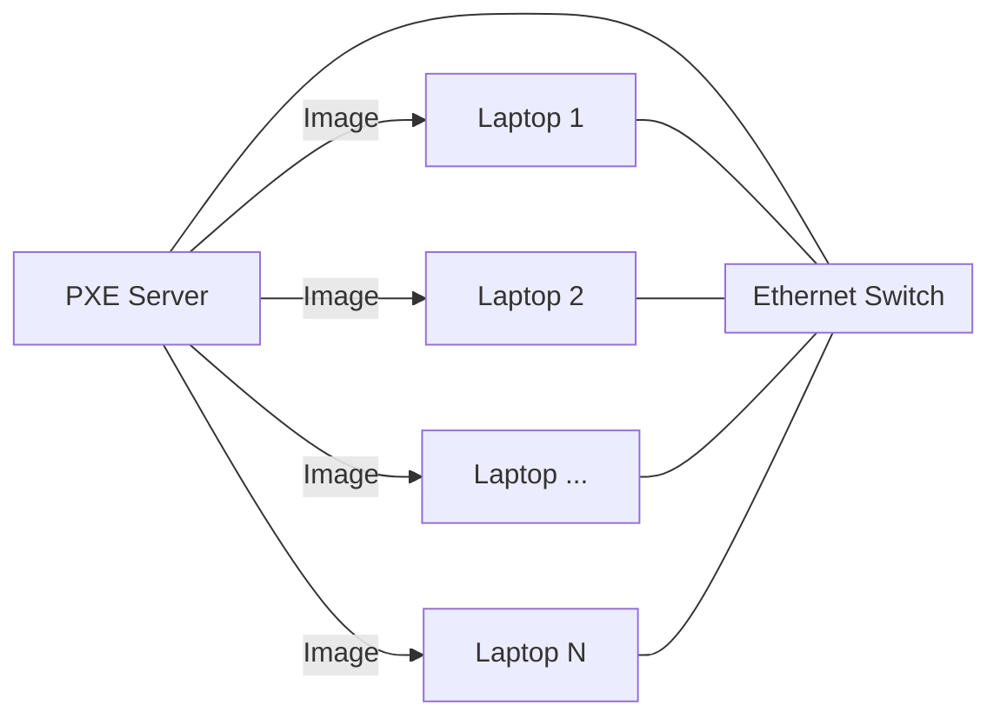
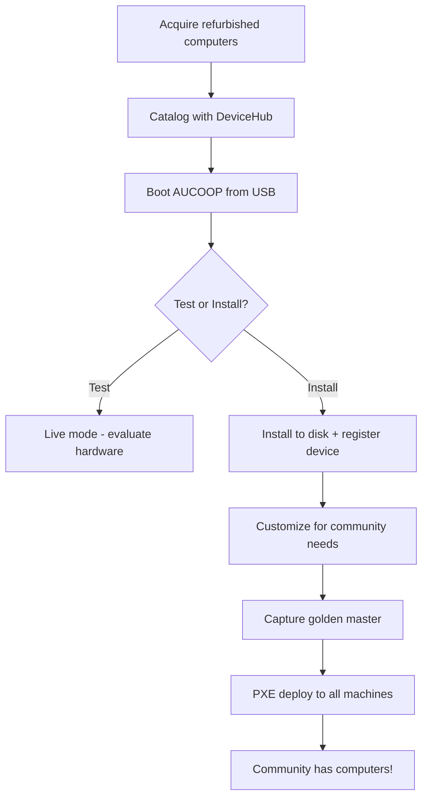

# *"We have the network — now we need computers for the people"*

The wireless signal reaches every corner of the community center. The routers are configured. The internet connection is live. But as you look around the room, you realize something is missing: **where are the computers?**

A network without devices is like a library without books. You've built the infrastructure for digital access, but access requires something to access *with*. The community members need machines — laptops, desktops, something they can use to learn, work, connect.

But how do you equip an entire community with computers when budgets are tight and sustainability matters?

---

## The Refurbished Advantage

Buying new computers for a community center is expensive. A single laptop can cost €500-1000. Multiply that by twenty machines, and you're looking at a budget that most community projects simply don't have.

But here's the thing: **companies and institutions replace their computers every 3-5 years** — not because the machines stop working, but because IT policies mandate upgrades. Those "old" laptops? They're perfectly capable of running a modern operating system, browsing the web, editing documents, and learning to code.

Refurbished computers are:

- **Economically sustainable** — 20-50% the cost of equivalent new machines or even free
- **Environmentally sustainable** — Extends device lifespan, delays e-waste, maximizes the emissions already embedded in manufacturing
- **Functionally adequate** — A 5-year-old business laptop often outperforms a brand-new budget machine

Organizations like [Labdoo](https://www.labdoo.org/) and [eReuse](https://ereuse.org/) specialize in collecting corporate donations, refurbishing them, and redistributing them to communities in need. This circular economy approach transforms waste into opportunity.

!!! tip "Sustainability context"
    For the environmental and economic reasoning behind refurbished hardware, see [Chapter 2.21 — Sustainability](../2.21-Sustainability/index.md).

---

## Acquiring Computers

You start making calls. A local company is upgrading their fleet — they have 20 laptops they were about to recycle. An NGO offers to facilitate the donation. Within a few weeks, boxes arrive at the community center.

You open the first box. HP ProBooks. Lenovo ThinkPads. Some have stickers from their previous life, corporate asset tags still attached. They're dusty, some have worn keyboards, but they power on. They work.

Now comes the question: **how do you know what you actually have?**

---

## Cataloging Your Hardware

Before you can deploy anything, you need an inventory. Not just "20 laptops" but the actual specifications: CPU model, RAM, storage type and size, battery health, serial numbers.

Why does this matter?

- **Deployment planning** — You can't clone an image to a 128 GB disk if the source was 500 GB
- **Maintenance tracking** — When a machine fails, you need to know which one it is
- **Accountability** — Who has what? When was it assigned? What's its status?
- **Donor reporting** — Organizations that donate hardware want to know their devices are being used

This is where a **device management platform** becomes invaluable. Tools like [DeviceHub](https://app.ereuse.org/) (from the eReuse project) allow you to:

1. **Scan and diagnose** devices automatically using bootable USB tools
2. **Record hardware specifications** — CPU, RAM, storage, battery cycles, serial numbers
3. **Track device lifecycle** — From donation through deployment to end-of-life
4. **Generate evidence** — Timestamped records of device condition and chain of custody

When you boot a laptop from the diagnostic USB, it automatically uploads its hardware profile to the platform. Within minutes, you have a complete inventory without manually typing a single specification.

!!! info "Work in Progress"
    **Suggested image:** Screenshot of the DeviceHub dashboard showing a batch of cataloged laptops with their specifications.

Here's a sample of what a cataloged batch looks like:

| ID | Manufacturer | Model | CPU | RAM | Storage | Status |
|----|--------------|-------|-----|-----|---------|--------|
| 1A0B41 | HP | ProBook 430 G4 | i5-7200U | 16 GB | 224 GB SSD | Ready |
| 4D2509 | Lenovo | T460 | i5-6200U | 8 GB | 466 GB HDD | Ready |
| DB77CD | Lenovo | T460 | i5-6200U | 8 GB | 238 GB SSD | Ready |

This data becomes the foundation for everything that follows.

---

## The AUCOOP Base Image

Now that you know what hardware you have, you need software. Every laptop needs an operating system, applications, and configuration.

The **AUCOOP image** is a ready-to-use Linux Mint system designed specifically for community deployments. It's pre-configured with:

- **Linux Mint Cinnamon** — A familiar, Windows-like interface that minimizes user training
- **OnlyOffice** — A productivity suite that looks and feels like Microsoft Office
- **Web browser** — Firefox, pre-configured with useful bookmarks
- **System optimizations** — Cleaned of unnecessary applications, lightweight and fast

The AUCOOP image is available from a public repository. You download it, write it to a USB drive, and you have a bootable system that works on almost any PC hardware.

!!! info "Work in Progress"
    **Suggested image:** Photo of a USB drive labeled "AUCOOP Image" next to a laptop.

### Testing Before Committing

When you boot a laptop from the AUCOOP USB, you have two options:

1. **Live mode** — Run the system entirely from USB without touching the hard drive. This lets you test hardware compatibility, check that WiFi works, verify the screen displays correctly — all without making any permanent changes.

2. **Install mode** — Write the system permanently to the laptop's hard drive. This is the real deployment.

This two-step approach is valuable: you can evaluate a batch of machines in live mode first, identify any hardware issues, and only then commit to installation.

---

## Installing the System

When you choose to install permanently, the AUCOOP image includes automated setup options:

### Device Registration
During installation, you can enter a **DeviceHub token**. This automatically uploads the machine's hardware evidence to your tracking platform. Every installed laptop is automatically cataloged — no manual data entry required.

### Offline Resources
Depending on connectivity constraints, the installation can include:

- **Wikipedia offline** — The complete encyclopedia, available without internet
- **Local language model** — AI assistant that works offline for educational support
- **Educational games** — Learning applications that don't require connectivity

These offline resources are especially valuable for communities with unreliable or expensive internet connections. The laptop becomes useful even when the network is down.

!!! info "Work in Progress"
    **Suggested image:** Screenshot of the installation wizard showing the DeviceHub token entry and offline resource selection.

---

## Creating Your Community's Golden Master

The AUCOOP image is a starting point — but every community has specific needs. Maybe your community center teaches graphic design and needs GIMP. Maybe the local cooperative uses specific accounting software. Maybe you want the desktop wallpaper to show your organization's logo.

This is where you create your **golden master**: a customized version of the AUCOOP image tailored to your community's requirements.

The process:

1. **Start with AUCOOP** — Install the base image on one reference laptop
2. **Customize** — Add software, configure settings, create user accounts, set the hostname
3. **Test** — Make sure everything works as expected
4. **Capture** — Create a disk image of your golden master using Clonezilla
5. **Deploy** — Clone that image to all other laptops

By evening, you had one perfect machine sitting on the table. Every laptop you deployed from this point forward would be an exact copy — same software, same settings, same reliability.

---

## Scaling the Deployment

You've got your golden master. Now you need to deploy it to 19 other machines.

You could do it one by one: boot each laptop from a Clonezilla USB, restore the image, wait 20 minutes, repeat. That's about 7 hours of work, plus the tedium of swapping USB drives.

**There's a better way.** You connect all the laptops to an Ethernet switch, set up one machine as a **PXE server**, and deploy to all of them simultaneously over the network. The laptops boot from the network, receive the image, and reboot into a ready-to-use system.

The whole batch deploys in parallel. What would take a full day becomes a couple of hours.

### What You'll Need

- **Ethernet switch** — Enough ports for all machines plus the server
- **Ethernet cables** — One per machine
- **One laptop as PXE server** — Can be one of the machines you're deploying
- **Your golden master image** — Captured with Clonezilla

The technique is called **PXE network boot** (Preboot Execution Environment). It's the same approach used by IT departments to deploy hundreds of machines — adapted here for community networks with off-the-shelf hardware and free software.

---

## The Complete Flow

Here's how everything fits together:

Each step builds on the previous one. The result: a fleet of identical, tracked, community-ready machines deployed efficiently and sustainably.

---

!!! tip "Guide reference"
    For step-by-step technical instructions, continue to [Guide — Laptop Deployment](../../3-Guide/Laptop-Deployment/index.md).

---

**Next steps:**

- [How do I set up the PXE server and deploy?](../../3-Guide/Laptop-Deployment/index.md)
- [What does the AUCOOP image include?](../../3-Guide/Laptop-Deployment/AUCOOP-image.md)
- [How did Namibia do their deployment?](../../4-Real-Use-Cases/4.1-Namibia/index.md)
