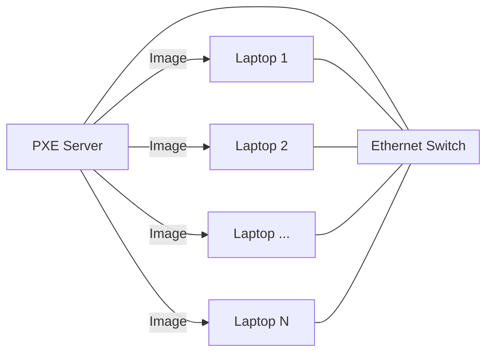
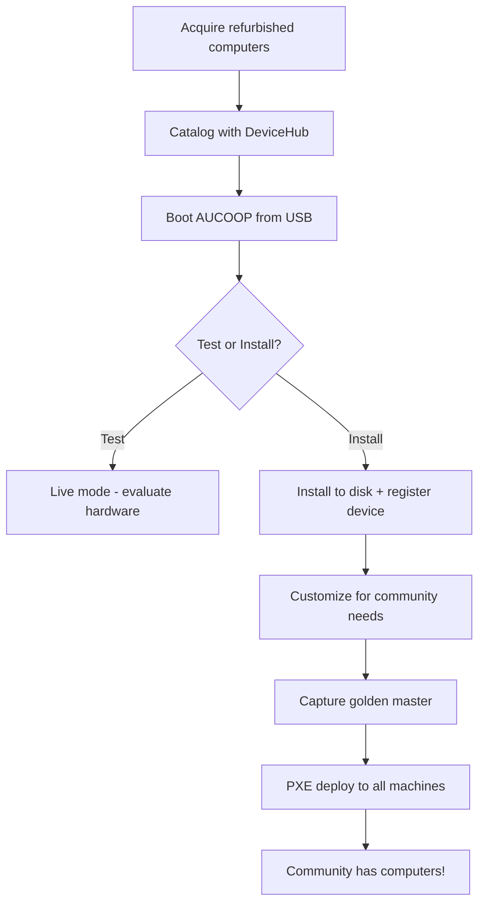

## Scaling the Deployment

You've got your golden master. Now you need to deploy it to 19 other machines.

You could do it one by one: boot each laptop from a Clonezilla USB, restore the image, wait 20 minutes, repeat. That's about 7 hours of work, plus the tedium of swapping USB drives and babysitting each machine.

**There's a better way.**

### PXE Network Boot

You connect all the laptops to an Ethernet switch, set up one machine as a **PXE server**, and deploy to all of them simultaneously over the network. The laptops boot from the network, receive the image, and reboot into a ready-to-use system.

### What You Need

The equipment list is surprisingly simple:

- **One laptop as PXE server** — This can be any Linux machine with an Ethernet port
- **An Ethernet switch** — A basic 8-port or 16-port switch works fine
- **Ethernet cables** — One for each laptop plus the server
- **Your golden master image** — The Clonezilla image you captured earlier

You set up the PXE server during lunch. By mid-afternoon, all 20 laptops are connected to the switch, cables snaking across the table like digital spaghetti.

### The Deployment

You power on the first batch of laptops. They boot from the network — no USB drives needed. The GRUB menu appears, you select "Restore", and Clonezilla starts streaming the golden master image to each machine simultaneously.

The progress bars crawl forward together. 10%... 25%... 50%...

You step outside for coffee. When you return, the laptops are rebooting into Linux Mint. One by one, the familiar desktop appears. Same wallpaper. Same applications. Same configuration. Twenty identical machines, ready to use.

### The Complete Picture

Here's how everything fits together:

Each step builds on the previous one. The result: a fleet of identical, tracked, community-ready machines deployed efficiently and sustainably.

### The Moment of Truth

The next morning, community members arrive for the first computer literacy class. They sit down at the laptops — machines that two weeks ago were gathering dust in a corporate warehouse. Now they're clicking, typing, learning.

One person opens OnlyOffice and starts typing a letter. Another discovers Wikipedia offline and starts reading about local history. A teenager finds the educational games and challenges a friend.

The network you built carries their traffic. The computers you deployed serve their needs. The community is connected — not just to the internet, but to opportunity.

---

!!! tip "Guide reference"
    For step-by-step technical instructions on PXE setup and deployment, continue to [Guide — Laptop Deployment](../../3-Guide/Laptop-Deployment/index.md).

---

**Next steps:**

- [How do I set up the PXE server and deploy?](../../3-Guide/Laptop-Deployment/index.md)
- [What does the AUCOOP image include?](../../3-Guide/Laptop-Deployment/AUCOOP-image.md)
- [How did Namibia do their deployment?](../../4-Real-Use-Cases/4.1-Namibia/index.md)

---

**← Previous sections:**

- [The Refurbished Advantage](2.22.1-The-Refurbished-Advantage.md)
- [Cataloging Your Hardware](2.22.2-Cataloging-Your-Hardware.md)
- [Adding the Operating System](2.22.3-Adding-Operating-System.md)
