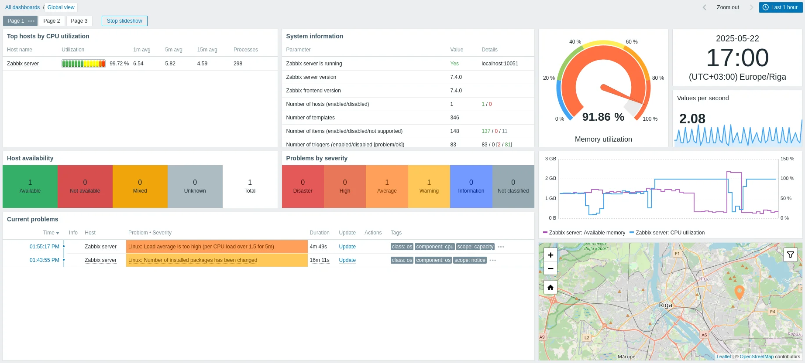

# *"A router died and nobody noticed for three days!"*

One of the routers in the library stopped working on Monday. Nobody noticed until Thursday, when a teacher complained that the internet was down in her classroom. By the time you got there, three days of connectivity had been lost and you had no idea why the router failed in the first place. Was it a power surge? Overheating? A firmware crash? You will never know because nothing was watching.

This is the reality of managing a community network part-time. You have a handful of OpenWrt routers spread across buildings, a couple of Linux servers running Proxmox and Docker containers, and a few wireless antennas linking distant sites. You are not sitting in a network operations center staring at screens all day. You have other things to do. So when something fails silently, it stays failed until someone complains, and by then the damage is done. Users lose trust, and you lose sleep trying to figure out what went wrong without any logs or history to guide you.

The worst part is that most of these failures are predictable. A router's CPU runs hot for hours before it crashes. A server's disk fills up gradually before services start failing. An antenna's signal degrades over days before the link drops entirely. If you had been watching, you could have fixed the problem before anyone even noticed.

## You need a pair of eyes that never blinks

That is exactly what **Zabbix** gives you. Zabbix is an open-source monitoring platform that watches every device in your network around the clock. It collects data, tracks trends, and fires alerts the moment something goes wrong.

When something crosses a threshold you define, Zabbix fires a **trigger**. A router goes offline? Trigger. A server's disk hits 90% full? Trigger. CPU stays above 80% for ten minutes? Trigger. Each trigger can escalate into an **alert** that reaches you wherever you are.

For a community network, **Telegram notifications** are the sweet spot. You create a simple bot, connect it to Zabbix, and from that moment on your phone buzzes the instant a problem appears. When the problem resolves, you get a recovery message too. No more finding out about outages three days later from an annoyed teacher.

And then there are the **dashboards**. Zabbix gives you a single screen where you can see the health of your entire network at a glance: which devices are up, which have active problems, traffic graphs, and historical trends. When you do sit down to check on the network, everything you need is in one place.

Monitoring does not just tell you when things break. It changes how you manage the network entirely. Instead of reacting to complaints, you act on data. Instead of guessing, you know. And instead of losing three days to a dead router, you lose three minutes.

!!! tip "Guide reference"
    For step-by-step Zabbix setup, see [Guide — Zabbix](../../3-Guide/Zabbix/index.md).
