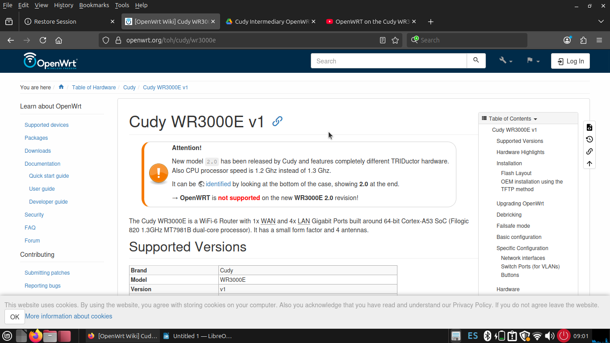
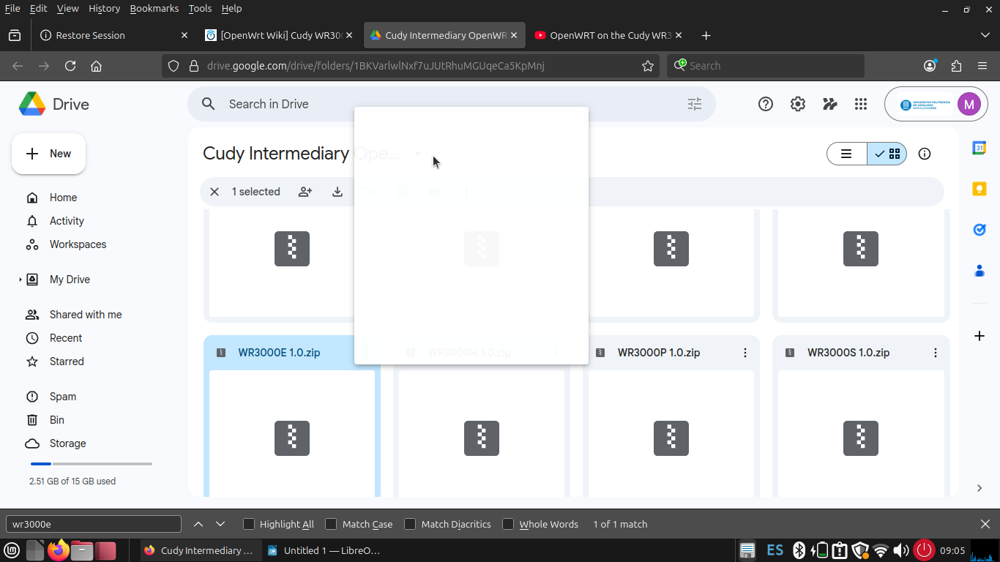
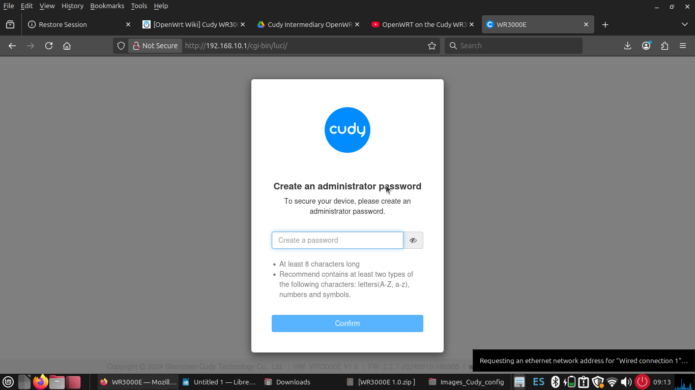
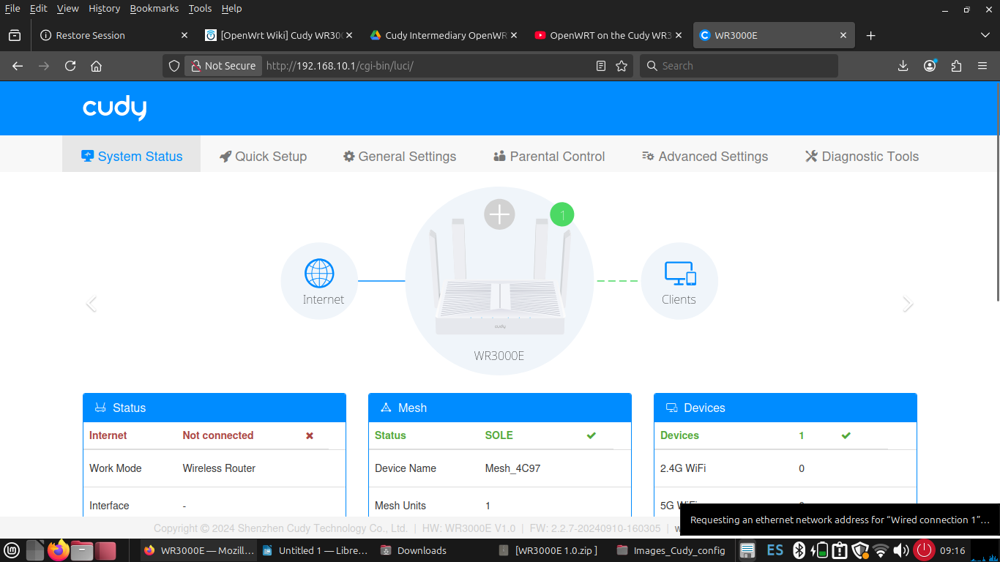
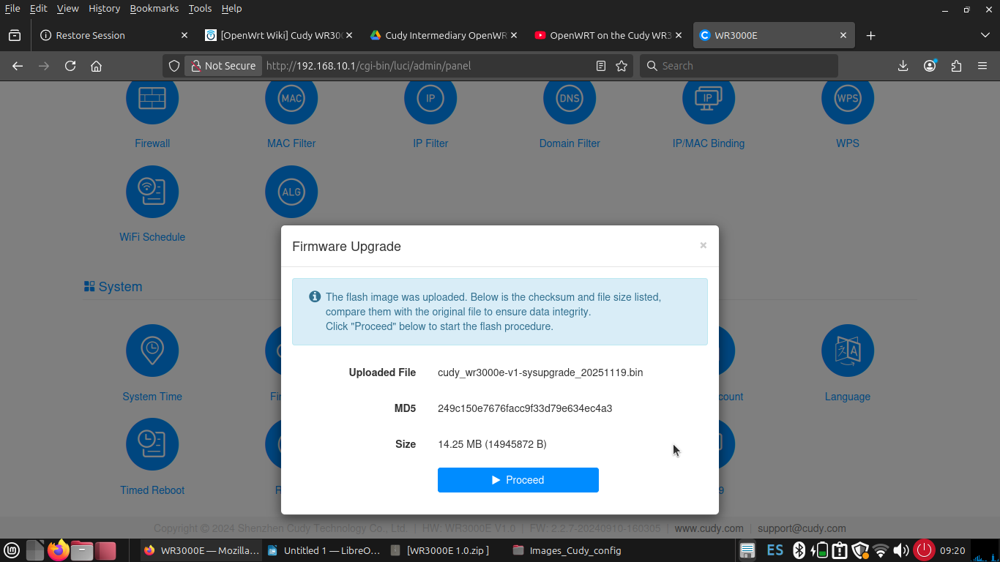
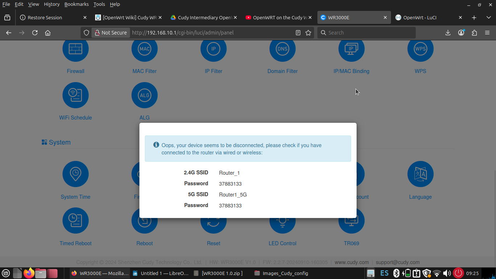
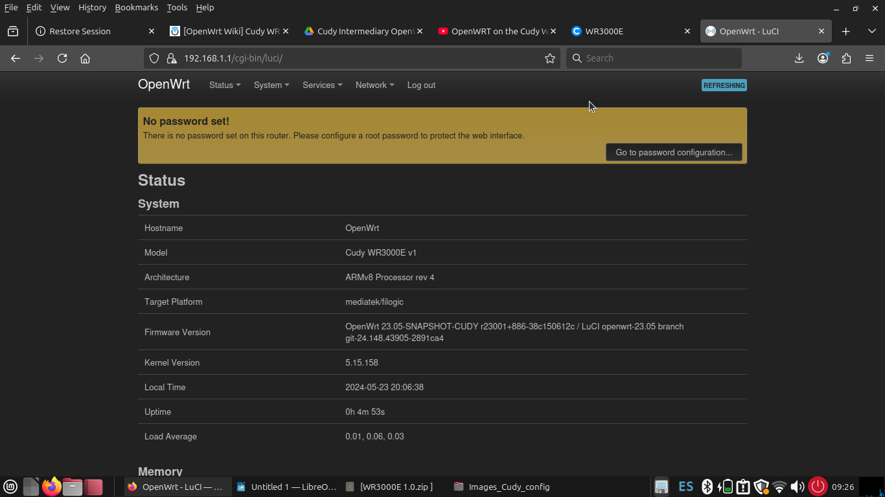
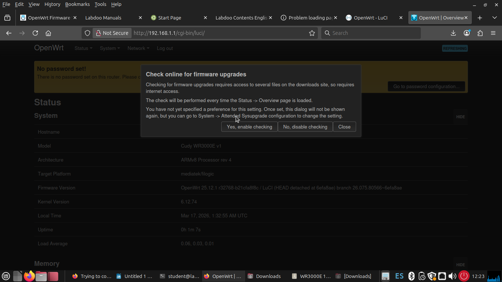

# Cudy WR3000E — Flash OpenWrt

This guide covers how to replace the stock Cudy firmware on the WR3000E v1 router with OpenWrt using the two-stage installation method.

This guide implements the concept introduced in
[Chapter 2.1.2 — Installing OpenWrt](../../2-Imaginary-Use-Case/2.1-The-First-Router/2.1.2-Installing-OpenWrt.md).

## What You'll Learn

- How to verify your hardware revision before flashing
- How to download the correct Cudy-signed intermediate firmware
- How to flash through the stock Cudy web UI
- How to access the OpenWrt interface after the first boot
- How to apply the official OpenWrt sysupgrade image for a clean installation

## Prerequisites

- Cudy WR3000E v1 router (verify the revision — see warning below)
- Computer with an Ethernet port
- Ethernet cable
- Cudy-signed intermediate OpenWrt firmware image (downloaded from Cudy's site)
- Official OpenWrt sysupgrade image for `cudy_wr3000e-v1` (from OpenWrt Firmware Selector)

!!! warning "Check your hardware revision before flashing"
    The WR3000E comes in two hardware revisions. The **v2.0 revision is not supported by OpenWrt**.
    Check the serial number on the sticker on the bottom of the router. If it starts with `2543` or higher (manufactured November 2025 or later), you may have a v2.0 unit. In that case, do not proceed with this guide.

    Units with serial numbers below `2543...` are v1 and can follow this guide safely.

!!! warning "Use a wired connection throughout"
    After flashing the intermediate firmware, Wi-Fi will not be available until OpenWrt is fully configured. Connect your computer to one of the LAN ports on the router and keep the wired connection throughout the entire process.

## Step-by-Step Implementation

### 1. Locate the OpenWrt device page

Open the official [OpenWrt Website](https://openwrt.org/) and search for `Cudy WR3000E`. Read very carefully the information on the device page to confirm that your hardware revision is supported and to understand the flashing process for this specific model. This website is the authoritative source for OpenWrt compatibility and installation instructions so we recommend reading it thoroughly before proceeding.

{ width="600" }

This first step is only to validate that your router is supported, once you confirm that, you can proceed to the next steps. No need to do anything else on the OpenWrt website for this guide.

### 2. Download the intermediate (Cudy-signed) firmware

The WR3000E stock firmware only accepts images signed by Cudy. You must first flash a Cudy-signed OpenWrt intermediate image before you can install the official OpenWrt build.

Go to the [Cudy OpenWrt download page](https://www.cudy.com/en-us/blogs/faq/openwrt-software-download) and scroll down until you find "Download OpenWrt Firmware to Remove Signature Check: Drive". Once you finthe link to the drive, you must open this shared folder, and find and download the intermediate firmware for the WR3000E v1. Extract the `.bin` file from the downloaded archive.

!!! tip
    If your unit was manufactured after November 2025, make sure you download the updated intermediate firmware that supports the new F50L1G41LC flash chip (version 24.10.5 or newer). The Cudy download page notes this compatibility update.

{ width="600" }

### 3. Connect to the router and complete the setup wizard

Connect your computer to a LAN port on the router using an Ethernet cable. Power on the router and open a browser, then navigate to `http://192.168.10.1`.

!!! tip "Can't reach 192.168.10.1?"
    Disable Wi-Fi on your computer, check your cable, and make sure your computer got an IP in the `192.168.10.x` range. See the [general troubleshooting section](index.md#cant-reach-the-routers-default-ip) for more steps.

The Cudy setup wizard will start. Complete it with the following settings:

- Create an admin password when prompted (i.e. admin123)
- Mode: **Wireless Router**
- Timezone: select your local timezone
- WAN: **DHCP**

{ width="600" }

After the wizard completes, you will land on the Cudy dashboard.

{ width="600" }

### 4. Flash the intermediate OpenWrt firmware

In the Cudy web UI, navigate to **Advanced Settings → System → Firmware**.

Upload the Cudy-signed intermediate firmware `.bin` file you downloaded in step 2 and start the upgrade.

{ width="600" }

Wait for the process to complete. The router will display a completion message before rebooting.

{ width="600" }

!!! warning
    Do not power off the router during the flash process. Wait for the completion message before doing anything else.

### 5. Access the OpenWrt interface

After the router reboots, the connection to `192.168.10.1` will drop. OpenWrt uses a different default IP address.

Open your browser and navigate to `http://192.168.1.1`. The OpenWrt LuCI login page will appear.

Log in with:

- **Username:** `root`
- **Password:** *(leave blank — no password set by default)*

{ width="600" }

!!! tip "Set a root password immediately"
    OpenWrt has no root password by default. Go to **System → Administration** and set a strong password before connecting the router to any network.

### 6. Flash the official OpenWrt sysupgrade image

The intermediate firmware gets you into OpenWrt, but it is recommended to upgrade to the latest stable official release.

Download the **sysupgrade** image for `cudy_wr3000e-v1` from the [OpenWrt Firmware Selector](https://firmware-selector.openwrt.org/?target=mediatek%2Ffilogic&id=cudy_wr3000e-v1).

In LuCI, go to **System → Backup / Flash Firmware → Flash new firmware image**. Upload the sysupgrade image.

!!! warning "Uncheck 'Keep settings'"
    When flashing the sysupgrade image after the intermediate firmware, uncheck **Keep settings and retain the current configuration**. This ensures you start with a clean OpenWrt configuration and avoids potential conflicts from the intermediate firmware's settings.

Wait 2–3 minutes for the router to reboot. When done, log in again at `http://192.168.1.1` with username `root` and no password. You now have a clean, up-to-date OpenWrt installation.

After installing this new version, you will probably be prompted to enable automatic updates. You can choose to enable them or not. We recommend not enabling automatic updates to avoid unexpected changes in the router's behavior.

{ width="600" }

## References

- OpenWrt Website - <https://openwrt.org/>
- OpenWrt Firmware Selector — Cudy WR3000E v1: <https://firmware-selector.openwrt.org/?target=mediatek%2Ffilogic&id=cudy_wr3000e-v1>
- Cudy OpenWrt Software Download page: <https://www.cudy.com/en-us/blogs/faq/openwrt-software-download>
- OpenWrt forum — Cudy WR3000 version identification: <https://forum.openwrt.org/t/cudy-wr3000e-cudy-wr3000-determining-version-number/243206>
- OpenWrt forum — WR3000 v1 flash guide discussion: <https://forum.openwrt.org/t/cudy-wr3000-v1-flash-from-interim-firmware-to-latest-openwrt-which-download-to-go-with-solved/243612>
- Community installation walkthrough (Sergio Giménez, 2026): <https://sergiogimenez.com/posts/2026/openwrt-cudy-w3000-v1/>

## Revision History

| Date       | Version | Changes                | Author           | Contributors                |
|------------|---------|------------------------|------------------|-----------------------------|
| 2026-03-23 | 1.0     | Initial guide creation | Maria Jover      | Jaime Motjé, Sergio Giménez |
