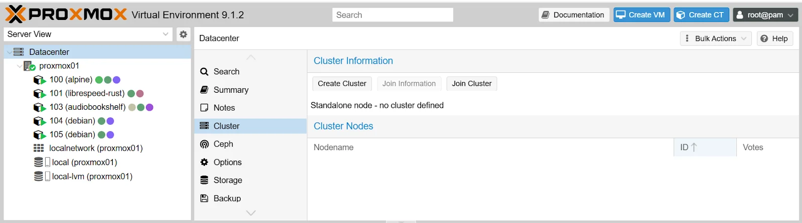
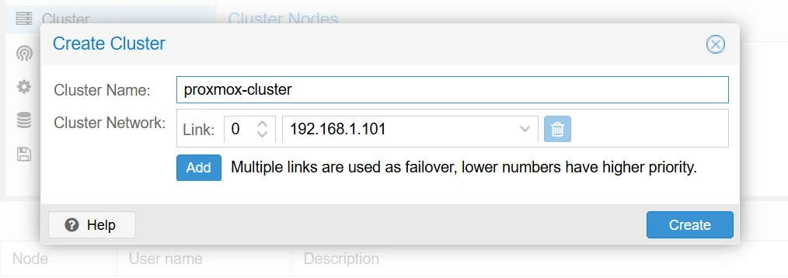
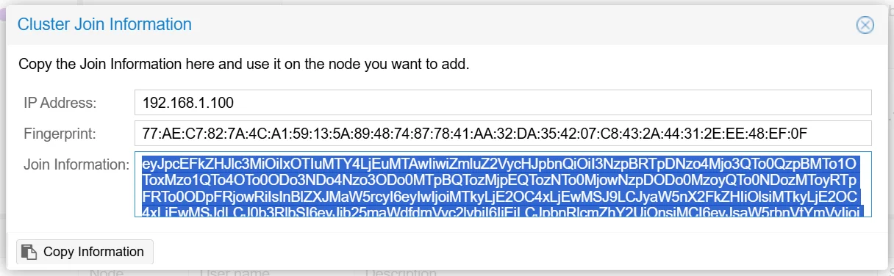
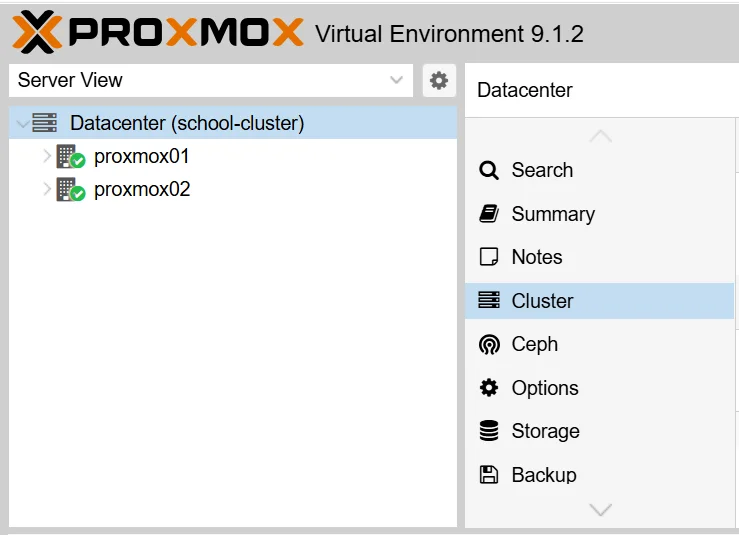

# Create and Manage a Proxmox Cluster

This guide covers how to create a Proxmox VE cluster from two or more nodes.

This guide implements the concept introduced in [Chapter 2.14 -- Clustering](../../2-Imaginary-Use-Case/2.14-Clustering/index.md).

## What You'll Learn

- How to create a Proxmox VE cluster and join additional nodes

## Prerequisites

- Two or more machines running Proxmox VE (same major version on all nodes)
- Network connectivity between all nodes (ideally a dedicated cluster network)
- Root SSH access between nodes

## Used Versions

| Software       | Version              |
|----------------|----------------------|
| Proxmox VE     | 9.1.2                 |

## Step-by-Step Implementation

### 1. Prepare the nodes

1. Ensure all nodes run the same Proxmox VE major version.
2. Set a unique hostname on each node. The hostname must be resolvable from every other node.
3. Verify that each node can reach the others via SSH. Inside the terminal of the first node, run:

    ```bash
    ssh root@<other-node-ip> hostname
    ```

4. Repeat for each node to confirm connectivity.


!!! warning "Empty node requirement"
    When a node joins an existing cluster, its local configuration (`/etc/pve`) is replaced by the cluster configuration. Any VMs or containers defined only on that node's local config will be lost. Always join from a fresh or empty node, or back up first.

!!! info "CPU model considerations"
    If nodes have different CPU models, plan to set the CPU type to `x86-64-v2-AES` (or another common baseline) for any VMs you want to live-migrate. The `Host` CPU type only works when all nodes share the same CPU.
---

### 2. Create the cluster on the first node

1. Open the Proxmox web UI on the node that will be the first cluster member.
2. Navigate to **Datacenter --> Cluster --> Create Cluster**.

    { width="600" }
    
3. Enter a cluster name (e.g., `School-Cluster`).
4. Select the network link for cluster communication. If you have a dedicated cluster network interface, choose it here.
5. Click **Create**.


    { width="600" }

!!! info "Cluster network"
    The cluster link carries Corosync traffic (heartbeat, quorum votes, configuration sync). A dedicated network or VLAN avoids contention with VM traffic. If you only have one network, that works too -- Corosync traffic is lightweight.

---

### 3. Join the second node to the cluster

1. On the **first node** (the one where you created the cluster), navigate to **Datacenter --> Cluster**.
2. Click **Join Information** and copy the displayed join string.

    { width="600" }

3. On the **second node**, navigate to **Datacenter --> Cluster --> Join Cluster**.
4. Paste the join information.
5. Enter the **root password** of the first node.
6. Select the correct network link if prompted.
7. Click **Join**.


!!! warning "Irreversible merge"
    Joining a cluster overwrites the joining node's `/etc/pve` configuration. If the second node already has VMs or containers, back up their configurations before joining.

---

### 4. Verify cluster status

1. On any node, run:

    ```bash
    pvecm status
    ```

2. Confirm the output shows all expected nodes and `Quorate: Yes`.
3. List individual nodes and their vote counts:

    ```bash
    pvecm nodes
    ```

4. In the web UI, navigate to **Datacenter --> Cluster** and verify all nodes appear with a green status.

    { width="600" }

---


## References
-  YouTube: "Como crear un cluster con Proxmox 8 y cosas a tener en cuenta - Tu servidor desde cero - Parte #3" -- <https://www.youtube.com/watch?v=t5yvfnFvQrU>
## Revision History

| Date       | Version | Changes                | Author | Contributors |
|------------|---------|------------------------|--------|--------------|
| 2026-04-02 | 1.0     | Initial guide creation | Jaime Motjé    | Sergio Gimenez              |
