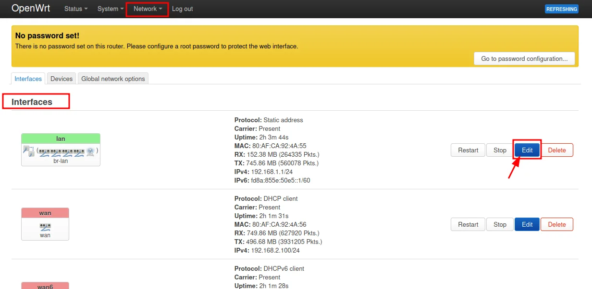
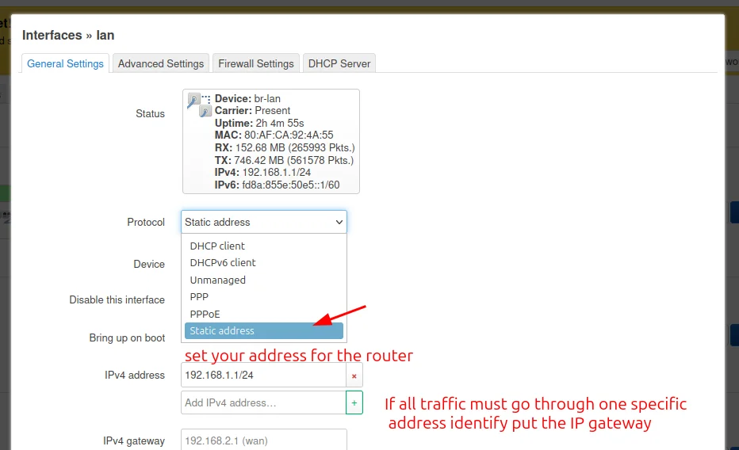

# IP Addressing

This guide covers how to configure static IP addresses on OpenWrt routers and create an IP addressing plan for your community network.

This guide implements the concept introduced in [Chapter 2 — IP Addressing](../../2-Imaginary-Use-Case/2.2-Expanding-Coverage/2.2.2-IP-Addressing.md).

## What You'll Learn

- How to change a router's IP address in OpenWrt LuCI
- When to use static IPs vs DHCP
- How to set up a gateway for traffic routing
- How to document your IP plan for troubleshooting

## Prerequisites

- At least one router running OpenWrt with LuCI web interface
- Ethernet cable for initial configuration
- Basic understanding of IP addresses (e.g., `192.168.1.1`)

## Step-by-Step Implementation

### 1. Plan your network IP range

Before changing any settings, decide what IP range your network will use.

1. If you don't expect more than 255 devices, a `/24` network (e.g., `192.168.70.0/24`) is sufficient.
2. Choose a range that doesn't conflict with common defaults. Avoid `192.168.1.x` and `192.168.0.x` since most routers use these out of the box.
3. Pick a consistent scheme. For example, `192.168.70.x` for your entire deployment.

!!! info "Why not use the default?"
    Most routers ship with `192.168.1.1` as their IP address. If you connect multiple routers without changing their IPs, they'll all claim to be `192.168.1.1` and cause network conflicts.

### 2. Connect to the router

1. Connect your computer to the router using an Ethernet cable.
2. Open a web browser and navigate to the router's current IP address (usually `192.168.1.1`).
3. Log in with your OpenWrt credentials.

!!! tip
    Ethernet is recommended for initial configuration. If you configure via Wi-Fi, you may lose connection when the IP changes.

### 3. Navigate to the LAN interface settings

1. In LuCI, go to **Network → Interfaces → LAN** and click **Edit**.

{ width="600" }

### 4. Configure the static IP address

1. In the **IPv4 address** field, enter the new IP for this router (e.g., `192.168.70.1`).
2. Set the **IPv4 netmask** to `255.255.255.0` (for a `/24` network).
3. If this router needs to route traffic through another device (e.g., a main gateway router), enter that device's IP in the **IPv4 gateway** field.
4. Click **Save & Apply**.

{ width="600" }

!!! warning
    After applying, the router will restart its network services. You'll be disconnected. Unplug and replug your Ethernet cable to get a new IP address in the new range, then reconnect to the router at its new IP.

### 5. Repeat for additional routers

1. Connect to each additional router.
2. Assign it a unique IP within your chosen range (e.g., `192.168.70.2`, `192.168.70.3`, etc.).
3. Set the gateway to point to your main internet-connected router if needed.

### 6. Document your IP addressing plan

Create a simple document or spreadsheet that tracks:

- **Device name** — what the device is (e.g., "Office Router", "Classroom AP")
- **IP address** — the assigned static IP
- **Location** — where the device is physically located
- **MAC address** (optional) — useful for DHCP reservations

{ width="600" }

!!! tip "Keep it updated"
    An outdated IP plan is worse than no plan. Update it every time you add, move, or remove a device.

## Summary

| Setting | Example Value |
|---------|---------------|
| Network range | `192.168.70.0/24` |
| Main router IP | `192.168.70.1` |
| Second router IP | `192.168.70.2` |
| Netmask | `255.255.255.0` |
| Gateway (for secondary routers) | `192.168.70.1` |

## References

- OpenWrt Documentation — Network Basics — https://openwrt.org/docs/guide-user/base-system/basic-networking
- OpenWrt Documentation — Static IP Configuration — https://openwrt.org/docs/guide-user/network/ipv4.configuration

## Revision History

| Date       | Version | Changes                | Author           | Contributors                |
|------------|---------|------------------------|------------------|-----------------------------|
| 2026-04-03 | 1.0     | Initial guide creation | Maria Jover         |                             |
