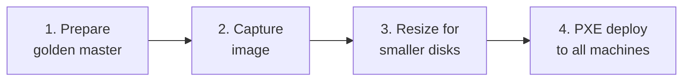
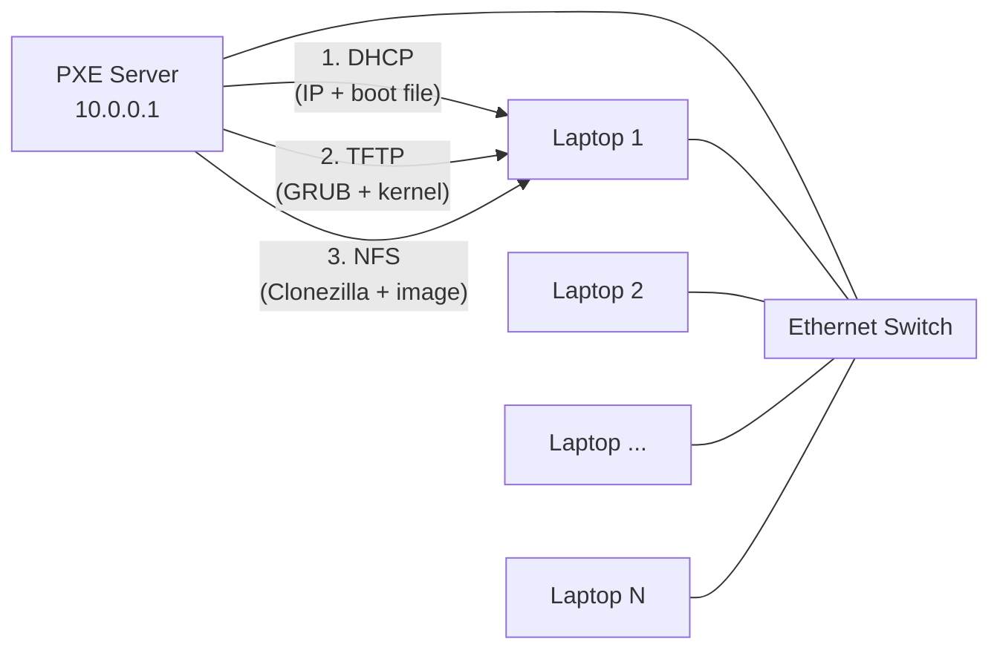

# Mass Laptop Deployment with PXE and Clonezilla

This guide covers how to prepare a golden master Linux image, set up a PXE server, and mass-deploy the image to multiple laptops over the network using Clonezilla.

This guide implements the concept introduced in
[Chapter 2.22 -- Laptop Deployment](../../2-Imaginary-Use-Case/2.22-Laptop-Deployment/index.md).

## What You'll Learn

- How to prepare a golden master image from a reference laptop
- How to capture the master image with Clonezilla
- How to set up a PXE boot server (DHCP + TFTP + NFS)
- How to configure GRUB for UEFI network boot with Clonezilla
- How to deploy the image to multiple machines simultaneously

## Prerequisites

- One **master laptop** already configured with the desired OS, user accounts, and software
- One **PXE server machine** (any Linux laptop or desktop) with an Ethernet port
- An **Ethernet switch** and enough cables for all target machines
- A [Clonezilla Live ISO](https://clonezilla.org/downloads.php) (`.iso` file)
- All target machines must support **UEFI PXE boot** over Ethernet
- Basic familiarity with the Linux command line

!!! note "Hardware compatibility"
    All target machines should have similar hardware (same architecture). Disk sizes can vary, but the source **partition layout** in the Clonezilla image must fit on the smallest target disk. If the golden master was captured from a 466 GB disk, you must shrink the filesystem and partition before capturing the image -- even if the actual data is only 12 GB. See [Step 5a](#5a-shrink-the-partition-for-smaller-target-disks) for details.

## Used Versions

| Software              | Version                      |
|-----------------------|------------------------------|
| Master OS             | Linux Mint 22.3 (Cinnamon)   |
| PXE Server OS         | Linux Mint 22.3 / Ubuntu 24.04 base |
| Clonezilla Live       | 3.3.1-35 (Debian-based, amd64) |
| GRUB                  | 2.12                         |
| Target BIOS           | Lenovo ThinkPad UEFI         |

## Step-by-Step Implementation

### Overview

The deployment has four phases:



**Phase 1** happens on the master laptop. **Phase 2** uses Clonezilla to capture the disk image. **Phase 3** shrinks the image's partition layout so it fits on all target disks (skip this if all disks are the same size). **Phase 4** sets up a PXE server and deploys the image over the network.

---

### Phase 1 -- Prepare the Golden Master

#### 1. Set up the reference machine

Install the OS on one laptop and configure it exactly as you want all machines to be. This includes:

- Create a standard user account (e.g., `aucoop` with a known password)
- Install all required software packages
- Configure the desktop environment (wallpaper, default apps, bookmarks)
- Set the hostname to something generic (e.g., `aucoop-desktop`)
- Remove any machine-specific configuration

!!! tip "Clean up before capturing"
    Remove caches and temporary files to keep the image small:

    ```bash
    sudo apt clean
    sudo apt autoremove -y
    rm -rf ~/.cache/thumbnails/*
    sudo journalctl --vacuum-time=1d
    ```

#### 2. Verify the disk layout

Check the partition table and disk usage on the master machine. You need to know the partition scheme (GPT vs MBR) and which partitions exist:

```bash
sudo parted /dev/sda print
df -h
```

A typical UEFI Linux installation has:

| Partition | Type   | Size     | Purpose         |
|-----------|--------|----------|-----------------|
| `/dev/sda1` | FAT32  | ~500 MB  | EFI System Partition |
| `/dev/sda2` | ext4   | ~460 GB  | Root filesystem (`/`) |

Note the actual disk usage (not the partition size). If the root filesystem uses 12 GB, the compressed image will be roughly 3--5 GB regardless of the partition size.

---

### Phase 2 -- Capture the Image with Clonezilla

#### 3. Boot Clonezilla on the master machine

Download [Clonezilla Live](https://clonezilla.org/downloads.php) (the ISO for amd64) and write it to a USB drive:

```bash
sudo dd if=clonezilla-live-3.3.1-35-amd64.iso of=/dev/sdX bs=4M status=progress
sync
```

Boot the master laptop from the USB drive. Select **Clonezilla live** from the boot menu.

#### 4. Save the disk image

In Clonezilla, choose:

1. **device-image** -- work with disk/partition images
2. **local_dev** -- mount a local device as the image repository (use a USB drive or external HDD)
3. Select the external drive as the image destination
4. **Beginner mode**
5. **savedisk** -- save the entire local disk as an image
6. Name the image descriptively (e.g., `aucoop-mint22.3-2026-03`)
7. Select the source disk (e.g., `sda`)
8. Accept the default compression (gzip)

Clonezilla will create a directory with the image files. A 12 GB used disk typically compresses to ~4 GB.

!!! warning "Do not save the image to the same disk you are capturing"
    The image repository must be on a different physical disk (USB drive, external HDD, or network share).

#### 5. Transfer the image to the PXE server

Copy the entire image directory to the machine that will be the PXE server. The image needs to be in a directory that will be NFS-exported later:

```bash
# On the PXE server, create the image directory
sudo mkdir -p /home/partimag

# Copy from USB drive or over the network
sudo cp -r /media/usb/aucoop-mint22.3-2026-03 /home/partimag/
```

Verify the image files are complete:

```bash
ls /home/partimag/aucoop-mint22.3-2026-03/
```

You should see files like `sda1.vfat-ptcl-img.gz`, `sda2.ext4-ptcl-img.gz`, `sda-pt.parted`, `parts`, `disk`, etc. (Clonezilla may split large files with `.aa`, `.ab` suffixes.)

---

### Phase 3 -- Resize the Image for Smaller Target Disks

!!! info "Skip this phase if all target disks are the same size as the master"
    This phase is only needed when some target disks are smaller than the disk the image was captured from. If all machines have the same disk size, proceed directly to [Phase 4](#phase-4----set-up-the-pxe-server).

#### 5a. Why resizing is necessary

Clonezilla stores the source partition layout in the image. When restoring, `partclone` writes data blocks at the same offsets as the original filesystem. The ext4 filesystem scatters metadata (block group descriptors, inode tables, bitmaps) across the **entire** partition, not just the first N gigabytes.

This means that even if the actual data is only 12 GB, a partition captured from a 466 GB disk will have blocks scattered up to position ~466 GB. When restoring to a 238 GB disk, `partclone` will try to seek beyond the target partition and fail with:

```
target seek ERROR: Invalid argument
```

The `-k1` flag (proportional partitions) and `-icds` flag (ignore disk size check) are **not sufficient** to fix this. The partition layout itself must be physically smaller than the smallest target disk.

#### 5b. Shrink the filesystem and partition

You need a copy of the master disk as a raw or qcow2 image. If you saved the Clonezilla image to an external drive, you can restore it to a qcow2 file first:

```bash
# Create a qcow2 from the Clonezilla image (on your workstation, not on a target machine)
qemu-img create -f qcow2 master-disk.qcow2 500G
sudo modprobe nbd max_part=8
sudo qemu-nbd --connect=/dev/nbd0 master-disk.qcow2
# Then use ocs-sr or partclone to restore the image to /dev/nbd0
```

If you already have a qcow2 or raw copy of the master disk, connect it directly:

```bash
sudo modprobe nbd max_part=8
sudo qemu-nbd --connect=/dev/nbd0 master-disk.qcow2
sudo partprobe /dev/nbd0
lsblk /dev/nbd0    # Verify partitions appear
```

Now shrink the ext4 filesystem and partition. Choose a size that is larger than the actual data usage but smaller than the smallest target disk. For example, if the data is 12 GB, shrinking to 20 GB gives plenty of room:

```bash
# 1. Check the filesystem (required before resize)
sudo e2fsck -fy /dev/nbd0p2

# 2. Shrink the filesystem to 20 GB
sudo resize2fs /dev/nbd0p2 20G

# 3. Shrink the partition to slightly larger than the filesystem
#    The filesystem is 20 GB = 20 * 1024^3 = 21,474,836,480 bytes
#    Add the partition start offset (~538 MB) plus margin
sudo parted /dev/nbd0 resizepart 2 22100MB

# 4. Verify the filesystem is still clean
sudo e2fsck -fy /dev/nbd0p2
```

!!! warning "Order matters"
    Always shrink the **filesystem first**, then the **partition**. If you shrink the partition first, you will truncate the filesystem and lose data.

#### 5c. Recapture the Clonezilla image

With the partition resized, capture a new Clonezilla image using `partclone` directly:

```bash
# Capture the EFI partition
sudo partclone.vfat -c -s /dev/nbd0p1 | gzip -c > new-image/sda1.vfat-ptcl-img.gz

# Capture the root partition (this takes a few minutes)
sudo partclone.ext4 -c -s /dev/nbd0p2 | gzip -c > new-image/sda2.ext4-ptcl-img.gz
```

You also need to regenerate the metadata files (`sda-pt.parted`, `sda-gpt.sgdisk`, `sda-pt.sf`, `disk`, `parts`, `dev-fs.list`, etc.) with the new partition layout. Use `parted`, `sgdisk`, `sfdisk`, and `blkid` to dump the current state of `/dev/nbd0` and save the output to the corresponding files, replacing `nbd0` with `sda` in the content.

Finally, disconnect the disk:

```bash
sudo qemu-nbd --disconnect /dev/nbd0
```

Transfer the new image directory to the PXE server's `/home/partimag/`.

---

### Phase 4 -- Set Up the PXE Server

The PXE server provides three services:

| Service | Port | Purpose |
|---------|------|---------|
| DHCP    | 67   | Assigns IP addresses and tells clients where to find the boot file |
| TFTP    | 69   | Serves the GRUB bootloader, kernel, and initrd |
| NFS     | 2049 | Serves the Clonezilla Live filesystem and the disk image |



#### 6. Configure the network

Connect the PXE server and all target laptops to a dedicated Ethernet switch. This must be an **isolated network** — do not connect it to your main network or you will interfere with existing DHCP servers.

Assign a static IP to the PXE server's Ethernet interface:

```bash
# Find your Ethernet interface name
ip link show

# Assign a static IP (non-persistent, for this session only)
sudo ip addr add 10.0.0.1/24 dev enp0s31f6
sudo ip link set enp0s31f6 up
```

Replace `enp0s31f6` with your actual Ethernet interface name.

!!! tip "Making the IP persistent"
    The `ip addr add` command does not survive a reboot. For a persistent configuration, use NetworkManager or add it to `/etc/network/interfaces`. For a one-time deployment session, the non-persistent method is fine.

#### 7. Install the required services

```bash
sudo apt update
sudo apt install -y isc-dhcp-server tftpd-hpa nfs-kernel-server grub-efi-amd64-bin
```

#### 8. Extract Clonezilla Live files for PXE

Mount the Clonezilla Live ISO and copy the kernel, initrd, and root filesystem:

```bash
# Mount the ISO
sudo mkdir -p /mnt/clonezilla-iso
sudo mount -o loop clonezilla-live-3.3.1-35-amd64.iso /mnt/clonezilla-iso

# Create the TFTP and NFS directories
sudo mkdir -p /tftpboot/nbi_img/clonezilla/live
sudo mkdir -p /tftpboot/clonezilla/live

# Copy kernel and initrd to TFTP root (served via TFTP)
sudo cp /mnt/clonezilla-iso/live/vmlinuz /tftpboot/nbi_img/clonezilla/live/
sudo cp /mnt/clonezilla-iso/live/initrd.img /tftpboot/nbi_img/clonezilla/live/

# Copy the full live directory to NFS root (served via NFS)
sudo cp /mnt/clonezilla-iso/live/vmlinuz /tftpboot/clonezilla/live/
sudo cp /mnt/clonezilla-iso/live/initrd.img /tftpboot/clonezilla/live/
sudo cp /mnt/clonezilla-iso/live/filesystem.squashfs /tftpboot/clonezilla/live/

sudo umount /mnt/clonezilla-iso
```

!!! note "Why two copies of vmlinuz/initrd?"
    The files in `/tftpboot/nbi_img/clonezilla/live/` are served via **TFTP** (GRUB downloads them during boot). The files in `/tftpboot/clonezilla/live/` are served via **NFS** (the booted kernel mounts this as its root filesystem). TFTP uses `--secure` mode which chroots to `/tftpboot/nbi_img`, so files outside this directory are not accessible via TFTP.

#### 9. Generate the GRUB netboot binary

Use `grub-mknetdir` to generate a GRUB EFI binary with network boot support (TFTP and EFI network modules built in):

```bash
sudo grub-mknetdir --net-directory=/tftpboot/nbi_img --subdir=/grub
```

This creates:

- `/tftpboot/nbi_img/grub/x86_64-efi/core.efi` -- the GRUB EFI binary
- `/tftpboot/nbi_img/grub/x86_64-efi/*.mod` -- GRUB modules
- `/tftpboot/nbi_img/grub/fonts/unicode.pf2` -- font file

Copy the generated EFI binary to the TFTP root as `bootx64.efi` (the standard UEFI filename):

```bash
sudo cp /tftpboot/nbi_img/grub/x86_64-efi/core.efi /tftpboot/nbi_img/bootx64.efi
```

!!! warning "Secure Boot must be disabled"
    The GRUB binary generated by `grub-mknetdir` is **unsigned**. Target machines with Secure Boot enabled will silently reject it — they will download the file but immediately fall through to the next boot option without any error message. **Disable Secure Boot** in the BIOS of every target machine before attempting PXE boot (see [Step 14](#14-disable-secure-boot-on-target-machines)).

#### 10. Configure DHCP

Edit `/etc/dhcp/dhcpd.conf`:

```bash
# AUCOOP PXE Deployment DHCP Config
default-lease-time 600;
max-lease-time 7200;
ddns-update-style none;
authoritative;

allow booting;
allow bootp;

option arch code 93 = unsigned integer 16;

subnet 10.0.0.0 netmask 255.255.255.0 {
    option subnet-mask 255.255.255.0;
    option routers 10.0.0.1;
    next-server 10.0.0.1;
    range 10.0.0.101 10.0.0.120;

    # UEFI clients get GRUB EFI
    if option arch = 00:07 or option arch = 00:09 {
        filename "bootx64.efi";
    } else {
        filename "lpxelinux.0";
    }
}
```

Configure DHCP to listen only on the Ethernet interface. Edit `/etc/default/isc-dhcp-server`:

```
INTERFACESv4="enp0s31f6"
INTERFACESv6=""
```

Replace `enp0s31f6` with your Ethernet interface name.

#### 11. Configure TFTP

Edit `/etc/default/tftpd-hpa`:

```
TFTP_USERNAME="tftp"
TFTP_DIRECTORY="/tftpboot/nbi_img"
TFTP_ADDRESS=":69"
TFTP_OPTIONS="--secure --verbose"
```

!!! warning "Symlinks and `--secure` mode"
    The `--secure` flag makes `tftpd-hpa` chroot to `TFTP_DIRECTORY`. Symlinks pointing outside this directory will not work. Always place files directly inside `/tftpboot/nbi_img/` or its subdirectories.

#### 12. Configure NFS

Edit `/etc/exports`:

```
/tftpboot/clonezilla 10.0.0.0/24(ro,no_root_squash,async,no_subtree_check)
/home/partimag       10.0.0.0/24(ro,no_root_squash,async,no_subtree_check)
```

Apply the exports:

```bash
sudo exportfs -ra
```

#### 13. Write the GRUB boot menu

Create `/tftpboot/nbi_img/grub/grub.cfg`:

```bash
set default=0
set timeout=10

menuentry "Restore -- Deploy image to disk" --id restore {
  echo "Loading Clonezilla Live for image restore..."
  linux /clonezilla/live/vmlinuz boot=live union=overlay username=user config components quiet hostname=deploy noswap edd=on nomodeset enforcing=0 locales= keyboard-layouts= ocs_live_batch="no" vga=788 net.ifnames=0 nosplash netboot=nfs nfsroot=10.0.0.1:/tftpboot/clonezilla ocs_prerun1="mount -t nfs 10.0.0.1:/home/partimag /home/partimag" ocs_live_run="/home/partimag/auto-restore.sh"
  initrd /clonezilla/live/initrd.img
}

menuentry "Clonezilla Live (Interactive)" --id interactive {
  echo "Loading Clonezilla Live (interactive mode)..."
  linux /clonezilla/live/vmlinuz boot=live union=overlay username=user config components quiet hostname=deploy noswap edd=on nomodeset enforcing=0 locales= keyboard-layouts= ocs_live_run="ocs-live-general" ocs_live_extra_param="" ocs_live_batch="no" vga=788 net.ifnames=0 nosplash netboot=nfs nfsroot=10.0.0.1:/tftpboot/clonezilla
  initrd /clonezilla/live/initrd.img
}

menuentry "Boot from local disk" --id local {
  echo "Booting local disk..."
  exit
}
```

The first entry calls an auto-restore script instead of running `ocs-sr` inline. Create `/home/partimag/auto-restore.sh` on the PXE server:

```bash
#!/bin/bash
# Auto-detect target disk and restore
IMAGE_NAME="aucoop-mint22.3-small"   # Change to your image directory name

if [ -b /dev/nvme0n1 ]; then
  DISK=nvme0n1
elif [ -b /dev/sda ]; then
  DISK=sda
elif [ -b /dev/vda ]; then
  DISK=vda
else
  echo "ERROR: No suitable disk found!"
  lsblk
  read -p "Press Enter to continue..."
  exit 1
fi

echo "Detected target disk: /dev/$DISK"
/usr/sbin/ocs-sr -g auto -e1 auto -e2 -r -j2 -icds -k1 -scr -p reboot restoredisk "$IMAGE_NAME" "$DISK"
```

Make it executable: `chmod +x /home/partimag/auto-restore.sh`

Key kernel parameters explained:

| Parameter | Purpose |
|-----------|---------|
| `boot=live` | Boot as a live system |
| `netboot=nfs` | Fetch the root filesystem via NFS |
| `nfsroot=10.0.0.1:/tftpboot/clonezilla` | NFS path to Clonezilla Live root |
| `ocs_prerun1="mount -t nfs ..."` | Mount the image repository before Clonezilla starts |
| `ocs_live_run="/home/partimag/auto-restore.sh"` | Run the auto-detect restore script |

Key `ocs-sr` flags:

| Flag | Purpose |
|------|---------|
| `-k1` | Proportionally resize partitions to fill the target disk |
| `-icds` | Skip the "destination disk too small" check |
| `-scr` | Skip checking if the image is restorable |
| `-p reboot` | Reboot after restore completes |

!!! tip "Why use a script instead of inline ocs-sr?"
    Using an external script lets you auto-detect the target disk (`nvme0n1` vs `sda`) and keeps the GRUB config clean. This is essential when deploying to machines with mixed storage types (NVMe SSD vs SATA HDD).

#### 14. Disable Secure Boot on target machines

On each target laptop, enter the BIOS setup (usually **F1** or **Enter** then **F1** on Lenovo ThinkPads) and:

1. Go to **Security > Secure Boot**
2. Set Secure Boot to **Disabled**
3. Save and exit (**F10**)

This is required because the GRUB netboot binary is unsigned. Without disabling Secure Boot, the machine will download the GRUB binary but silently fail and fall through to the next boot option.

!!! note "Re-enable Secure Boot after deployment"
    If the deployed OS supports Secure Boot (most modern Linux distributions do), you can re-enable Secure Boot after deployment is complete.

#### 15. Start all services

```bash
sudo systemctl restart isc-dhcp-server
sudo systemctl restart tftpd-hpa
sudo systemctl restart nfs-kernel-server
```

Verify they are running:

```bash
sudo systemctl is-active isc-dhcp-server tftpd-hpa nfs-kernel-server
```

All three should report `active`.

#### 16. Boot the target machines

On each target laptop:

1. Connect the Ethernet cable to the switch
2. Power on and enter the boot menu (usually **F12** on Lenovo ThinkPads)
3. Select **PXE Boot** or **Network Boot** (the Ethernet/LAN option)

The machine will:

1. Get an IP address via DHCP (you will see the assigned IP on screen)
2. Download `bootx64.efi` via TFTP
3. GRUB loads and displays the boot menu
4. After 10 seconds (or when you press Enter), Clonezilla boots via NFS
5. Clonezilla restores the golden master image to the local disk
6. The machine reboots into the deployed OS

!!! tip "Deploy multiple machines at once"
    You can boot all machines simultaneously. Each one independently contacts the PXE server, downloads the boot files, and restores the image. The bottleneck is the PXE server's disk I/O and network bandwidth, but for 5--10 machines on a gigabit switch this works fine.

## Troubleshooting

### Machine downloads the NBP but immediately falls through to IPv6

This is a **Secure Boot** issue. The unsigned GRUB binary is being rejected silently. Disable Secure Boot in the BIOS (see [Step 14](#14-disable-secure-boot-on-target-machines)).

### GRUB loads but cannot find vmlinuz

Check that the kernel and initrd are **inside** the TFTP root directory (`/tftpboot/nbi_img/clonezilla/live/`), not just symlinked. The `--secure` flag in `tftpd-hpa` chroots the TFTP server and will not follow symlinks that point outside the root.

### GRUB shows "bad shim signature" when loading the kernel

This also means Secure Boot is enabled. GRUB (loaded via shim) is trying to verify the Clonezilla kernel's signature. Disable Secure Boot.

### Clonezilla boots but cannot mount NFS

- Verify NFS is running: `sudo systemctl is-active nfs-kernel-server`
- Verify exports: `sudo exportfs -v`
- Check that the client got an IP in the correct subnet: the DHCP lease log is at `/var/lib/dhcp/dhcpd.leases`

### Clonezilla cannot find the image

- Check that the image directory name in `grub.cfg` (or `auto-restore.sh`) matches exactly the directory name in `/home/partimag/`
- Verify NFS export of `/home/partimag`: `showmount -e 10.0.0.1`

### Restore fails with "target seek ERROR" at ~77%

The source image was captured from a larger disk than the target. Even with `-k1` (proportional partitions) and `-icds` (skip size check), `partclone` fails because ext4 scatters data blocks across the entire original partition. You need to shrink the source filesystem and partition, then recapture the image. See [Phase 3](#phase-3----resize-the-image-for-smaller-target-disks).

## File Layout Reference

After completing all steps, the PXE server should have this directory structure:

```
/tftpboot/
├── nbi_img/                          # TFTP root
│   ├── bootx64.efi                   # GRUB EFI binary (from grub-mknetdir)
│   ├── grub/
│   │   ├── grub.cfg                  # Boot menu configuration
│   │   ├── fonts/
│   │   │   └── unicode.pf2           # GRUB font
│   │   └── x86_64-efi/
│   │       ├── core.efi              # Original GRUB binary
│   │       └── *.mod                 # GRUB modules
│   └── clonezilla/
│       └── live/
│           ├── vmlinuz               # Clonezilla kernel (TFTP)
│           └── initrd.img            # Clonezilla initrd (TFTP)
└── clonezilla/                       # NFS-exported
    └── live/
        ├── vmlinuz                   # Clonezilla kernel (NFS)
        ├── initrd.img                # Clonezilla initrd (NFS)
        └── filesystem.squashfs       # Clonezilla root filesystem (NFS)

/home/partimag/                       # NFS-exported
├── aucoop-mint22.3-small/            # Clonezilla disk image
│   ├── sda-pt.parted
│   ├── sda-gpt.sgdisk
│   ├── sda1.vfat-ptcl-img.gz
│   ├── sda2.ext4-ptcl-img.gz
│   └── ...
└── auto-restore.sh                   # Auto-detect disk script
```

## References

- Clonezilla Project -- <https://clonezilla.org/>
- Clonezilla PXE Server Documentation -- <https://clonezilla.org/clonezilla-SE/>
- DRBL (Diskless Remote Boot in Linux) -- <https://drbl.org/>
- GNU GRUB Manual -- Network booting -- <https://www.gnu.org/software/grub/manual/grub/html_node/Network.html>
- ISC DHCP Server Documentation -- <https://kb.isc.org/docs/isc-dhcp-44-manual-pages-dhcpdconf>
- Labdoo Project -- <https://www.labdoo.org/>
- tftpd-hpa manual -- <https://manpages.debian.org/tftpd-hpa>

## Revision History

| Date       | Version | Changes                | Author           | Contributors |
|------------|---------|------------------------|------------------|--------------|
| 2026-03-31 | 1.0     | Initial guide creation | Sergio Gimenez   |              |
| 2026-03-31 | 1.1     | Add partition resizing for mixed disk sizes, auto-detect disk script, improved ocs-sr flags | Sergio Gimenez   |              |
