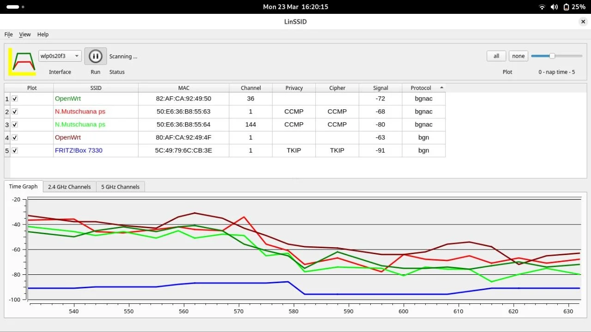
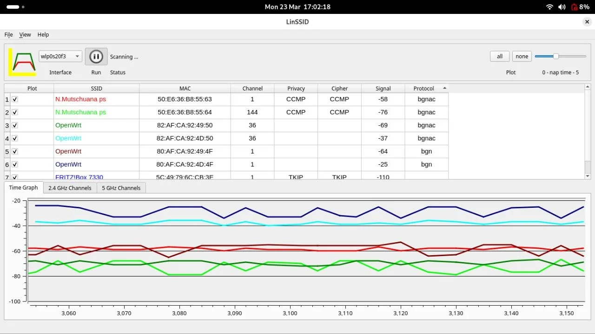
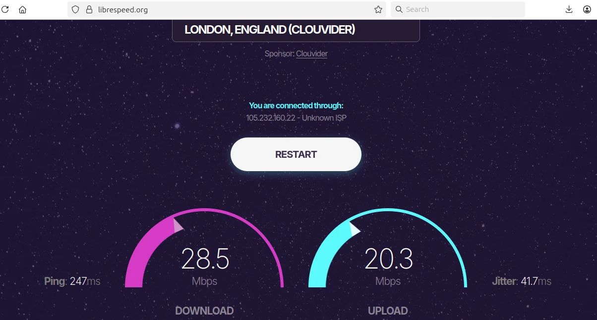
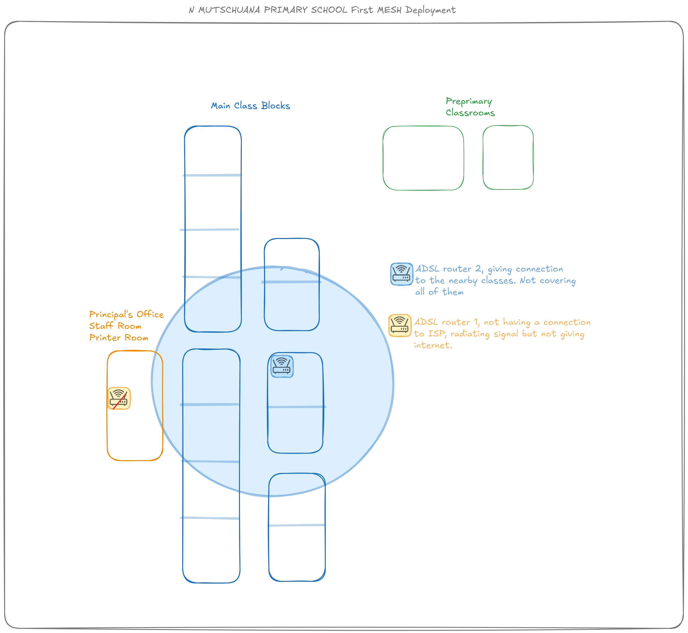
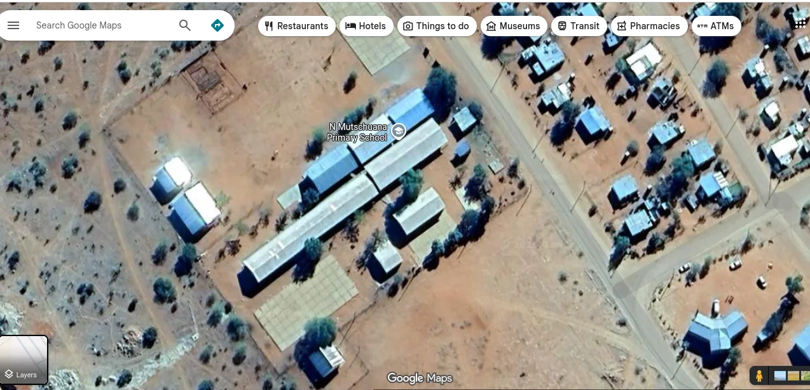

# Site Assessment

You have internet. Now you need to understand the physical environment before buying any equipment. This section covers surveying coverage, measuring speed, and mapping the site.

This guide implements the concept introduced in
[Chapter 2.2.1 — Planning](../../2-Imaginary-Use-Case/2.2-Expanding-Coverage/2.2.1-Planning.md).

---

## 1. Assess current Wi-Fi coverage

Before purchasing additional equipment, map out the existing coverage and physical environment.

### Walk the site with a Wi-Fi analyzer

1. Install a Wi-Fi analyzer app on your smartphone or laptop:
    - **Linux**: LinSSID
    - **Android/iOS**: WiFiman, NetSpot

2. Walk through every area where you want network coverage.

3. Note the signal strength (in dBm) at each location. Record:
    - Strong signal areas (above -50 dBm)
    - Weak signal areas (-70 to -80 dBm)
    - Dead zones (below -80 dBm or no signal)

4. Check for interference from neighboring networks on the same channel.

{ width="600" }

The image above shows signal power dropping significantly when moving between rooms separated by thick walls.

{ width="600" }

This image shows how signal strength remains stable when there are no obstructions.

---

## 2. Measure baseline internet speed

Understanding your starting bandwidth is critical—expanding the network to more devices does not create more bandwidth.

1. Connect to the existing network.

2. Run a speed test using:
    - [Speedtest.net](https://speedtest.net)
    - [LibreSpeed](https://librespeed.org) (open source alternative)

3. Record the results:
    - Download speed (Mbps)
    - Upload speed (Mbps)
    - Latency/Ping (ms)

4. Run the test at different times of day to understand peak usage patterns.

{ width="600" }

---

## 3. Map the physical site

A visual map helps you measure distances, identify obstacles, and plan access point placement.

1. Use satellite imagery tools to get an overhead view:
    - Google Earth
    - OpenStreetMap

2. Alternatively, create a hand-drawn schema using tools like [draw.io](https://draw.io) or paper sketches.

3. Mark on your map:
    - The internet entry point (router/modem location)
    - Buildings and rooms requiring coverage
    - Distances between buildings
    - Obstacles (thick walls, metal structures, large trees)
    - Power outlet locations

{ width="600" }

{ width="600" }

!!! tip "Do this before arrival"
    You can prepare the satellite view mapping before traveling to the site. Then refine it on-site with actual measurements and observations.

---

## References

- [Speedtest by Ookla](https://speedtest.net)
- [LibreSpeed](https://librespeed.org)
- [LinSSID (Linux Wi-Fi Analyzer)](https://sourceforge.net/projects/linssid/)
- [WiFiman by Ubiquiti](https://wifiman.com)
- [draw.io (Diagramming)](https://draw.io)
