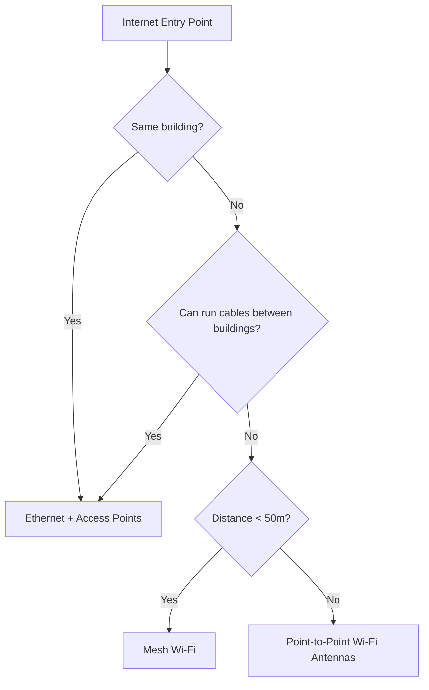

# Expansion Planning

You've surveyed the site, measured speeds, and drawn the map. Now it's time to decide where to place access points and which technologies to use.

This guide implements the concepts introduced in
[Chapter 2.2.1 — Planning](../../2-Imaginary-Use-Case/2.2-Expanding-Coverage/2.2.1-Planning.md) and
[Chapter 2.2.3 — Wired vs Wireless](../../2-Imaginary-Use-Case/2.2-Expanding-Coverage/2.2.3-Wired-vs-Wireless.md).

---

## 1. Plan access point placement

Use the following guidelines when deciding where to place routers and access points:

| Guideline | Reason |
|-----------|--------|
| **Mount high** | Walls and ceilings allow signal to radiate downward; furniture blocks signal |
| **Position centrally** | Signals radiate in all directions; central placement maximizes coverage |
| **Minimize wall crossings** | Every wall (especially concrete) weakens the signal |
| **Prioritize gathering spots** | Cover common areas, meeting spaces, and high-traffic zones first |

---

## 2. Choose your expansion technology

Based on your assessment, select the appropriate method to expand from the original access point. Depending on your site layout, you may need to combine multiple technologies—for example, using point-to-point antennas to connect buildings and Ethernet within each building.

### Option A: Ethernet cabling + additional access points

- **Best for**: Expanding coverage within the same building or adjacent rooms if doing a cable installation is possible.
- **How it works**: Run Cat6 cable from the main router to new areas and connect additional Wi-Fi access points
- **Advantages**: Most reliable and fastest connection

### Option B: Point-to-Point Wi-Fi antennas

- **Best for**: Connecting separate buildings without digging cable trenches
- **How it works**: Mount directional Wi-Fi antennas on each building, aimed at each other to create a wireless link
- **Advantages**: No physical cabling between buildings

### Option C: Mesh Wi-Fi systems

- **Best for**: Indoor environments where running cables is impractical
- **How it works**: Multiple mesh nodes communicate wirelessly to extend coverage
- **Advantages**: Easy to deploy, self-configuring
- **Disadvantages**: Reduced overall speed compared to wired access points

