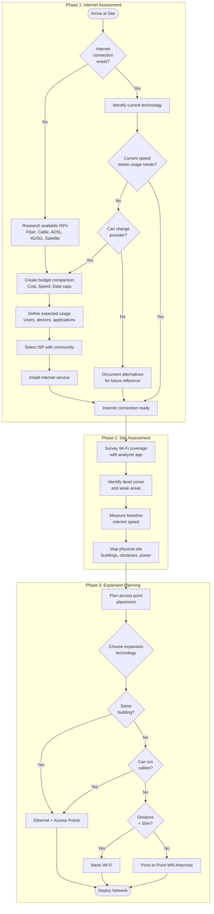

# Network Planning

This guide walks you through assessing a location for network deployment—whether starting from scratch or expanding an existing setup.

This guide implements the concepts introduced in
[Chapter 2.1 — The First Router](../../2-Imaginary-Use-Case/2.1-The-First-Router/index.md) and
[Chapter 2.2 — Expanding Coverage](../../2-Imaginary-Use-Case/2.2-Expanding-Coverage/index.md).

## What You'll Learn

- How to evaluate whether internet connectivity exists at your site
- Tools and techniques for surveying Wi-Fi coverage and identifying dead zones
- Methods for measuring baseline internet speed
- How to map your site and plan access point placement
- Decision criteria for choosing expansion technologies

## Prerequisites

- A smartphone or laptop with Wi-Fi capability
- Access to the physical site you want to assess
- Basic understanding of Wi-Fi signal strength concepts

---

## Overview

The following flowchart shows the complete network planning process from initial assessment to technology selection:

Each phase is covered in detail in its own section:

1. [Internet Assessment](1-Internet-Assessment.md) — Evaluate your internet connection or find one
2. [Site Assessment](2-Site-Assessment.md) — Survey coverage, measure speed, and map the site
3. [Expansion Planning](3-Expansion-Planning.md) — Place access points and choose technologies

---

## Revision History

| Date       | Version | Changes                | Author           | Contributors |
|------------|---------|------------------------|------------------|--------------|
| 2026-04-05 | 1.0     | Initial guide creation | Maria Jover        |              |
