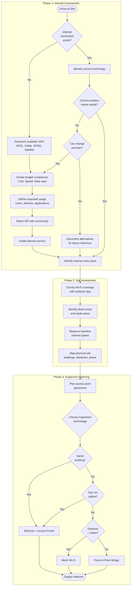
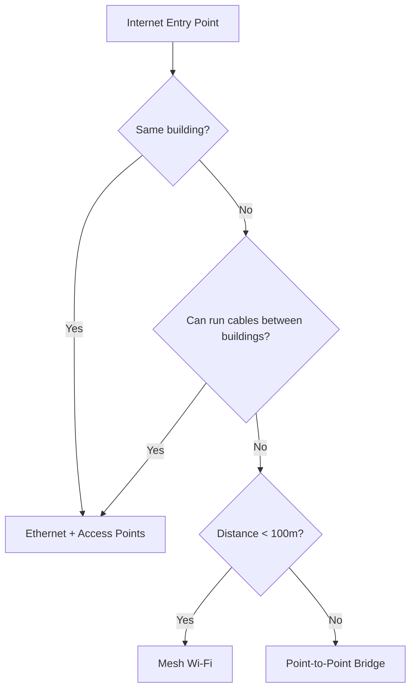

# Network Planning

This guide walks you through assessing a location for network deployment—whether starting from scratch or expanding an existing setup.

This guide implements the concept introduced in
[Chapter 2.2 — Expanding Coverage / Planning](../../2-Imaginary-Use-Case/2.2-Expanding-Coverage/2.2.1-Planning.md).

## What You'll Learn

- How to evaluate whether internet connectivity exists at your site
- Tools and techniques for surveying Wi-Fi coverage and identifying dead zones
- Methods for measuring baseline internet speed
- How to map your site and plan access point placement
- Decision criteria for choosing expansion technologies

## Prerequisites

- A smartphone or laptop with Wi-Fi capability
- Access to the physical site you want to assess
- Basic understanding of Wi-Fi signal strength concepts

---

## Step-by-Step Implementation

The following flowchart shows the complete network planning process from initial assessment to technology selection:

### 1. Determine your starting point

When you arrive at a site, you face one of two scenarios: either there is an existing internet connection, or there is none.

#### If there is no internet connection

1. Research internet service providers (ISPs) available in the area. Common options include:
    - ADSL
    - Cable Broadband
    - 4G/5G Mobile Router
    - Low Earth Orbit Satellites (e.g., Starlink)

2. Check the country's ISP websites for available plans and coverage maps.

3. For satellite coverage, check [Starlink's availability map](https://starlink.com/map).

4. Speak with local contacts to understand what connectivity options are commonly used in the area.

5. Create a budget comparison using the template below. Download and complete it for each ISP option:

    [:material-download: Download ISP Budget Comparison Template (CSV)](downloads/isp-budget-comparison.csv){ .md-button }

    The template guides you through three steps:

    1. **Define your usage profile** — Document expected users, primary applications, peak hours, and minimum requirements
    2. **Compare ISP offerings** — Fill in each provider's specifications side by side
    3. **Calculate weighted scores** — Rate each ISP against your requirements and calculate a total score

    | Criterion | Weight | Why it matters |
    |-----------|--------|----------------|
    | Meets download speed needs | 5 | Core functionality depends on this |
    | Within budget | 5 | Sustainability requires affordability |
    | No restrictive data cap | 4 | Unexpected overage fees disrupt operations |
    | Reliability reputation | 4 | Downtime affects all network users |
    | Meets upload speed needs | 3 | Important for video calls and file sharing |
    | Acceptable latency | 3 | Critical for real-time applications |
    | Local support available | 3 | Faster problem resolution |
    | No long-term contract | 2 | Flexibility to change if needs evolve |

!!! tip "Match the plan to the use case"
    Different network uses have vastly different bandwidth requirements. Before selecting a plan, define how many users will connect simultaneously, what applications they will use (web browsing, video streaming, file transfers), and during which hours peak usage will occur. This understanding drives the right choice.

6. Discuss the options with the community and select the most appropriate ISP.

#### If there is an existing internet connection

1. Identify the current technology in use (ADSL, Cable, 4G/5G, Satellite).

2. Perform the budget comparison exercise above to verify the current solution is optimal.

!!! info "Working with constraints"
    Sometimes the internet service is provided by a government entity or institution and cannot be changed. Even so, document the alternatives for future reference.

3. Locate the internet entry point—this is where your network planning begins.

---

### 2. Assess current Wi-Fi coverage

Before purchasing additional equipment, map out the existing coverage and physical environment.

#### Walk the site with a Wi-Fi analyzer

1. Install a Wi-Fi analyzer app on your smartphone or laptop:
    - **Linux**: LinSSID
    - **Android/iOS**: WiFiman, NetSpot

2. Walk through every area where you want network coverage.

3. Note the signal strength (in dBm) at each location. Record:
    - Strong signal areas (above -50 dBm)
    - Weak signal areas (-70 to -80 dBm)
    - Dead zones (below -80 dBm or no signal)

4. Check for interference from neighboring networks on the same channel.

{ width="600" }

The image above shows signal power dropping significantly when moving between rooms separated by thick walls.

{ width="600" }

This image shows how signal strength remains stable when there are no obstructions.

---

### 3. Measure baseline internet speed

Understanding your starting bandwidth is critical—expanding the network to more devices does not create more bandwidth.

1. Connect to the existing network.

2. Run a speed test using:
    - [Speedtest.net](https://speedtest.net)
    - [LibreSpeed](https://librespeed.org) (open source alternative)

3. Record the results:
    - Download speed (Mbps)
    - Upload speed (Mbps)
    - Latency/Ping (ms)

4. Run the test at different times of day to understand peak usage patterns.

{ width="600" }

---

### 4. Map the physical site

A visual map helps you measure distances, identify obstacles, and plan access point placement.

1. Use satellite imagery tools to get an overhead view:
    - Google Earth
    - OpenStreetMap

2. Alternatively, create a hand-drawn schema using tools like [draw.io](https://draw.io) or paper sketches.

3. Mark on your map:
    - The internet entry point (router/modem location)
    - Buildings and rooms requiring coverage
    - Distances between buildings
    - Obstacles (thick walls, metal structures, large trees)
    - Power outlet locations

{ width="600" }

{ width="600" }

!!! tip "Do this before arrival"
    You can prepare the satellite view mapping before traveling to the site. Then refine it on-site with actual measurements and observations.

---

### 5. Plan access point placement

Use the following guidelines when deciding where to place routers and access points:

| Guideline | Reason |
|-----------|--------|
| **Mount high** | Walls and ceilings allow signal to radiate downward; desks block signal |
| **Position centrally** | Signals radiate in all directions; central placement maximizes coverage |
| **Minimize wall crossings** | Every wall (especially concrete) weakens the signal |
| **Prioritize gathering spots** | Cover classrooms, meeting rooms, and courtyards first |

---

### 6. Choose your expansion technology

Based on your assessment, select the appropriate method to expand from the original access point:

#### Option A: Ethernet cabling + additional access points

- **Best for**: Expanding coverage within the same building or adjacent rooms
- **How it works**: Run Cat6 cable from the main router to new areas and connect additional Wi-Fi access points
- **Advantages**: Most reliable and fastest connection

#### Option B: Point-to-Point (PtP) wireless bridges

- **Best for**: Connecting separate buildings without digging cable trenches
- **How it works**: Mount directional antennas on each building, aimed at each other to create a wireless link
- **Advantages**: No physical cabling between buildings

#### Option C: Mesh Wi-Fi systems

- **Best for**: Indoor environments where running cables is impractical
- **How it works**: Multiple mesh nodes communicate wirelessly to extend coverage
- **Advantages**: Easy to deploy, self-configuring
- **Disadvantages**: Reduced overall speed compared to wired access points

---

## References

- [Starlink Coverage Map](https://starlink.com/map)
- [Speedtest by Ookla](https://speedtest.net)
- [LibreSpeed](https://librespeed.org)
- [LinSSID (Linux Wi-Fi Analyzer)](https://sourceforge.net/projects/linssid/)
- [WiFiman by Ubiquiti](https://wifiman.com)
- [draw.io (Diagramming)](https://draw.io)

---

## Revision History

| Date       | Version | Changes                | Author           | Contributors |
|------------|---------|------------------------|------------------|--------------|
| 2026-04-05 | 1.0     | Initial guide creation | Maria Jover        |              |
