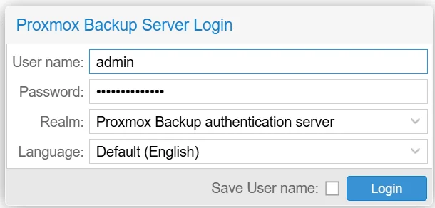
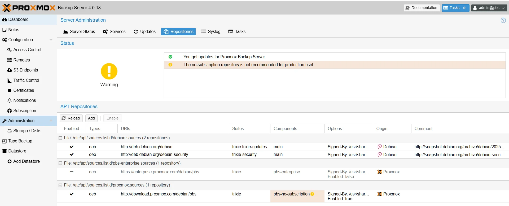
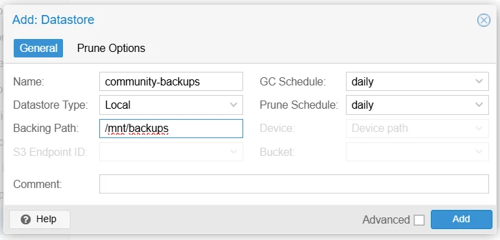
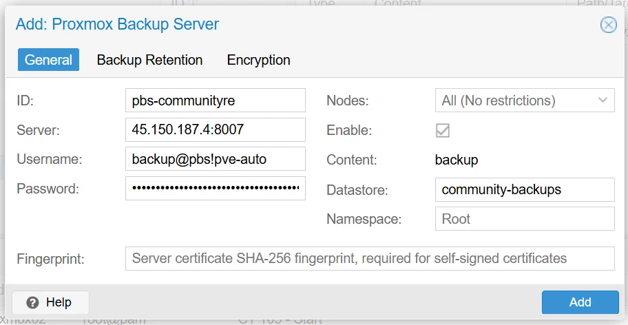
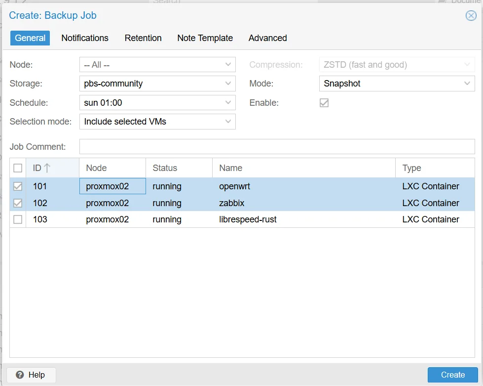

# Install and Configure Proxmox Backup Server

This guide covers installing Proxmox Backup Server (PBS), creating a datastore, connecting it to your Proxmox VE cluster, and scheduling automated backups.

This guide implements the concept introduced in
[Chapter 2 — Backups](../../2-Imaginary-Use-Case/2.16-Backups/index.md).

## What You'll Learn

- How to install PBS (dedicated hardware or as an LXC container)
- How to configure repositories and create a datastore
- How to create backup users and API tokens
- How to connect Proxmox VE to PBS
- How to schedule backup jobs and configure retention policies
- How to restore a VM or container from a backup

## Prerequisites

- A machine, VM, or LXC container to run PBS (separate from your Proxmox VE nodes) that meets the [system requirements](https://pbs.proxmox.com/docs/system-requirements.html)
- A dedicated disk or partition for backup storage (separate from the OS disk)
- Network connectivity between PBS and your Proxmox VE nodes
- Root access to both PBS and Proxmox VE

## Used Versions

| Software               | Version        |
|------------------------|----------------|
| Proxmox Backup Server  | 4.0.18         |
| Proxmox VE             | 9.1.2          |

## Step-by-Step Implementation

### 1. Install PBS

PBS can run on dedicated hardware or as a virtualized instance. Choose the approach that fits your resources:

- **Dedicated hardware (recommended for production):** Install PBS from the official ISO on a separate physical machine. This gives the best isolation — a Proxmox VE node failure won't take your backups down with it.
- **LXC container (good for small deployments):** Run PBS inside a container on a Proxmox node. Simpler to set up, but your backups live on the same infrastructure they protect. Make sure the backup disk is physically separate.

!!! info "System requirements"
    See oficial system requirements on [system requirements](https://pbs.proxmox.com/docs/system-requirements.html)

    - **CPU:** 4+ cores (more cores help with compression and checksumming during parallel backups)
    - **RAM:** 4 GiB minimum for the OS and PBS daemons, plus roughly 1 GiB per TiB of backup storage
    - **OS disk:** 32 GiB minimum, SSD preferred
    - **Backup disk:** as large as your retention policy demands — a good starting point is 2–3x the total size of all VMs and containers you plan to back up

#### Option A — Dedicated hardware (ISO install)

1. Download the latest **Proxmox Backup Server ISO** from the [Proxmox downloads page](https://www.proxmox.com/en/downloads/proxmox-backup-server).
2. Create a bootable USB drive using [Rufus](https://rufus.ie/), [Etcher](https://etcher.balena.io/), or `dd`:
    ```bash
    dd if=proxmox-backup-server_*.iso of=/dev/sdX bs=4M status=progress
    ```
3. Boot the target machine from the USB drive. Enter the BIOS if needed and set the USB as the first boot device.
4. The PBS installer will start. Click **Install Proxmox Backup Server**.
5. Select the **target disk** for the OS. All data on this disk will be erased.
6. Choose a filesystem:
    - **ext4** — simple, reliable, single-disk setups
    - **xfs** — good for large files and high throughput
    - **ZFS** — choose this if you have multiple disks and want software RAID
7. Set your **country, timezone, and keyboard layout**.
8. Set the **root password** and an **email address** for notifications.
9. Configure the **network**:
    - Use a **static IP address** (strongly recommended)
    - Set the correct hostname, gateway, and DNS server
10. Review the summary and click **Install**.
11. After installation completes, remove the USB drive and reboot.

#### Option B — LXC container

If you prefer not to dedicate a physical machine, you can run PBS inside an LXC container using a community helper script.

1. SSH into your Proxmox VE node.
2. Run the helper script:
    ```bash
    bash -c "$(wget -qLO - https://community-scripts.github.io/ProxmoxVE/scripts?id=proxmox-backup-server)"
    ```
3. Follow the prompts to configure the container (CPU, RAM, storage, network).
4. The script will create and start the container with PBS pre-installed.
5. Run the post-install script to optimize and configure the PBS container:
    ```bash
    bash -c "$(curl -fsSL https://raw.githubusercontent.com/community-scripts/ProxmoxVE/main/tools/pve/post-pbs-install.sh)"
    ```

!!! warning "Backup disk separation"
    Even when running PBS as a container, mount a **separate physical disk** as the datastore. Backing up to the same disk that hosts your VMs provides no protection against disk failure.

### 2. Access the web interface

1. Open a browser and navigate to:
    ```
    https://<PBS_IP>:8007
    ```
2. Accept the self-signed certificate warning.
3. Log in with:
    - **Username:** `admin`
    - **Password:** the root password set during installation
    - **Realm:** `Proxmox Backup authentication server`

{ width="600" }

### 3. Configure package repositories

!!! tip "Skip if using the LXC post-install script"
    If you deployed PBS as an LXC container and ran the `post-pbs-install.sh` script in the previous step, your repositories are likely already configured. In that case, you can safely skip ahead to **Step 4**.

By default, PBS is configured to use the enterprise repository, which requires a paid subscription. For community use, switch to the no-subscription repository.

1. In the PBS web UI, navigate to **Administration → Repositories**.
2. Select the **enterprise** repository and click **Disable**.
3. Click **Add** and select the **No-Subscription** repository.
4. Click **Add** to enable it.
5. Update the package index:
    ```bash
    apt update && apt dist-upgrade -y
    ```

    !!! warning "Fixing missing GPG keys"
        If you get a key error such as `Failed to parse keyring "/usr/share/keyrings/proxmox-archive-keyring.gpg"` during the update step, explicitly download the Proxmox key first:
        ```bash
        wget https://enterprise.proxmox.com/debian/proxmox-release-trixie.gpg -O /usr/share/keyrings/proxmox-archive-keyring.gpg
        ```

{ width="600" }

### 4. Create a datastore

<!-- TODO: Test -->

A datastore is where PBS stores all backup data. It should point to a dedicated disk or mount point separate from the OS.

1. If your backup disk is not yet mounted, format and mount it:
    ```bash
    mkfs.ext4 /dev/sdb
    mkdir -p /mnt/backups
    mount /dev/sdb /mnt/backups
    ```
    Add it to `/etc/fstab` so it mounts on boot:
    ```bash
    echo '/dev/sdb /mnt/backups ext4 defaults 0 2' >> /etc/fstab
    ```
2. In the PBS web UI, navigate to **Datastore → Add Datastore**.
3. Fill in:
    - **Name:** e.g., `community-backups`
    - **Backing Path:** `/mnt/backups`
4. Click **Add**.

{ width="600" }

### 5. Create a backup user and API token

Avoid using the root account for automated backups. Create a dedicated user and API token.

**Create the user:**

1. Navigate to **Configuration → Access Control → User Management**.
2. Click **Add**.
3. Set:
    - **User ID:** `backup`
    - **Password:** a strong password
4. Click **Add**.

**Assign permissions:**

5. Navigate to **Configuration → Access Control → Permissions**.
6. Click **Add → User Permission**.
7. Set:
    - **Path:** `/datastore/community-backups` (or your datastore name)
    - **User:** `backup@pbs`
    - **Role:** `DatastoreBackup`
8. Click **Add**.

**Create an API token:**

9. Navigate to **Configuration → Access Control → API Token**.
10. Click **Add**.
11. Set:
    - **User:** `backup@pbs`
    - **Token Name:** e.g., `pve-auto`
12. Click **Add**.
13. **Copy the token secret immediately** — it is shown only once.

**Assign permissions to the API token:**

14. Navigate to **Configuration → Access Control → Permissions**.
15. Click **Add → API Token Permission**.
16. Set:
    - **Path:** `/datastore/community-backups` (or your datastore name)
    - **API Token:** `backup@pbs!pve-auto`
    - **Role:** `DatastoreBackup`
17. Click **Add**.

### 6. Connect Proxmox VE to PBS

On your Proxmox VE node, add the PBS as a storage backend.

1. Open the Proxmox VE web UI.
2. Navigate to **Datacenter → Storage → Add → Proxmox Backup Server**.
3. Fill in:
    - **ID:** e.g., `pbs-community`
    - **Server:** the PBS IP address
    - **Datastore:** `community-backups` (must match the datastore name on PBS)
    - **Username:** `backup@pbs!pve-auto` (user + token ID)
    - **Password:** paste the API token secret
    - **Fingerprint:** find this on the PBS web UI by navigating to **Datastore → [Your Datastore] → Show Connection Information**
4. Click **Add**.

{ width="600" }

!!! warning "Error: Cannot find datastore, check permissions and existence"
    This error from PVE usually has one of these causes:

    1. **Missing API token permission** — adding a User Permission for `backup@pbs` is not enough. You must also add an **API Token Permission** for `backup@pbs!pve-auto` on the datastore path (see Step 5, sub-steps 14–17).
    2. **Datastore name mismatch** — the name in the **Datastore** field must match exactly what is configured on PBS, including case. Verify it in the PBS web UI under **Datastore**.

### 7. Schedule backup jobs

<!-- TODO: Verify if the bkp at the school was created -->

1. In the Proxmox VE web UI, navigate to **Datacenter → Backup → Add**.
2. Configure the job:
    - **Storage:** select your PBS storage (e.g., `pbs-community`)
    - **Schedule:** e.g., daily at 02:00
    - **Selection mode:** choose **All** to back up everything, or **Include selected VMs** to pick specific ones
    - **Mode:** `Snapshot` (recommended — backs up VMs without stopping them)
    - **Compression:** `ZSTD` (good balance of speed and compression ratio)
3. Click **Create**.

{ width="600" }

!!! info "Backup modes"
    - **Snapshot:** backs up the VM while it's running (requires QEMU guest agent for consistency)
    - **Suspend:** briefly pauses the VM during backup for a consistent state
    - **Stop:** shuts down the VM, backs it up, then restarts it — most consistent but causes downtime

### 8. Verify and restore from backups

<!-- TODO: Verify if it works -->

Always test that you can restore from a backup. A backup you've never tested is a backup you can't trust.

**Verify a backup:**

1. In the Proxmox VE web UI, select a VM or container.
2. Go to **Backup**.
3. Select a backup entry and click **Show Log** to confirm it completed without errors.

**Restore a backup:**

1. Navigate to **Datacenter → Storage → pbs-community → Content**.
2. Select the backup you want to restore.
3. Click **Restore**.
4. Choose the target node and storage for the restored VM/container.
5. Optionally change the VM ID to avoid conflicts with the original.
6. Click **Restore** and wait for completion.

!!! tip "Restore to a different ID"
    If the original VM is still running, restore the backup with a different VM ID. This lets you verify the backup without affecting the production service.

### 9. Configure pruning and garbage collection

Over time, backups accumulate. Pruning removes old backups based on your retention policy. Garbage collection reclaims disk space from deduplicated chunks that are no longer referenced.

!!! info "Retention policy"
    You can configure retention on the datastore (applies to all backups) or per backup job in PVE (overrides the datastore policy for that job). The values below are a reasonable starting point — adjust based on your available disk space.

**Set up pruning:**

1. In the PBS web UI, navigate to **Datastore → community-backups → Prune & GC**.
2. Set the retention policy:
    - **Keep Last:** 3
    - **Keep Daily:** 7
    - **Keep Weekly:** 4
    - **Keep Monthly:** 3
3. Set the schedule (e.g., daily).
4. Click **Save**.

**Garbage collection runs automatically** after pruning. You can also trigger it manually from the same page.

!!! warning "Monitor disk usage"
    Deduplication means disk usage doesn't scale linearly with backup count, but it still grows. Check the datastore usage regularly under **Datastore → Summary** and adjust retention or add storage before running out of space.


## Revision History

| Date       | Version | Changes                | Author | Contributors |
|------------|---------|------------------------|--------|--------------|
| 2026-04-02 | 1.0     | Initial guide creation | Jaime Motje    | Sergio Giménez              |
