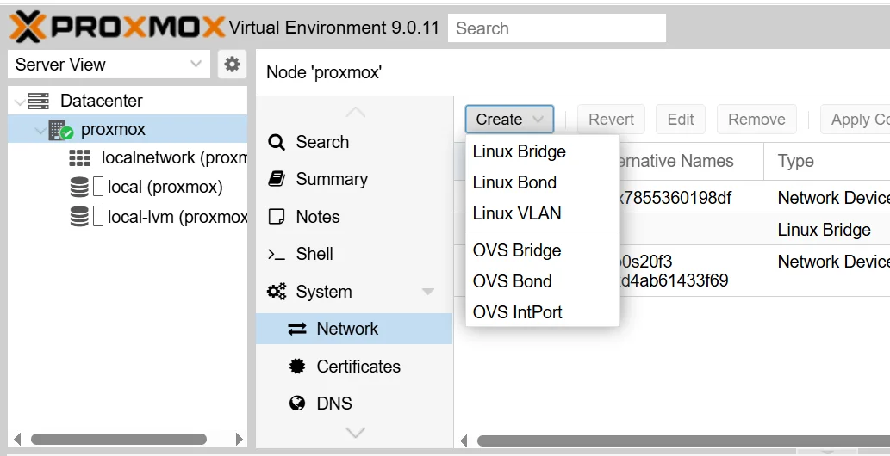
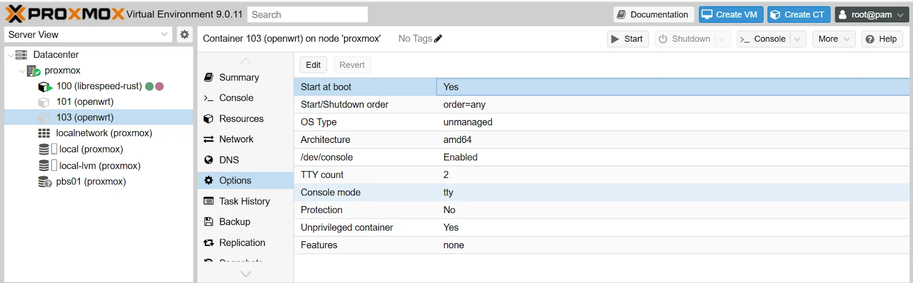

# Run OpenWrt as an LXC Container in Proxmox

This guide covers how to deploy an OpenWrt router inside a lightweight LXC container on Proxmox VE, giving you a fully functional virtual router for your community network infrastructure.

This guide implements the concept introduced in
[Chapter 2.12 --- Virtualization](../../2-Imaginary-Use-Case/2.12-Virtualization/index.md).

## What You'll Learn

- How to create an isolated Linux bridge in Proxmox for internal LAN traffic
- How to download the OpenWrt rootfs image from the Linux Containers image server
- How to create and configure an LXC container running OpenWrt
- How to enable TUN device passthrough for VPN support
- How to access the OpenWrt web interface (LuCI) from your management network

## Prerequisites

- Proxmox VE server with web UI access
- Basic familiarity with the Proxmox shell and `pct` commands
- Internet access on the Proxmox host

!!! info "Resource requirements"
    The OpenWrt LXC container is extremely lightweight: roughly **8 MB of RAM** and **21 MB of disk** in use. You can safely allocate 64--512 MB of RAM; even 64 MB is enough for basic routing. Increase the allocation if you plan to run many packages or a complex firewall configuration.

## Used Versions

| Software    | Version                |
|-------------|------------------------|
| Proxmox VE  | 9.1.2             |
| OpenWrt     | 25.12 (rootfs from Linux Containers) |

## Step-by-Step Implementation

### 1. Create a Linux bridge for the internal LAN

!!! info "What is a bridge in Proxmox?"
    A bridge acts as a virtual network switch. You need a dedicated bridge for the OpenWrt container's internal LAN side so that other VMs and containers on the same host can connect to it as clients.

1. In the Proxmox web UI, go to **Datacenter → your node → System → Network**.
2. Click **Create → Linux Bridge**.
    - **Name:** `vmbr1` (or any unused `vmbrN` name).
    - **Bridge ports:** leave blank — this keeps the bridge isolated (internal only). The OpenWrt container will provide DHCP and NAT on this bridge.
3. Click **Create**, then **Apply Configuration**.

{ width="600" }

!!! info "Physical NIC attachment"
    If you want the bridge to carry traffic to a physical LAN segment, add a physical NIC name (e.g., `enp2s0`) in the **Bridge ports** field. This guide assumes a purely virtual internal LAN.

### 2. Download the OpenWrt rootfs

1. Open a shell on the Proxmox host (web UI console or SSH).
2. Browse <https://images.linuxcontainers.org/images/openwrt/> and locate the OpenWrt version you want. Choose the same version running on your physical routers, or pick the latest available.
3. Navigate into `amd64/default/` for that version. Copy the full URL of the `rootfs.tar.xz` file.
4. Download it on the Proxmox host:

```bash
wget https://images.linuxcontainers.org/images/openwrt/25.12/amd64/default/<BUILDDATE>/rootfs.tar.xz
```

!!! info "Build date in the URL"
    The URL contains a build date directory (e.g., `20260317_11:57`) that changes with each rebuild. Visit the image server in your browser, find the current date string, and copy the direct link.

### 3. Create the LXC container

Run the following `pct create` command (replace `101` with any free container ID):

```bash
pct create 101 ./rootfs.tar.xz \
  --unprivileged 1 \
  --ostype unmanaged \
  --hostname openwrt \
  --features nesting=1 \
  --net0 name=eth0,bridge=vmbr0 \
  --net1 name=eth1,bridge=vmbr1 \
  --rootfs local-lvm:4 \
  --storage local-lvm
```

- `--net0` on `vmbr0` is the WAN / management interface.
- `--net1` on `vmbr1` is the internal LAN interface (the bridge from step 1).
- Adjust `--rootfs` size and storage name to match your environment.

!!! info "What the other flags do"

    | Flag | Purpose |
    |------|---------|
    | `--unprivileged 1` | Runs without root-level host privileges. Recommended for third-party rootfs images. |
    | `--ostype unmanaged` | Skips OS-specific setup. Required because OpenWrt is not a standard distribution template. |
    | `--features nesting=1` | Enables nesting support. **Required** for `dnsmasq` to start correctly inside the container. |

The output will end with a warning about architecture detection — this is normal:

```
Architecture detection failed: error in setup task (eval)
Falling back to amd64.
TASK OK
```

!!! info "Why the warning?"
    Proxmox cannot identify the OS inside the OpenWrt rootfs, so it falls back to `amd64`. The container works correctly despite this message.

### 4. Enable TUN device passthrough

VPN services (WireGuard, OpenVPN) need access to the host's `/dev/net/tun` device.

1. Open the container config file on the Proxmox host:

    ```bash
    nano /etc/pve/lxc/101.conf
    ```

2. Add these two lines at the end:

    ```
    lxc.cgroup2.devices.allow: c 10:200 rwm
    lxc.mount.entry: /dev/net dev/net none bind,create=dir
    ```

3. Save the file, then start the container:

    ```bash
    pct start 101
    ```

!!! info "What these lines do"
    - `c 10:200 rwm` grants the container read/write/mknod access to the TUN character device (major 10, minor 200).
    - The mount entry bind-mounts the host's `/dev/net` directory into the container so it can see `/dev/net/tun`.

### 5. Access the container and enable LuCI

1. Enter the container console:

    ```bash
    pct enter 101
    ```

2. Edit `/etc/config/firewall` to allow HTTP on the WAN interface (LuCI only listens on LAN by default):

    ```bash
    vi /etc/config/firewall
    ```

3. Add this rule block at the end of the file:

    ```
    config rule
    	option src      wan
    	option proto    tcp
    	option dest_port 80
    	option target   ACCEPT
    ```

4. Restart the firewall:

    ```bash
    /etc/init.d/firewall restart
    ```

5. Open a browser and go to `http://<openwrt_eth0_ip>`. Log in with username `root` and no password.

!!! tip "Finding the container IP"
    Run `ifconfig` inside the container console, or check the Proxmox web UI under the container's **Network** tab.

!!! tip "Using vi"
    `vi` is the only text editor inside the OpenWrt image. Press `i` to enter insert mode, make your changes, press `Esc`, then type `:wq` and `Enter` to save and quit.

!!! warning "LuCI on the WAN interface"
    Exposing LuCI on the WAN-facing interface is acceptable only in trusted management networks (such as your Proxmox host's internal bridge). In production, restrict access by IP or use SSH tunneling instead.

### 6. Enable start at boot

1. In the Proxmox web UI, select the container.
2. Go to **Options**.
3. Set **Start at boot** to **Yes**.

{ width="600" }

## Troubleshooting

**Cannot create TUN interface / VPN fails to start**
:   Double-check the two lines you added to `/etc/pve/lxc/<id>.conf`. A small typo (extra slash, wrong device numbers) will prevent the container from seeing `/dev/net/tun`. Verify the device exists on the host with `ls -l /dev/net/tun`.

**LuCI is unreachable from the browser**
:   Confirm the firewall rule for port 80 is present in `/etc/config/firewall` and that you restarted the firewall service. As a fallback, access the container via `pct enter <id>` from the Proxmox shell.

**Permission errors inside the container**
:   If you see permission-denied errors when accessing devices, confirm that `/dev/net/tun` exists on the Proxmox host and that the LXC config contains both the `cgroup2` allow line and the mount entry. Also verify the container was created with `--unprivileged 1`.

**dnsmasq fails to start**
:   This typically means the container was created without `--features nesting=1`. You can add it after creation with `pct set 101 --features nesting=1`, then restart the container.

## References

- YouTube tutorial: "Must-Have OpenWrt Router Setup For Your Proxmox" -- <https://www.youtube.com/watch?v=3mPbrunpjpk>

## Revision History

| Date       | Version | Changes                | Author       | Contributors                   |
|------------|---------|------------------------|--------------|--------------------------------|
| 2026-03-31 | 1.0     | Initial guide creation | Jaime Motje  | Maria Jover, Sergio Gimenez   |
