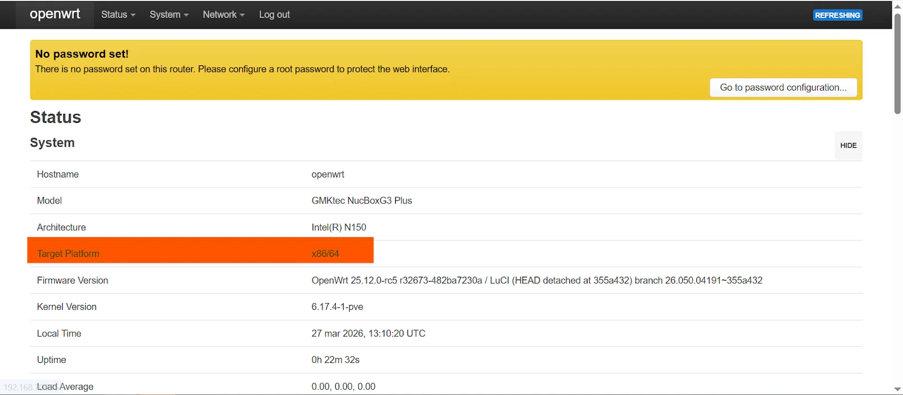
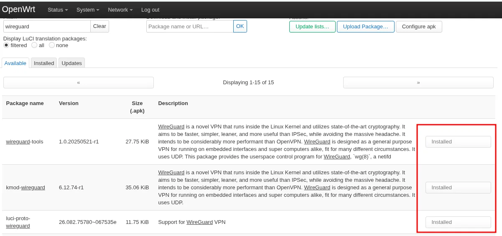
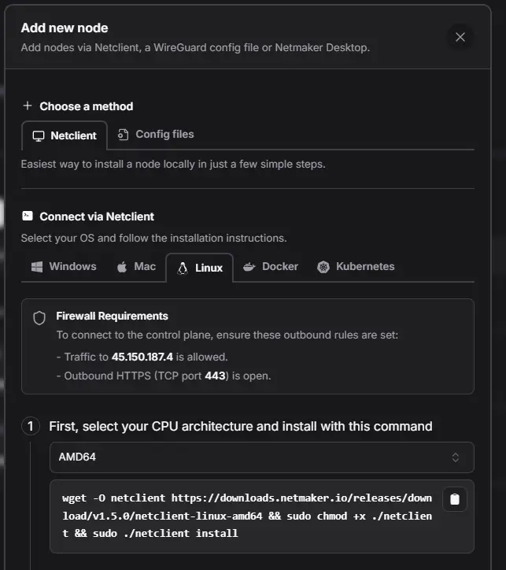
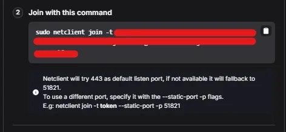
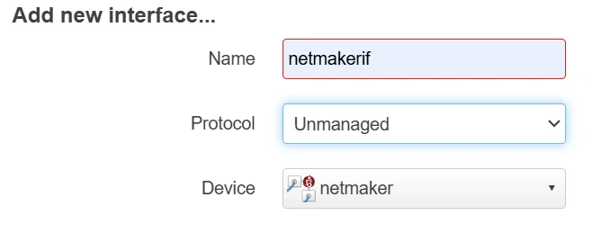
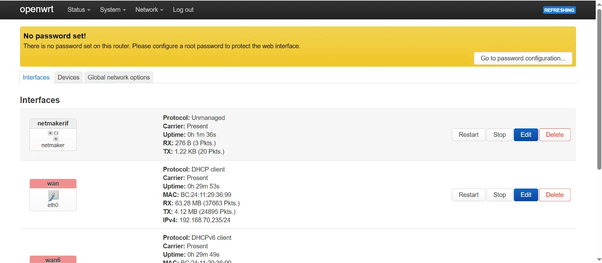
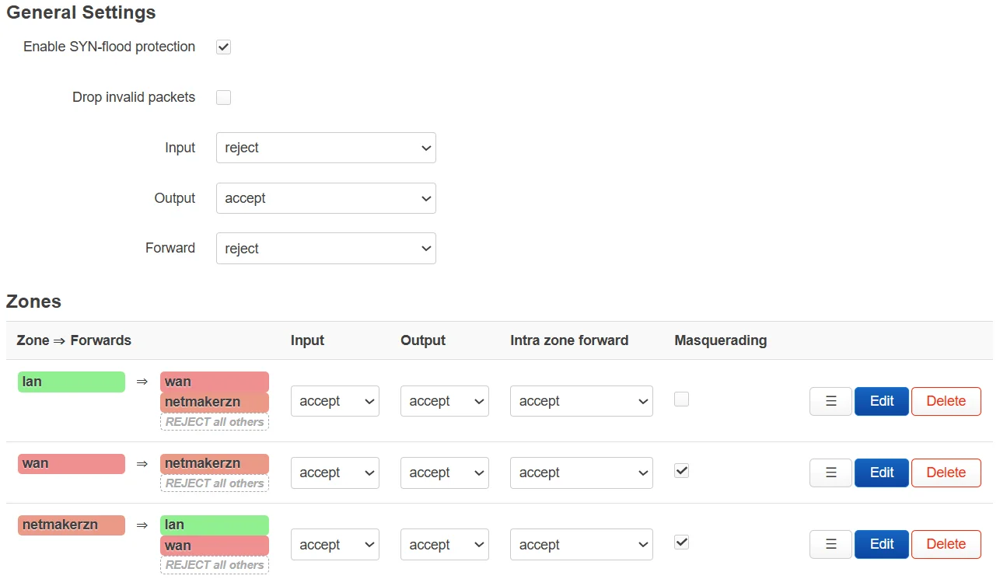
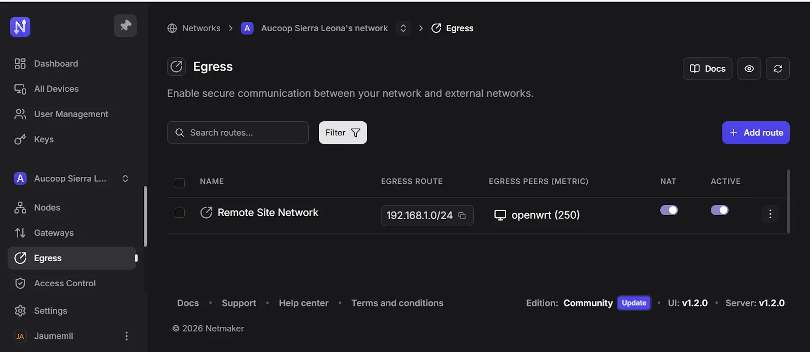

# Install Netclient on OpenWrt

This guide covers how to install and integrate the Netmaker Netclient on an OpenWrt router so it joins your Netmaker VPN network and can route traffic between the VPN and your local LAN.

This guide implements the concept introduced in
[Chapter 2 -- Remote Access](../../2-Imaginary-Use-Case/2.7-Remote-Access/index.md).

## What You'll Learn

- How to install WireGuard on OpenWrt as a prerequisite for Netclient
- How to install and run Netclient on an OpenWrt device (any supported architecture)
- How to register the VPN interface and configure firewall zones in LuCI
- How to set up egress routing so VPN nodes can reach your LAN

## Prerequisites

- An OpenWrt device (x86_64, ARM64, ARMv7, or MIPS -- see the architecture table in Step 2)
- A Netmaker server already deployed and reachable (see [Install Netmaker on a VPS](Netmaker-VPS.md))
- SSH access to the OpenWrt device
- A network already created on your Netmaker server

## Used Versions

| Software  | Version |
|-----------|---------|
| OpenWrt   | 25.10.x |
| Netmaker  | v1.5.0 (Community Edition) |
| Netclient | v1.5.0 |

## Step-by-Step Implementation

### 0. Identify your OpenWrt version and architecture

1. Open the OpenWrt LuCI web interface.
2. Go to **Status --> Overview** and note the **Architecture** field (e.g., `x86_64`, `aarch64`, `arm`, `mipsel`) and the **Firmware Version**. You will need the architecture in Step 2 to download the correct Netclient binary.

{ width="600" }

Alternatively, from SSH:

```bash
uname -m
```

### 1. Install WireGuard

1. SSH into your OpenWrt device.
2. Update the package index and install the required WireGuard packages:

    ```bash
    apk update
    apk add kmod-wireguard wireguard-tools luci-proto-wireguard
    ```

3. Reboot the device to load the WireGuard kernel module:

    ```bash
    reboot
    ```

!!! warning "Older OpenWrt versions (before 25.x)"
    If your device runs OpenWrt 24.x or earlier, use `opkg` instead of `apk`:

    ```bash
    opkg update
    opkg install kmod-wireguard wireguard-tools luci-proto-wireguard
    ```

Alternatively, you can install WireGuard from the LuCI web interface:

{ width="600" }

### 2. Install Netclient

1. SSH into the OpenWrt device (after reboot).
2. Find the correct binary name for your architecture:

    | OpenWrt Architecture (`uname -m`) | Netclient binary              |
    |-----------------------------------|-------------------------------|
    | `x86_64`                          | `netclient-linux-amd64`       |
    | `aarch64`                         | `netclient-linux-arm64`       |
    | `armv7l`                          | `netclient-linux-armv7`       |
    | `mips`                            | `netclient-linux-mips`        |
    | `mipsel`                          | `netclient-linux-mipsle`      |

3. Download and install Netclient, replacing the binary name if needed. Example for **x86_64**:

    ```bash
    wget -O netclient https://downloads.netmaker.io/releases/download/v1.5.0/netclient-linux-amd64 && chmod +x ./netclient && ./netclient install
    ```

    For **ARM64** (e.g., Raspberry Pi 4, modern ARM routers):

    ```bash
    wget -O netclient https://downloads.netmaker.io/releases/download/v1.5.0/netclient-linux-arm64 && chmod +x ./netclient && ./netclient install
    ```

!!! warning "Version compatibility"
    Netclient versions 1.2.0 and 1.4.0 cannot be installed directly on OpenWrt.

!!! info "Where to find the install command"
    The install command is also shown in the Netmaker dashboard under **Nodes --> Add Devices**. Select the **Netclient** tab, choose **Linux**, and pick your CPU architecture. Remember to remove `sudo` since OpenWrt runs as root by default.

{ width="600" }

### 3. Join your Netmaker network

1. In the Netmaker dashboard, go to **Nodes --> Add Devices**.
2. Copy the join token shown in step 2 of the dialog.
3. On the OpenWrt device, run the join command replacing `<TOKEN>` with your actual token:

    ```bash
    netclient join -t <TOKEN>
    ```

4. Verify the WireGuard interface was created:

    ```bash
    wg show
    ```

    If successful, a new WireGuard interface (usually `nm-*` or `netmaker`) will appear.

{ width="600" }

### 4. Enable auto-start on boot

1. Create a procd init script so Netclient starts automatically:

    ```bash
    cat << 'EOF' > /etc/init.d/netclient
    #!/bin/sh /etc/rc.common
    START=95
    USE_PROCD=1

    start_service() {
        procd_open_instance
        procd_set_param command /sbin/netclient daemon
        procd_set_param respawn
        procd_close_instance
    }
    EOF
    ```

2. Make it executable and enable it:

    ```bash
    chmod +x /etc/init.d/netclient
    /etc/init.d/netclient enable
    /etc/init.d/netclient start
    ```

!!! info "What is procd?"
    `procd` is OpenWrt's process management daemon -- the equivalent of `systemd` on standard Linux distributions, but lighter and designed for embedded devices. The `respawn` parameter ensures the daemon restarts automatically if it crashes.

### 5. Register the WireGuard interface in LuCI

1. Open the LuCI web interface.
2. Navigate to **Network --> Interfaces --> Add new interface**.
3. Fill in the fields:
    - **Name**: `netmakerif` (or any name you prefer)
    - **Protocol**: `Unmanaged`
    - **Device**: select the interface created by Netclient (`netmaker`, `nm-*`, etc.)

    { width="600" }

4. Click **Create Interface**.
5. Click **Save & Apply**.

{ width="600" }

### 6. Create a firewall zone for Netmaker

1. Navigate to **Network --> Firewall --> Zones**.
2. Click **Add** to create a new zone with these settings:

    | Field            | Value           |
    |------------------|-----------------|
    | Name             | `netmakerzn`    |
    | Input            | ACCEPT          |
    | Output           | ACCEPT          |
    | Forward          | ACCEPT          |
    | Masquerading     | ON              |
    | MSS Clamping     | ON              |
    | Covered Networks | `netmakerif`    |

3. Configure inter-zone forwarding:
    - **Allow forward to destination zones**: `LAN`
    - **Allow forward from source zones**: `LAN`

4. Click **Save & Apply**.

{ width="600" }

!!! tip "Forwarding rules by use case"

    | If you want...                             | Forwarding rules                                            |
    |--------------------------------------------|-------------------------------------------------------------|
    | Only the router itself to use Netmaker      | No extra changes needed                                     |
    | LAN devices to use the VPN (site-to-site)   | Allow `LAN` --> `netmakerzn` and `netmakerzn` --> `LAN`     |
    | Router to act as a VPN exit node            | Allow `netmakerzn` --> `WAN`                                |

### 7. Set up remote access port forwarding

Only needed if other VPN nodes must reach your LAN through this router from the internet.

1. Navigate to **Network --> Firewall --> Port Forwards**.
2. Click **Add** and configure:

    | Setting          | Value                                      |
    |------------------|--------------------------------------------|
    | Name             | `netmaker-remote-access`                   |
    | Protocol         | UDP/TCP                                    |
    | Source Zone      | WAN                                        |
    | External Port    | `51821` (or the port shown in Netmaker UI) |
    | Destination Zone | `netmakerzn`                               |
    | Internal IP      | The Netmaker VPN IP of this OpenWrt node   |
    | Internal Port    | Same port (e.g., `51821`)                  |

3. Click **Save & Apply**.

### 8. Add an egress route in Netmaker

1. Open the Netmaker dashboard.
2. Go to the **Egress** menu in your network.
3. Click **Add Route**.
4. Set the destination address to your LAN subnet (e.g., `192.168.1.0/24`).
5. Select the OpenWrt node as the gateway.
6. Enable **NAT**.
7. Save the changes and apply the configuration.

{ width="600" }

!!! tip
    Reboot the OpenWrt device after completing all the configuration steps to ensure all interfaces and routes are loaded correctly.

## References

- Netmaker OpenWrt integration guide -- <https://help.netmaker.io/en/articles/9773942-making-openwrt-successfully-integrate-with-the-netmaker-network>
- Netmaker Netclient on OpenWrt how-to -- <https://learn.netmaker.io/how-to-guides/how-to-run-netclient-on-openwrt>


## Revision History

| Date       | Version | Changes                | Author           | Contributors                |
|------------|---------|------------------------|------------------|-----------------------------|
| 2026-03-31 | 1.0     | Initial guide creation | Jaime Motje      | Maria Jover, Sergio Gimenez |
