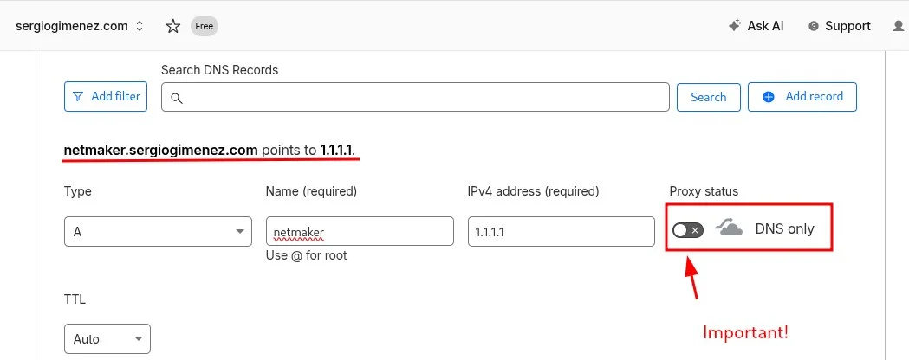
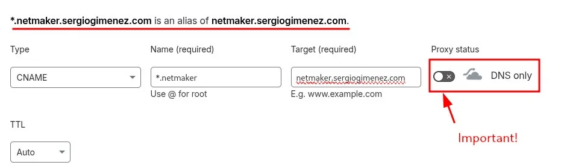
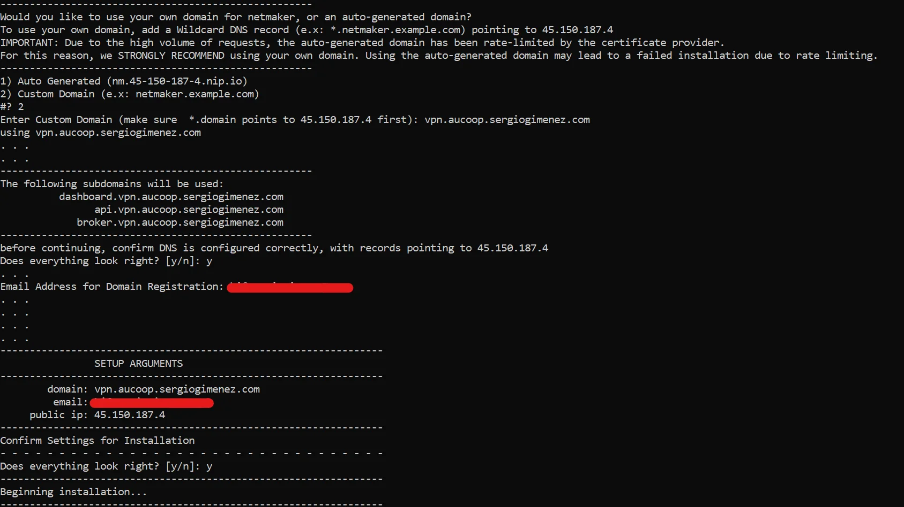
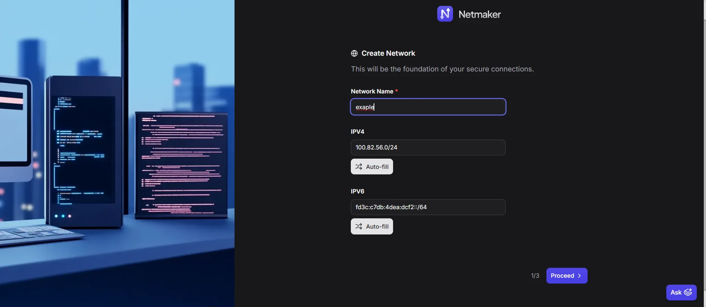

# Install Netmaker on a VPS

This guide covers how to deploy a Netmaker server on a Virtual Private Server (VPS) to create and manage WireGuard-based virtual networks for your community network.

!!! info "VPS already set up?" 
    Multiple VPNs can be configured on the same Netmaker server. Could it be that your network administration is already running a Netmaker instance? If so, you can skip this guide and jump to the next one on enrolling client nodes. **Ask your network administrator if you're not sure!**

<!-- TODO: Add Ch2 cross-link once the corresponding Chapter 2 story for VPN/Remote Access is written -->

## What You'll Learn

- How to choose and prepare a VPS for Netmaker
- How to configure DNS with wildcard records for Netmaker services
- How to run the Netmaker quick install script
- How to create an admin user and your first virtual network
- How to avoid common pitfalls with Cloudflare proxying and Oracle Cloud

## Prerequisites

- A VPS with a public static IP address. Recomended OS: Debian 12 or Ubuntu 22.04.
- A domain name you own, with access to its DNS management (Cloudflare recommended)
- SSH access to the VPS
- Basic familiarity with the Linux command line

## Used Versions

| Software  | Version |
|-----------|---------|
| Debian    | GNU/Linux 13.2 |
| Netmaker  | v1.5.0 (Community Edition) |

## Step-by-Step Implementation

### 1. Choose a VPS provider

Netmaker runs on most cloud providers. The minimum and recommended system resources are:

| Resource | Minimum | Recommended (production) |
|----------|---------|--------------------------|
| RAM      | 1 GB    | 2 GB                     |
| CPU      | 1 core  | 2 cores                  |
| Storage  | 2 GB    | 10 GB                    |

**Recommended provider:** IONOS offers good value for small community deployments. Other solid choices include DigitalOcean, Linode, KeepSec, AWS, Azure, and GCP.

!!! warning "Avoid Oracle Cloud"
    Oracle Cloud has known issues with network configuration that can interfere with Netmaker. If you already have an Oracle Cloud instance, expect extra troubleshooting around firewall and routing rules. We recommend choosing a different provider.

!!! tip "Dedicated environment"
    For optimal performance and easier troubleshooting, run Netmaker on a dedicated VPS rather than sharing it with other services.

### 2. Configure your domain and DNS

Netmaker runs several services (API server, dashboard UI, MQTT broker) that each need a publicly resolvable hostname. The simplest approach is to create a **wildcard DNS record** that covers all Netmaker subdomains at once.

**What you need:**

- A domain you own (e.g., `example.com`)
- A subdomain you designate for Netmaker (e.g., `netmaker.example.com`)
- A wildcard record pointing `*.netmaker.example.com` to your VPS public IP

This single wildcard record will automatically resolve addresses like `dashboard.netmaker.example.com`, `api.netmaker.example.com`, and `broker.netmaker.example.com` to your server.

#### 2a. Create a subdomain A record

In your DNS provider (Cloudflare is recommended), create an **A record** for `netmaker.example.com` pointing to your VPS public IP address.

{ width="600" }

#### 2b. Create a wildcard A record

Create a second **A record** with the name `*.netmaker.example.com` pointing to the same VPS public IP address.

{ width="600" }

!!! warning "Disable Cloudflare proxying"
    If you use Cloudflare, make sure the **proxy toggle is set to "DNS only"** (grey cloud icon) for both records. Cloudflare's HTTP proxying interferes with Netmaker's MQTT broker, which relies on direct TCP/UDP connections. Netmaker does not provide guidance for resolving Cloudflare proxy issues, so the safest path is to keep proxying disabled.

### 3. Open the required firewall ports

Before running the installation script, ensure your VPS firewall allows the following traffic:

| Port(s)       | Protocol | Purpose                                      |
|---------------|----------|----------------------------------------------|
| 80            | TCP      | HTTP (Caddy automatic TLS certificate renewal) |
| 443           | TCP/UDP  | HTTPS for dashboard, API, MQTT; WireGuard traffic |
| 51821-51830   | UDP      | WireGuard peer communication (one port per network) |

**Access your VPS** via SSH and open these ports in the firewall. 

We recommend using `ufw` to manage firewall rules on Debian/Ubuntu. Install `ufw` if it's not already available:

```bash
sudo apt update
sudo apt install ufw
```

Then allow the required ports:

```bash
sudo ufw allow 80/tcp
sudo ufw allow 443
sudo ufw allow 51821:51830/udp
sudo ufw reload
```

Also ensure IP forwarding is enabled:

```bash
sudo iptables --policy FORWARD ACCEPT
```

!!! tip
    The range 51821-51830 allows up to 10 networks. If you plan to create more, expand the range accordingly.

### 4. Run the Netmaker quick install script

SSH into your VPS and execute the following command. This downloads and runs the official Netmaker installation script, which sets up all required components (Netmaker server, Caddy reverse proxy, MQTT broker, and the WireGuard interface) using Docker containers.

```bash
sudo wget -qO /root/nm-quick.sh https://raw.githubusercontent.com/gravitl/netmaker/master/scripts/nm-quick.sh && sudo chmod +x /root/nm-quick.sh && sudo /root/nm-quick.sh
```

The script will prompt you interactively. When asked about the domain, select the option to use your **custom domain** and enter the base domain you configured (e.g., `netmaker.example.com`).

When the script finishes, it will display the dashboard URL and initial credentials.

{ width="600" }

!!! tip "Save the output"
    Copy the script output somewhere safe. It contains your dashboard URL, admin credentials, and the master key. You will need these to log in and to enroll client nodes later.

### 5. Create an admin user

Open a browser and navigate to the dashboard URL shown in the script output (e.g., `https://dashboard.netmaker.example.com`).

Log in with the credentials displayed by the installation script and create your admin user when prompted.

### 6. Create your first network

Once logged in to the Netmaker dashboard:

1. Click **Create Network**.
2. Add a name for your network. You can auto-fill the rest of the fields or customize them as needed. The IPV4/6 that you are asked to fill are the ones that your netmaker network will use.
3. Click **Create** to proceed with the defaults.

{ width="600" }

You can skip the **Egress** configuration for now. Egress gateways allow nodes in the Netmaker network to reach external subnets (e.g., your community network's LAN). You can configure this later once you have client nodes enrolled.

At this point your Netmaker server is running and ready to accept client connections.

Now you can proceed to the next guide on enrolling client nodes to start building your VPN network!

!!! tip "Next step"
    Ready to connect your first node? Follow the [Install Netclient on OpenWrt](Netclient-OpenWrt.md) guide to enroll an OpenWrt router into your Netmaker network.

## References

- Netmaker Quick Install documentation -- <https://docs.netmaker.io/docs/server-installation/quick-install>
- Netmaker Getting Started walkthrough -- <https://learn.netmaker.io/getting-started/quick-start/platform-installation>
- YouTube walkthrough: Netmaker VPS installation -- <https://www.youtube.com/watch?v=BpU5mMsek00>

## Revision History

| Date       | Version | Changes                | Author           | Contributors                |
|------------|---------|------------------------|------------------|-----------------------------|
| 2026-03-31 | 1.0     | Initial guide creation | Jaime Motje      | Maria Jover, Sergio Giménez |
