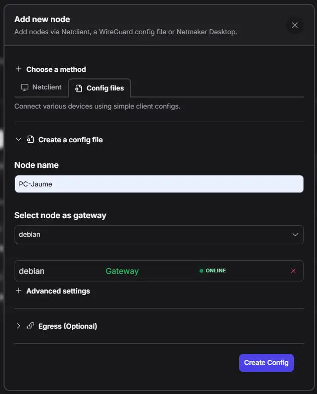
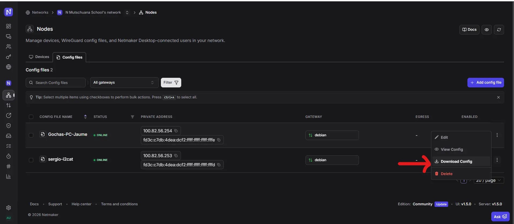
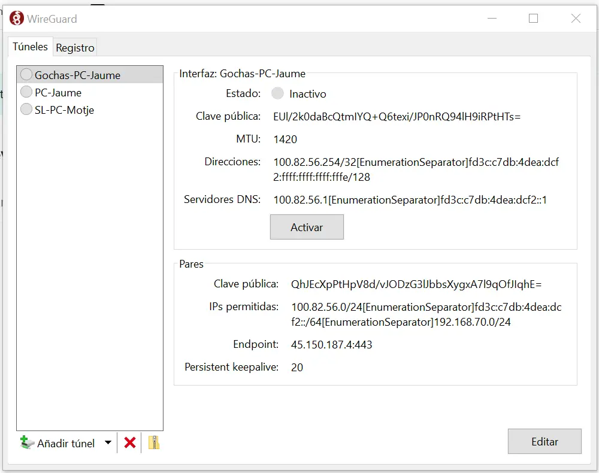

# Add a Device via WireGuard Config File

This guide covers how to add any device to your Netmaker VPN network by generating a WireGuard configuration file from the Netmaker dashboard and importing it on the client device.

This guide implements the concept introduced in
[Chapter 2 -- Remote Access](../../2-Imaginary-Use-Case/2.7-Remote-Access/index.md).

## What You'll Learn

- How to generate a WireGuard config file from the Netmaker dashboard
- How to import the config on Linux, Windows, macOS, or mobile devices
- How to verify the VPN tunnel is working

## Prerequisites

- A Netmaker server already deployed with at least one network created (see [Install Netmaker on a VPS](Netmaker-VPS.md))
- A Netclient agent installed on at least one OpenWrt router (see [Install Netclient on OpenWrt](Netclient-OpenWrt.md)) so you have an active VPN network to connect to 

!!! info "When to use this method"
    Use the config file method when you want to connect a device **without installing the Netclient agent** -- for example, a personal laptop, a phone, or a server where you prefer not to run extra daemons. The trade-off is that the config is static: if the network changes (new nodes, new keys), you need to download and re-import a fresh config file. For devices that should stay permanently connected and auto-update, use [Netclient](Netclient-OpenWrt.md) instead.

## Used Versions

| Software   | Version |
|------------|---------|
| Netmaker   | v1.5.0 (Community Edition) |
| WireGuard  | Any recent version |

## Step-by-Step Implementation

### 1. Install WireGuard on the client device

=== "Linux"

    ```bash
    # Debian / Ubuntu
    sudo apt update && sudo apt install wireguard

    # Fedora
    sudo dnf install wireguard-tools
    ```

=== "Windows"

    Download and install the official WireGuard client from <https://www.wireguard.com/install/>.

=== "macOS"

    Install from the App Store or via Homebrew:

    ```bash
    brew install wireguard-tools
    ```

=== "Android / iOS"

    Install the **WireGuard** app from Google Play or the App Store.

### 2. Generate a config file in Netmaker

1. Open the Netmaker dashboard.
2. Navigate to **Nodes --> Add Devices**.
3. Select the **Config files** tab.

<!-- TODO: Replace placeholder image — screenshot of Netmaker "Add new node" dialog with the Config files tab selected -->
{ width="600" }

4. Give the node a name (e.g., `jaime-laptop`).
5. Select the VPS as gateway.
6. Click **Create** to generate the configuration.
7. Download the `.conf` file.

<!-- TODO: Replace placeholder image — screenshot showing the generated config file ready to download -->
{ width="600" }

!!! tip "Save the config securely"
    The `.conf` file contains private keys. Treat it like a password -- do not share it or commit it to a repository.

### 3. Import the config on your device

=== "Linux"

    1. Copy the downloaded file to the WireGuard config directory:

        ```bash
        sudo cp ~/Downloads/jaime-laptop.conf /etc/wireguard/netmaker.conf
        ```

    2. Start the tunnel:

        ```bash
        sudo wg-quick up netmaker
        ```

    3. To enable the tunnel on boot:

        ```bash
        sudo systemctl enable wg-quick@netmaker
        ```

=== "Windows"

    1. Open the WireGuard application.
    2. Click **Import tunnel(s) from file**.
    3. Select the downloaded `.conf` file.
    4. Click **Activate** to connect.

=== "macOS"

    1. Open the WireGuard application.
    2. Click **Import tunnel(s) from file** (or drag the `.conf` file onto the window).
    3. Toggle the tunnel **on**.

=== "Android / iOS"

    1. Open the WireGuard app.
    2. Tap **+** and choose **Import from file or archive**.
    3. Select the `.conf` file (or scan a QR code if your Netmaker version supports it).
    4. Toggle the tunnel **on**.

{ width="600" }

### 4. Verify the connection

1. Check the tunnel is active:

    ```bash
    sudo wg show
    ```

    You should see the interface with a peer entry, a recent handshake timestamp, and data transfer counters.

2. Ping another node on the VPN to confirm connectivity:

    ```bash
    ping <IP-of-another-VPN-node>
    ```

!!! tip "No handshake?"
    If `wg show` does not display a recent handshake, check that:

    - The client device can reach the internet (the tunnel needs outbound UDP).
    - Your firewall allows outbound traffic on port **51821** (or the port configured in Netmaker).
    - The config file has not expired -- generate a fresh one from the dashboard if needed.

## References

- WireGuard official installation guide -- <https://www.wireguard.com/install/>

## Revision History

| Date       | Version | Changes                | Author           | Contributors                |
|------------|---------|------------------------|------------------|-----------------------------|
| 2026-03-31 | 1.0     | Initial guide creation | Jaime Motje      | Maria Jover, Sergio Gimenez |
