# Configure Satellite Routers with DHCP

This guide covers how to configure a satellite (secondary) router in your mesh network to receive its IP address via DHCP from the main router, turning it into a "dumb AP" that only bridges traffic.

This guide implements the concept introduced in [Chapter 2 — One Router to Rule Them All](../../../2-Imaginary-Use-Case/2.2-Expanding-Coverage/2.2.4-DHCP-Satellite.md).

!!! info "This guide builds on the Static IP Mesh guide"
    The [Static IP Mesh guide](../1-Static-IP-Mesh/index.md) has you assign a **static LAN IP** to the secondary router and disable its DHCP server manually. This guide offers an alternative approach: instead of a hard-coded static IP, the satellite requests its address via DHCP from the main router, and you then pin that address with a static lease. You can follow this guide to set up new satellites, or to convert existing satellites from static IP to DHCP.

## What You'll Learn

- How to convert a satellite router from static IP to DHCP client
- How to disable unnecessary services (DHCP server, firewall, WAN)
- How to find the satellite's new IP after reconfiguration
- How to create a static DHCP lease for stable management access

## Prerequisites

- Main router configured and reachable on the network
- Satellite router with OpenWrt and mesh interface already connected (see [Static IP Mesh guide](../1-Static-IP-Mesh/index.md))
- Access to LuCI web interface on both routers

!!! warning "Configure one at a time"
    Configure one satellite router at a time. Expect the satellite's IP address to change after applying these settings.

## Network Architecture Goal

After completing this guide:

- The **main router** provides DHCP, DNS, internet connectivity, and firewalling
- The **satellite router** only bridges traffic — it doesn't hand out IP addresses or route packets
- The satellite gets its management IP from the main router via DHCP

## Step-by-Step Implementation

### 1. Open the satellite router in LuCI

1. Connect to the satellite router's current IP address in your web browser.
2. Log in to LuCI with your credentials.

### 2. Change LAN from static IP to DHCP client

1. Go to **Network → Interfaces**.
2. Find the **LAN** interface and click **Edit**.

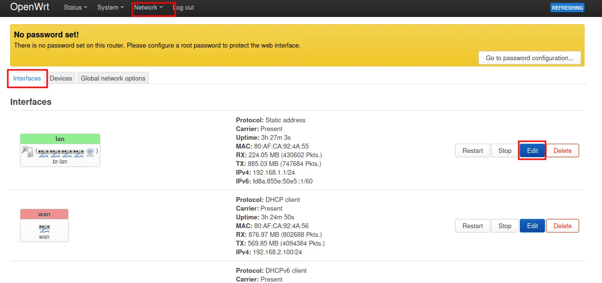{ width="600" }

3. In **General Settings**, change **Protocol** to **DHCP client**.
4. Click **Save** but **do not apply yet**.

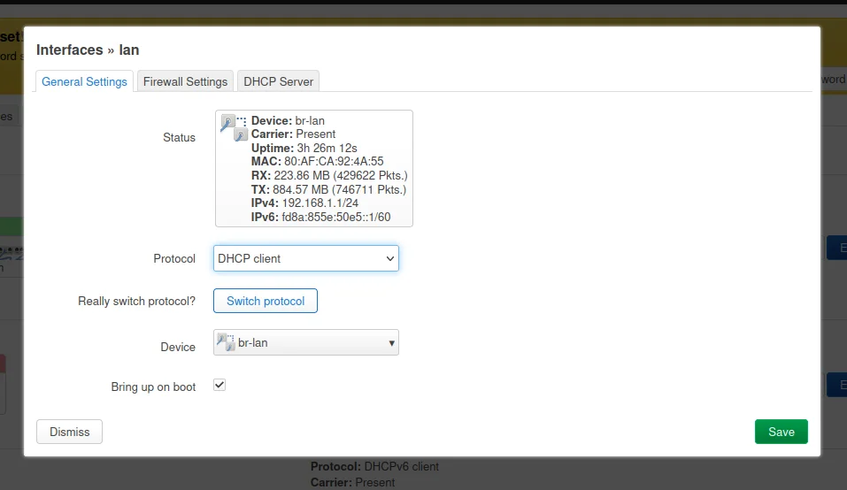{ width="600" }

!!! info "Why DHCP client?"
    By setting the satellite's LAN interface to DHCP client mode, it will request an IP address from the main router instead of using a manually configured static IP. This simplifies management and avoids IP conflicts.

### 3. Ensure WiFi interfaces are attached to LAN

1. Go to **Network → Wireless**.
2. Review your wireless interfaces.

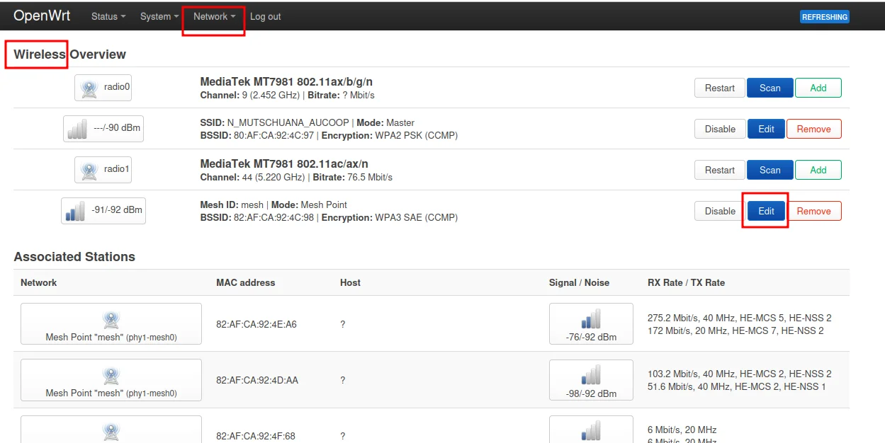{ width="600" }

3. Check the **client-facing WiFi AP** interface — ensure **Network** is set to **lan**.

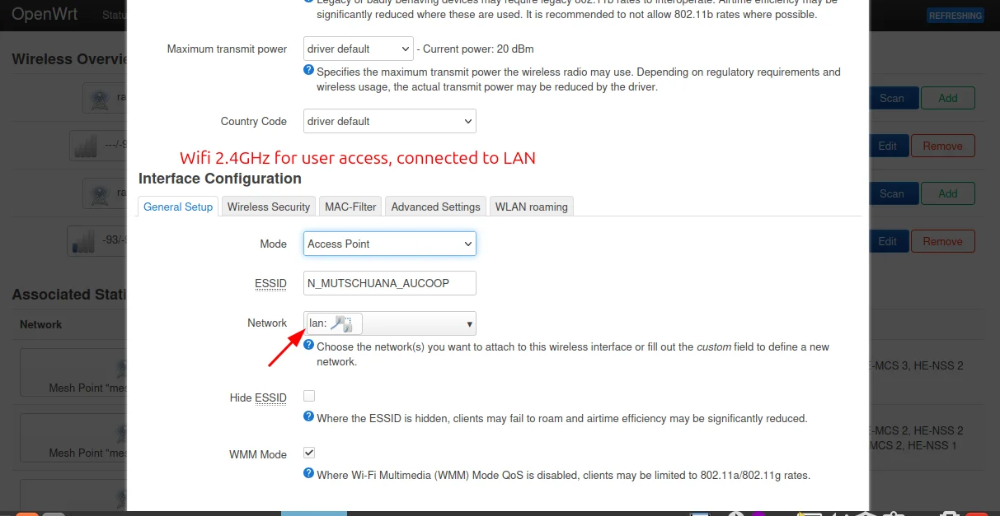{ width="600" }

4. Check the **802.11s mesh interface** — ensure **Network** is also set to **lan**.

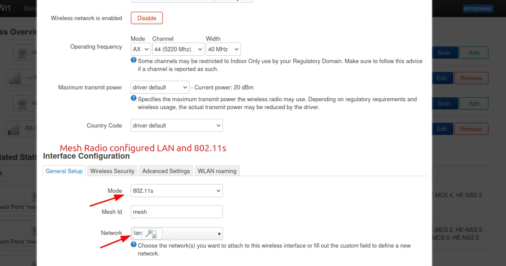{ width="600" }

!!! info "Why attach to LAN?"
    All wireless interfaces must be bridged to the LAN interface so that traffic from WiFi clients flows through to the main router. If an interface isn't attached to LAN, devices connecting to it won't get internet access.

### 4. Disable the DHCP server on the satellite

1. Go to **Network → Interfaces → LAN → DHCP Server** tab.
2. Check the box to **Disable DHCP for this interface** (or set it to ignore).
3. Click **Save**.

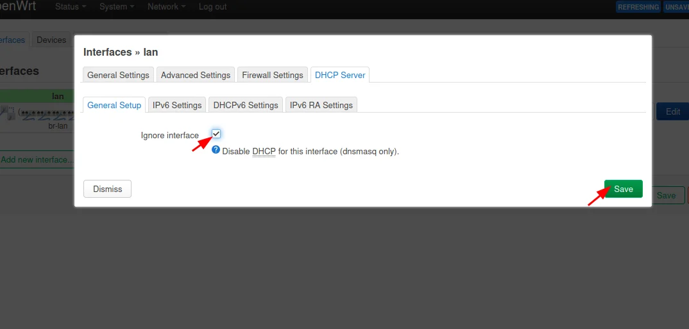{ width="600" }

!!! warning "Critical step"
    The satellite must **not** hand out IP addresses. If two DHCP servers run on the same network, devices will get conflicting addresses and connectivity will break randomly.

### 5. Remove WAN usage from the satellite

1. Go to **Network → Interfaces**.
2. Find **WAN** and **WAN6** interfaces.
3. Either delete them or set them to **unmanaged/disabled**.

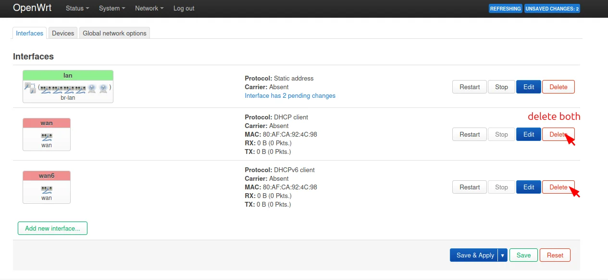{ width="600" }

!!! info "Why disable WAN?"
    The satellite should not provide routing for clients — all routing happens through the main router. Keeping WAN interfaces active can cause traffic to be routed incorrectly.

### 6. Disable the firewall on the satellite

1. Go to **System → Startup**.
2. Find **firewall** in the list of services.
3. Click **Stop** to stop the service.
4. Click **Disable** to prevent it from starting on boot.

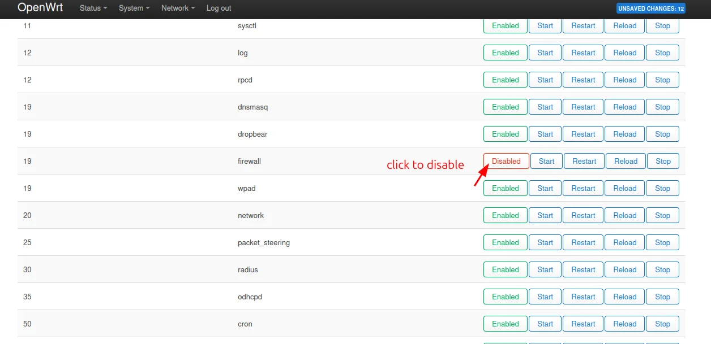{ width="600" }

!!! info "Why disable the firewall?"
    A dumb AP that only bridges traffic doesn't need a firewall — the main router handles all security. Running a firewall on the satellite can block legitimate traffic and cause connectivity issues.

### 7. Apply changes

1. Click **Save & Apply**.
2. Wait for the satellite router to reconnect to the network.
3. The old IP address will likely stop working.

!!! warning "You will lose connection"
    After applying, the satellite will request a new IP from the main router. Your current connection will drop. This is expected.

### 8. Find the new management IP

1. Open LuCI on the **main router**.
2. Go to **Network → DHCP and DNS → Active DHCP Leases**.
3. Find the satellite router by its MAC address or hostname.
4. Note the new IP address assigned by DHCP.

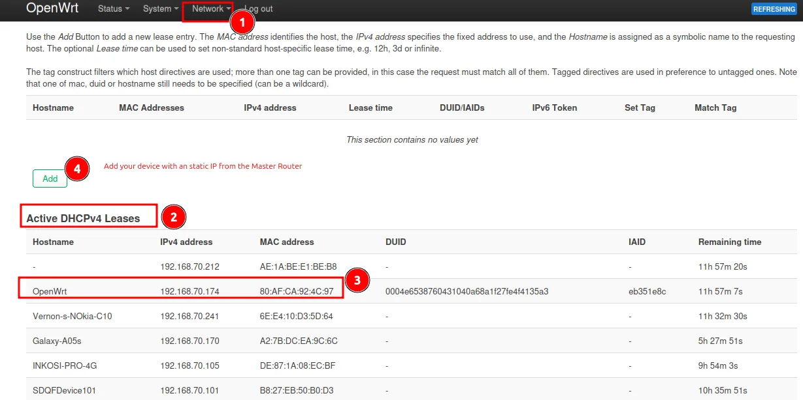{ width="600" }

5. Use this new IP to reconnect to the satellite router's LuCI interface.

### 9. Reserve the satellite IP on the main router

To ensure the satellite always gets the same IP address (for easy management), create a static lease:

1. On the **main router**, go to **Network → DHCP and DNS**.
2. Scroll to **Static Leases** section.
3. Click **Add** to create a new static lease:
    - **Hostname**: A descriptive name (e.g., `satellite-classroom`)
    - **MAC address**: The satellite's MAC address
    - **IPv4 address**: The IP you want to assign permanently
    - **Lease time**: Set to `infinite` for a permanent assignment
4. Click **Save & Apply**.

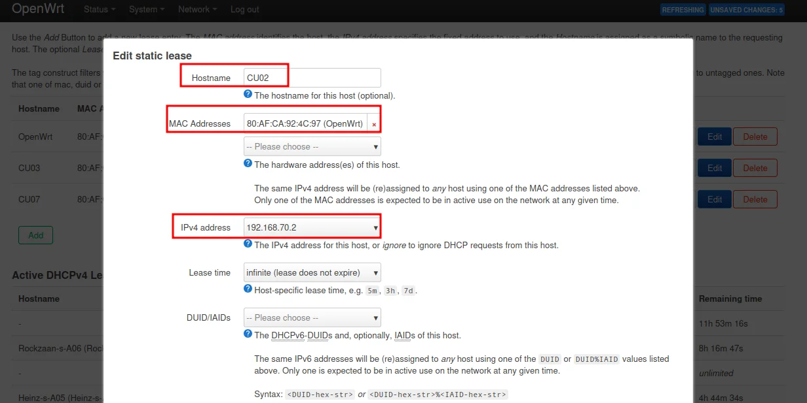{ width="600" }

!!! info "Why the new IP doesn't apply immediately"
    After creating the static lease, the satellite may still show the old dynamically-assigned IP. This is because the DHCP "handshake" already completed. You need to restart the satellite's LAN interface to request a new lease.

### 10. Restart the satellite's LAN interface

1. Connect to the satellite router using its current IP.
2. Go to **Network → Interfaces → LAN**.
3. Click **Restart** to force the interface to request a new DHCP lease.

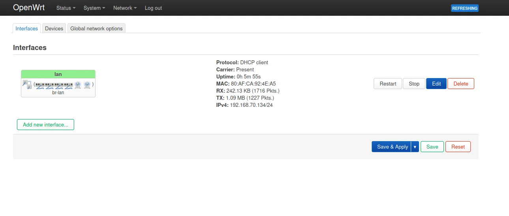{ width="600" }

The satellite will now receive the static IP you configured in the previous step.

### 11. Verify the result

From the satellite router, confirm:

- It received an IP address from the main router
- It has a default gateway pointing to the main router
- It has DNS servers configured
- Clients connected to the satellite can browse the internet

!!! tip "Quick test"
    Connect a phone or laptop to the satellite's WiFi. Check that it gets an IP in the main router's DHCP range and can load a website.

## Common Mistakes

| Problem | Cause | Solution |
|---------|-------|----------|
| Clients get no IP | DHCP server still running on satellite | Disable DHCP server (Step 4) |
| Clients get IP but no internet | WAN interface still active | Disable WAN interfaces (Step 5) |
| Can't reach satellite after applying | IP changed | Find new IP in main router's DHCP leases (Step 8) |
| Satellite IP keeps changing | No static lease | Create a static DHCP lease (Step 9) |

## Revision History

| Date       | Version | Changes                | Author           | Contributors                |
|------------|---------|------------------------|------------------|-----------------------------|
| 2026-04-04 | 1.0     | Initial guide creation | Maria Jover         |                             |
