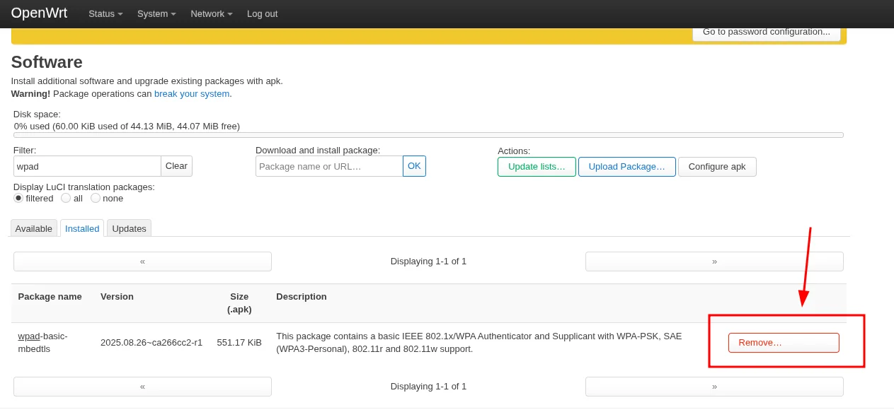
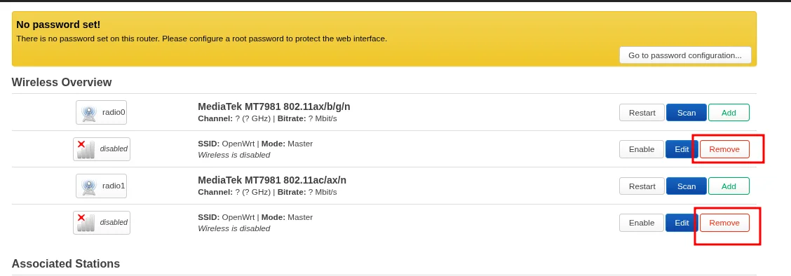
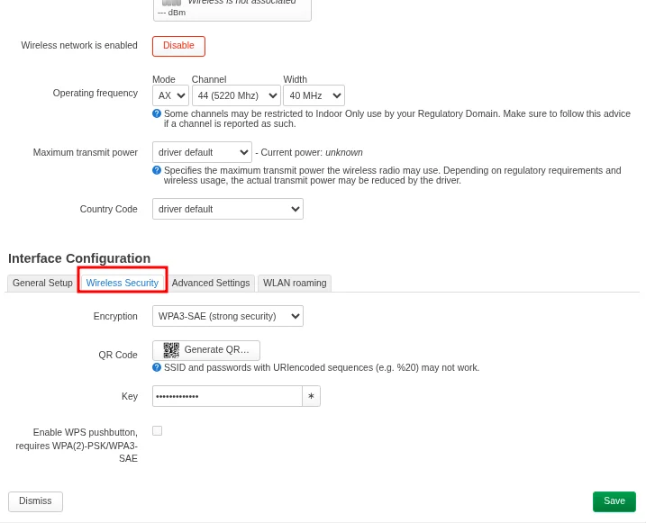
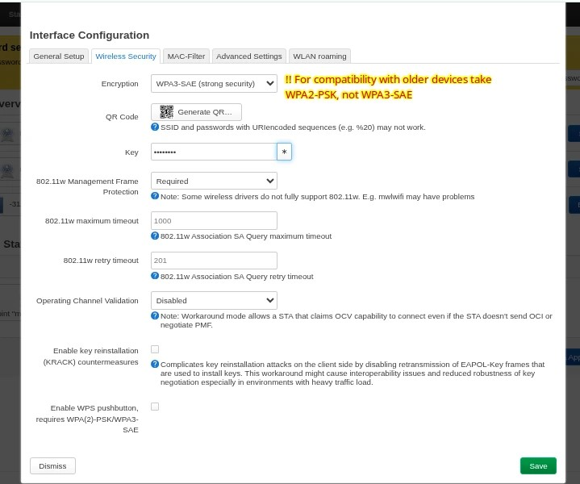

# OpenWrt 802.11s Wireless Mesh Setup

This guide walks you through configuring an 802.11s wireless mesh backhaul between two OpenWrt routers using the LuCI web interface, plus a shared 2.4 GHz access point for end users.

This guide implements the concepts introduced in
[Chapter 2.2 -- Expanding Coverage](../../2-Imaginary-Use-Case/2.2-Expanding-Coverage/index.md).

!!! note "Other mesh setups possible"
    This is not the only way to set up a wireless mesh with OpenWrt. This guide focuses on a simple, beginner-friendly setup using LuCI that is suitable for most community network use cases. It uses the 5 GHz band for the mesh backhaul and 2.4 GHz for the access point, but other configurations are possible depending on your hardware capabilities and coverage needs.

## What You'll Learn

- How to swap the default Wi-Fi package for one that supports 802.11s mesh
- How to turn a secondary router into a "dumb AP" so it does not conflict with the main router
- How to create a 5 GHz mesh backhaul link between two routers
- How to configure a shared 2.4 GHz access point for seamless roaming

## Prerequisites

- Two OpenWrt routers with dual-band radios (2.4 GHz + 5 GHz). Could be also done only with 2.4 GHz.
- Both routers already flashed with OpenWrt (see [Flash OpenWrt](../Flash-OpenWrt/index.md))
- LuCI web interface accessible on both routers
- Both routers on the same LAN subnet (or reachable for initial configuration)
- A computer with a web browser and an Ethernet cable

!!! warning "Perform the package swap on both routers"
    Every step marked "on both routers" must use **identical** settings on each device. A mismatch in mesh ID, channel, or encryption key will prevent the link from forming.

## Used Versions

| Software       | Version          |
|----------------|------------------|
| OpenWrt        | 25.12.1          |
| wpad-mesh-wolfssl | 2025.08.26~ca266cc2-r1	    |
| Router model   | Cudy WR3000E v1  |

!!! note "Your versions may work as well"
    This guide was tested with the above versions, but other recent versions of OpenWrt and the wpad-mesh package should work similarly.

    [**You can open an issue**](https://github.com/aucoop/Community-Network-Handbook/issues/new) if you encounter any problems with your versions.

## Step-by-Step Implementation

### 1. Set the LAN IP address

Before anything else, each router needs a unique IP on your subnet so they do not conflict.

Go to **Network > Interfaces** and edit the **LAN** interface. Change the **IPv4 address** to fit your main subnet. For example, if the main router is `192.168.70.1`, set the secondary router to `192.168.70.3`.

{ width="600" }

Click **Save & Apply**. You will need to reconnect to the router using the new IP address.

### 2. Remove the default Wi-Fi package

OpenWrt ships with `wpad-basic-mbedtls` (or a similar variant), which does not support 802.11s mesh. You must replace it with the mesh-capable version.

Navigate to **System > Software** and click **Update lists** to refresh the package index.

Filter for `wpad-basic`. Find your installed version (e.g., `wpad-basic-mbedtls`) and click **Remove**.

{ width="600" }

!!! warning "Wait for the removal to finish"
    Do not proceed until the removal completes. Installing the new package while the old one is still present can cause LuCI errors or a broken Wi-Fi stack.

### 3. Install the mesh-capable Wi-Fi package

Still in **System > Software**, filter for `wpad-mesh`. Find the matching variant (e.g., `wpad-mesh-wolfssl`) and click **Install**.

{ width="600" }

After installation completes, navigate to **System > Reboot** and restart the router. Repeat steps 1 through 3 on the second router before continuing.

!!! tip "Verify the package is active"
    After rebooting, go back to **System > Software** and confirm that `wpad-mesh-wolfssl` (or your chosen variant) appears in the installed list and that `wpad-basic-*` is gone.

### 4. Disable DHCP on the secondary router

The secondary router must act as a "dumb AP" so it does not hand out its own IP addresses or compete with the main router's DHCP server.

On the **secondary router only**, go to **Network > Interfaces**, edit the **LAN** interface, and scroll down to the **DHCP Server** section. Check the box **Ignore interface** to disable DHCP on this device.

{ width="600" }

Click **Save & Apply**.

!!! note "Why disable DHCP?"
    Two DHCP servers on the same network will hand out conflicting leases, causing intermittent connectivity for all clients. Only the main router should run DHCP.

### 5. Configure the 5 GHz mesh backhaul

This is the wireless link that connects the two routers together. The settings must be **identical** on both devices.

On each router, go to **Network > Wireless**. Find the radios (i.e. radio0, radio1) and remove any default Wi-Fi networks attached to it.

{ width="600" }

Click **Add** on the 5 GHz radio to create a new wireless interface.

{ width="600" }

Configure the new interface with these settings:

**Device Configuration:**

| Setting   | Value                                                                 |
|-----------|-----------------------------------------------------------------------|
| Channel   | A fixed channel (e.g., **44**). Do **not** use Auto.                  |
| Width     | **20 MHz** or **40 MHz**. Narrower channels penetrate walls better.   |

**Interface Configuration:**

| Setting   | Value                                                     |
|-----------|-----------------------------------------------------------|
| Mode      | **802.11s**                                               |
| Mesh ID   | `School_Backhaul` (must match exactly on both routers)    |
| Network   | Check the box for **lan**                                 |

{ width="600" }

**Wireless Security:**

| Setting    | Value                                                        |
|------------|--------------------------------------------------------------|
| Encryption | **WPA3-SAE**                                                 |
| Key        | A strong password, identical on both routers                 |

{ width="600" }

Click **Save & Apply** on both routers. Then check the **Network > Wireless** page -- a **Tx/Rx rate** appearing on the mesh interface confirms the link is up.

!!! tip "No link forming?"
    Double-check that the channel, mesh ID, encryption type, and key are identical on both routers. Also ensure both devices are within radio range and that no DFS channels are causing radar detection delays.

### 6. Configure the 2.4 GHz access point (fronthaul)

This is the Wi-Fi network that end users will connect to. Configure it on **both** routers so users can roam seamlessly between them.

Go to **Network > Wireless**, find the **2.4 GHz radio**, and click **Add** (or **Edit** if a default network exists).

**Device Configuration:**

| Setting         | Value                                                              |
|-----------------|--------------------------------------------------------------------|
| Channel         | **Auto**, or a fixed non-overlapping channel (**1**, **6**, or **11**) |
| Transmit Power  | Default or Medium (approximately 15--18 dBm)                      |

**Interface Configuration:**

| Setting   | Value                          |
|-----------|--------------------------------|
| Mode      | **Access Point**               |
| ESSID     | `School_Student_WiFi`          |
| Network   | Check the box for **lan**      |

{ width="600" }

**Wireless Security:**

| Setting    | Value                                                                     |
|------------|---------------------------------------------------------------------------|
| Encryption | **WPA2-PSK** (best compatibility with older student devices)              |
| Key        | The shared password for students                                          |

{ width="600" }

Click **Save & Apply**.

!!! note "Seamless roaming between access points"
    For users to move between coverage areas without re-entering the password, the **ESSID**, **Encryption**, and **Key** must be identical on the 2.4 GHz AP of all routers. Devices will automatically switch to the strongest available signal.

## References

- OpenWrt Documentation -- Mesh / 802.11s: <https://openwrt.org/docs/guide-user/network/wifi/mesh/80211s>
- Video: "OpenWrt 802.11s Mesh Setup" — <https://www.youtube.com/watch?v=vVoZppb_FR0>

## Revision History

| Date       | Version | Changes                | Author           | Contributors |
|------------|---------|------------------------|------------------|--------------|
| 2026-03-24 | 1.0     | Initial guide creation | Maria Jover        |Jaime Motjé, Sergio Giménez              |
