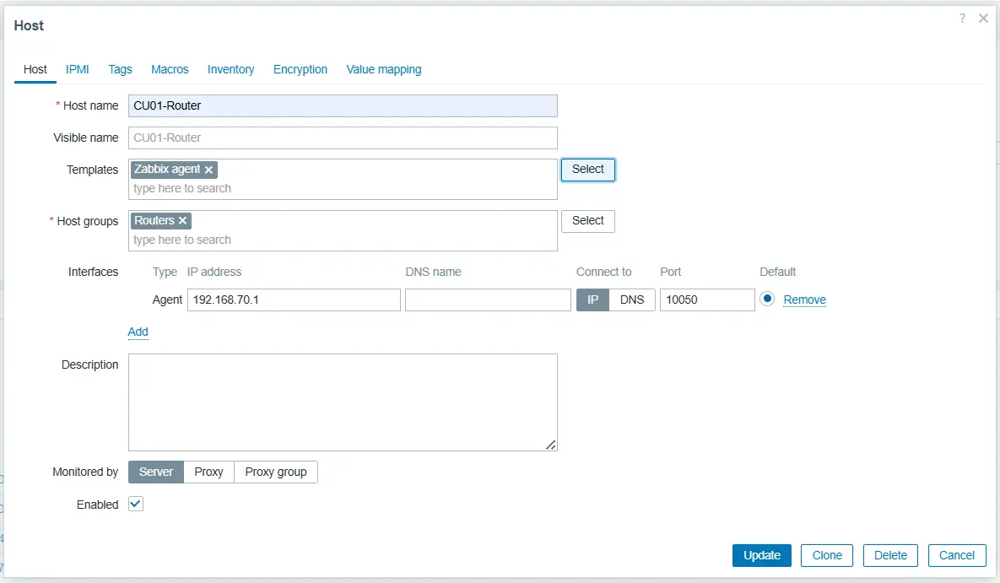

# Add Hosts to Zabbix

This guide covers how to register network devices and servers in your Zabbix monitoring system, including OpenWrt routers (Zabbix Agent), antennas (SNMP), and Linux servers running Docker (Zabbix Agent 2).

This guide implements the concept introduced in
[Chapter 2 -- Monitoring](../../2-Imaginary-Use-Case/2.5-Monitoring/index.md).

## What You'll Learn

- How to add an OpenWrt router as a monitored host using Zabbix Agent
- How to configure the Zabbix agent on OpenWrt to accept server connections
- How to add an antenna or network device using SNMP
- How to install Zabbix Agent 2 on a Linux server and monitor Docker containers

## Prerequisites

- A running Zabbix server (7.0 LTS or later) accessible from your network
- SSH access to the devices you want to monitor
- For OpenWrt devices: the `zabbix-agentd` package available in the OpenWrt repository
- For antennas: SNMP enabled on the device (most network equipment supports SNMPv2c by default)
- For Docker servers: a Debian/Ubuntu-based Linux server with Docker installed

## Used Versions

| Software       | Version          |
|----------------|------------------|
| Zabbix Server  | 7.0 LTS          |
| OpenWrt        | 23.05.x          |
| Zabbix Agent 2 | 7.0              |
| Debian         | 12 (Bookworm)    |

## Step-by-Step Implementation

### 1. Create a host group for your devices

Before adding individual hosts, create a host group to organize them.

1. Log in to the Zabbix web interface.
2. Navigate to **Data collection --> Host groups**.
3. Click **Create host group**.
4. Enter a name (e.g., `Routers`, `Antennas`, or `Servers`).
5. Click **Add**.

!!! info "Why host groups?"
    Host groups let you organize monitored devices by type, location, or role. You can later assign permissions, filter dashboards, and scope alert rules by group. Create separate groups for routers, antennas, and servers.

---

### 2. Add an OpenWrt router (Zabbix Agent)

#### 2a. Install and configure the agent on the router

1. SSH into your OpenWrt router.
2. Install the Zabbix agent package:

    ```bash
    opkg update
    opkg install zabbix-agentd
    ```

3. Edit the agent configuration to allow your Zabbix server to connect:

    ```bash
    sed -i -E "s/^Server=127.0.0.1/Server=192.168.10.1/" /etc/zabbix_agentd.conf
    ```

4. Restart the agent to apply the changes:

    ```bash
    /etc/init.d/zabbix_agentd restart
    ```

!!! info "Allowing a subnet instead of a single IP"
    The `Server=` parameter also accepts CIDR notation. If your Zabbix server might move between addresses on the same subnet, you can use `Server=192.168.10.0/24` to allow any host on that subnet to query the agent. For most deployments, specifying the exact Zabbix server IP (e.g., `192.168.10.1`) is more secure.

!!! warning "OpenWrt 25.x uses `apk` instead of `opkg`"
    If your router runs OpenWrt 25.x or later, replace `opkg` with `apk`:

    ```bash
    apk update
    apk add zabbix-agentd
    ```

#### 2b. Register the router in the Zabbix web interface

1. In the Zabbix web interface, navigate to **Data collection --> Hosts**.
2. Click **Create host** (top-right corner).
3. Fill in the host configuration:
    - **Host name**: a descriptive name (e.g., `router-library`)
    - **Host groups**: select the group you created (e.g., `Routers`)
    - **Interfaces**: click **Add** and select **Agent**
        - **IP address**: the router's IP (e.g., `192.168.10.2`)
        - **Port**: `10050` (default)
4. Go to the **Templates** tab and link an appropriate template (e.g., `Linux by Zabbix agent` or `OpenWrt by Zabbix agent`).
5. Click **Add** to save the host.

<!-- TODO: Replace placeholder image -- screenshot of Zabbix Data collection > Hosts page showing the Create host button -->
{ width="600" }

<!-- TODO: Replace placeholder image -- screenshot of the Create host dialog with Agent interface filled in -->
{ width="600" }

!!! tip "Verify the connection"
    After adding the host, wait a few minutes and check the **Availability** column on the **Data collection --> Hosts** page. A green **ZBX** icon means the Zabbix server can reach the agent. A red icon indicates a connectivity or configuration problem.

---

### 3. Add an antenna or network device (SNMP)

Most wireless antennas and managed switches support SNMP for monitoring. The process is similar to adding an agent-based host, but you select the SNMP interface instead.

1. In the Zabbix web interface, navigate to **Data collection --> Hosts**.
2. Click **Create host**.
3. Fill in the host configuration:
    - **Host name**: a descriptive name (e.g., `antenna-rooftop-north`)
    - **Host groups**: select or create a group (e.g., `Antennas`)
    - **Interfaces**: click **Add** and select **SNMP**
        - **IP address**: the device's IP address
        - **Port**: `161` (default SNMP port)
        - **SNMP version**: select the version your device supports (typically `SNMPv2`)
        - **SNMP community**: enter the community string (default is usually `public`)
4. Go to the **Templates** tab and link the appropriate template for your device (e.g., `ICMP Ping`, or a vendor-specific SNMP template).
5. Click **Add** to save the host.

<!-- TODO: Replace placeholder image -- screenshot of the Create host dialog with SNMP interface selected -->
{ width="600" }

!!! info "Finding the right SNMP template"
    Zabbix ships with many built-in SNMP templates for common vendors (Ubiquiti, MikroTik, Cisco, etc.). Browse **Data collection --> Templates** and search for your device brand. If no specific template exists, the generic `Network Generic Device by SNMP` template covers basic metrics like uptime, interface traffic, and ICMP availability.

!!! warning "SNMP community string security"
    The default `public` community string provides read-only access, which is sufficient for monitoring. If your device uses a custom community string, enter it here. Avoid using `private` as a community string in production, as it typically grants write access.

---

### 4. Add a Linux server with Docker (Zabbix Agent 2)

Zabbix Agent 2 is required for Docker monitoring because it includes a built-in Docker plugin that the classic `zabbix-agentd` does not support.

#### 4a. Install Zabbix Agent 2 on the server

1. SSH into your Linux server.
2. Download and install the Zabbix repository package (Debian 12 example):

    ```bash
    wget https://repo.zabbix.com/zabbix/7.0/debian/pool/main/z/zabbix-release/zabbix-release_latest_7.0+debian12_all.deb
    sudo dpkg -i zabbix-release_latest_7.0+debian12_all.deb
    sudo apt update
    ```

3. Install Zabbix Agent 2 and its plugins:

    ```bash
    sudo apt install -y zabbix-agent2 zabbix-agent2-plugin-*
    ```

4. Edit the agent configuration file:

    ```bash
    sudo nano /etc/zabbix/zabbix_agent2.conf
    ```

5. Set the following parameters (replace with your actual values):

    ```ini
    Server=192.168.10.1
    ServerActive=192.168.10.1
    Hostname=docker-server-01
    ```

6. Restart and enable the agent:

    ```bash
    sudo systemctl restart zabbix-agent2
    sudo systemctl enable zabbix-agent2
    ```

!!! info "Ubuntu users"
    On Ubuntu 24.04, use the appropriate repository package:

    ```bash
    wget https://repo.zabbix.com/zabbix/7.0/ubuntu/pool/main/z/zabbix-release/zabbix-release_latest_7.0+ubuntu24.04_all.deb
    sudo dpkg -i zabbix-release_latest_7.0+ubuntu24.04_all.deb
    ```

#### 4b. Grant Docker access to the Zabbix user

1. Add the `zabbix` user to the `docker` group so the agent can query Docker:

    ```bash
    sudo gpasswd -a zabbix docker
    ```

2. Restart Zabbix Agent 2 for the group change to take effect:

    ```bash
    sudo systemctl restart zabbix-agent2
    ```

3. Verify that the agent can read Docker data. Install `zabbix-get` if not already available:

    ```bash
    sudo apt install -y zabbix-get
    ```

4. Test the Docker integration from the Zabbix server (or any machine with `zabbix-get`):

    ```bash
    zabbix_get -s 192.168.10.4 -k docker.info
    ```

    A successful response returns JSON with Docker engine information.

!!! warning "Check the logs if it fails"
    If `zabbix_get` returns an error, check the agent log for details:

    ```bash
    sudo tail -50 /var/log/zabbix/zabbix_agent2.log
    ```

    Common issues include the `zabbix` user not being in the `docker` group, or the Docker socket permissions being too restrictive.

#### 4c. Register the server in the Zabbix web interface

1. In the Zabbix web interface, navigate to **Data collection --> Hosts**.
2. Click **Create host**.
3. Fill in the host configuration:
    - **Host name**: must match the `Hostname` set in `zabbix_agent2.conf` (e.g., `docker-server-01`)
    - **Host groups**: select or create a group (e.g., `Servers`)
    - **Interfaces**: click **Add** and select **Agent**
        - **IP address**: the server's IP (e.g., `192.168.10.4`)
        - **Port**: `10050`
4. Go to the **Templates** tab and link:
    - `Linux by Zabbix agent active` -- for general OS monitoring
    - `Docker by Zabbix agent 2` -- for container monitoring
5. Click **Add** to save the host.

<!-- TODO: Replace placeholder image -- screenshot of host config with Docker template linked -->
{ width="600" }

!!! tip "Verify Docker monitoring"
    After a few minutes, navigate to **Monitoring --> Hosts**, click on your Docker server, and check the **Latest data** tab. You should see items like `docker.containers.running`, `docker.images`, and individual container metrics.

## References

- Zabbix 7.0 Documentation -- Configuring a host -- <https://www.zabbix.com/documentation/7.0/en/manual/config/hosts/host>
- Zabbix 7.0 Documentation -- SNMP agent monitoring -- <https://www.zabbix.com/documentation/7.0/en/manual/config/items/itemtypes/snmp>
- Zabbix 7.0 Documentation -- Docker plugin (Agent 2) -- <https://www.zabbix.com/documentation/7.0/en/manual/appendix/config/zabbix_agent2_plugins/d_plugin>
- Zabbix Docker integration page -- <https://www.zabbix.com/integrations/docker>
- Zabbix Agent configuration parameters -- <https://www.zabbix.com/documentation/7.0/en/manual/appendix/config/zabbix_agentd>

## Revision History

| Date       | Version | Changes                | Author           | Contributors                |
|------------|---------|------------------------|------------------|-----------------------------|
| 2026-04-01 | 1.0     | Initial guide creation | Jaime Motje      |                             |
