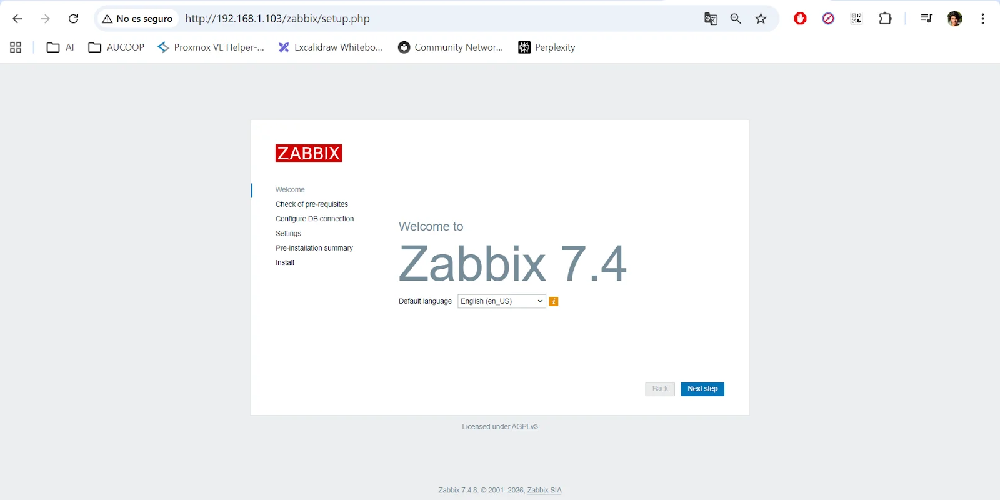
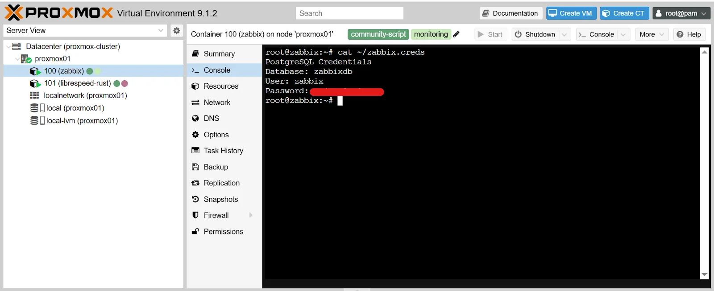
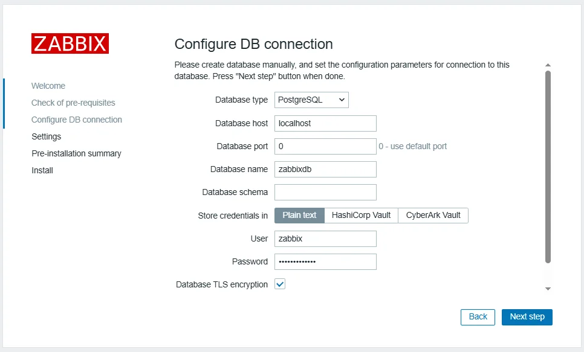
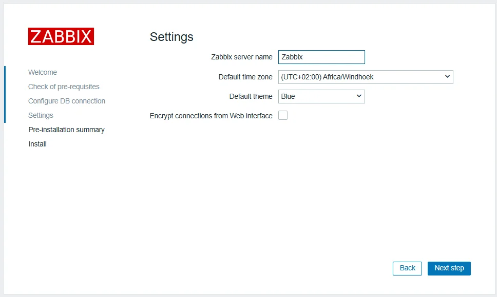
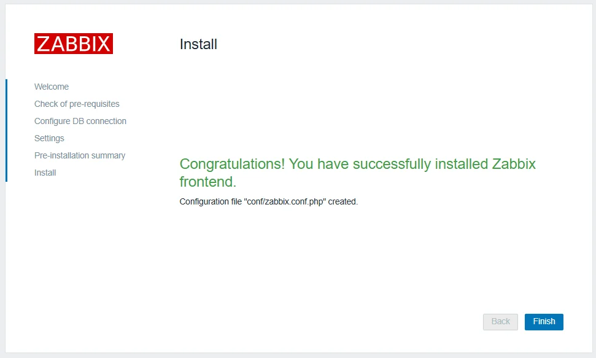

# Install Zabbix Server on Proxmox

This guide covers how to deploy a Zabbix monitoring server as a Proxmox LXC container using the community helper scripts, and complete the initial web setup wizard.

This guide implements the concept introduced in
[Chapter 2 -- Monitoring](../../2-Imaginary-Use-Case/2.5-Monitoring/index.md).

## What You'll Learn

- How to deploy a Zabbix server container on Proxmox using the community helper scripts
- How to complete the Zabbix web setup wizard
- How to retrieve and use the auto-generated database credentials
- How to configure the server name and timezone during initial setup

## Prerequisites

- A running Proxmox VE instance (see [Install Proxmox VE](../Proxmox/Install-Proxmox.md))
- SSH or console access to the Proxmox host
- Internet access on the Proxmox host (the script downloads packages during installation)

## Used Versions

| Software    | Version |
|-------------|---------|
| Zabbix      | 7.4     |
| Proxmox VE  | 9.1.2   |

## Step-by-Step Implementation

### 1. Run the Proxmox helper script

1. Open an SSH session to your Proxmox host or use the web shell (**Datacenter -> your node -> Shell**):

    ```bash
    ssh root@<proxmox-ip>
    ```

2. Run the Zabbix community helper script:

    ```bash
    bash -c "$(curl -fsSL https://raw.githubusercontent.com/community-scripts/ProxmoxVE/main/ct/zabbix.sh)"
    ```

3. Accept the default installation options when prompted. The script creates an LXC container with Zabbix Server, the web frontend, and a PostgreSQL database.

    !!! info "Default container resources"
        The helper script provisions the container with 2 CPU cores, 4 GB of RAM, and 6 GB of disk space. These defaults are adequate for small to medium community networks. You can adjust them later from the Proxmox web interface.

4. Wait for the script to finish. It will display the container's IP address at the end.

### 2. Open the Zabbix web setup

1. On a computer connected to the same network, open a browser and navigate to:

    ```
    http://<zabbix-ip>/zabbix/setup.php
    ```

    Replace `<zabbix-ip>` with the IP address shown at the end of the installation script.

2. The Zabbix welcome page appears, confirming the web frontend is running.

    { width="600" }

3. Click **Next step** to proceed.

### 3. Configure the database connection

1. Go to the Proxmox web interface and open the console of the Zabbix container (**Datacenter -> your node -> the Zabbix CT -> Console**).

2. Retrieve the auto-generated database credentials:

    ```bash
    cat ~/zabbix.creds
    ```

    { width="600" }

3. Back in the browser, on the **Configure DB connection** page, fill in the fields using the credentials from the previous sub-step:
    - **Database host:** the value shown in the credentials file (typically `localhost`)
    - **Database port:** `0` (means use the default port)
    - **Database name:** the database name from the credentials file
    - **User:** the database user from the credentials file
    - **Password:** the database password from the credentials file

    { width="600" }

4. Click **Next step** to continue.

### 4. Complete the setup wizard

1. On the **Settings** page, configure:
    - **Zabbix server name:** enter a descriptive name for your server (e.g., `Community Network Zabbix`)
    - **Default time zone:** select your local timezone

    { width="600" }

2. Click **Next step** to review the configuration summary.
3. Verify all settings are correct and click **Finish**.

{ width="600" }

!!! tip "Default login credentials"
    After completing the setup wizard, log in to Zabbix with the default credentials: username `Admin` (capital A) and password `zabbix`. Change the default password immediately under **Users Settings -> Profile -> Change password**.

## References

- Proxmox VE Helper Scripts -- Zabbix -- <https://community-scripts.github.io/ProxmoxVE/scripts?id=zabbix>
- YouTube: "Use Proxmox to monitor network devices with Zabbix
" -- <https://www.youtube.com/watch?v=lFtqJx5vpgc>

## Revision History

| Date       | Version | Changes                | Author       | Contributors |
|------------|---------|------------------------|--------------|--------------|
| 2026-04-02 | 1.0     | Initial guide creation | Jaime Motje  |              |
