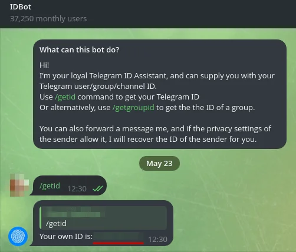
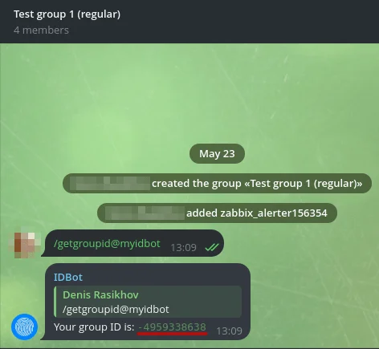
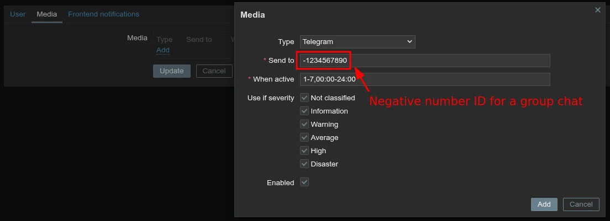
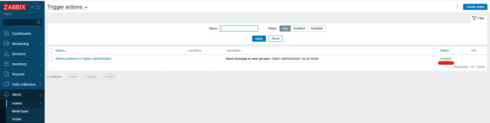

# Set Up Telegram Notifications in Zabbix

This guide covers how to configure Zabbix to send alert notifications through a Telegram bot, so you receive instant messages when a monitored host or service has a problem.

This guide implements the concept introduced in
[Chapter 2 — Monitoring](../../2-Imaginary-Use-Case/2.5-Monitoring/index.md).

## What You'll Learn

- How to create a Telegram bot and obtain its API token
- How to find your Telegram chat ID (personal or group)
- How to configure the Telegram media type in Zabbix
- How to assign Telegram as a notification channel for a Zabbix user
- How to create trigger actions that send alerts on problems and recoveries
- How to customize message templates

## Prerequisites

- A running Zabbix server (7.0 LTS or later) with admin access to the web interface
- A Telegram account
- At least one monitored host already configured in Zabbix (see [Add Hosts to Zabbix](Add-Hosts.md))

## Used Versions

| Software      | Version   |
|---------------|-----------|
| Zabbix Server | 7.4       |

## Step-by-Step Implementation

### 1. Create a Telegram bot with BotFather

1. Open Telegram and search for **@BotFather**.
2. Start a conversation and send the command:

    ```
    /newbot
    ```

3. Follow the prompts:
    - Enter a **display name** for your bot (e.g., `Zabbix Alerts`).
    - Enter a **username** for your bot (must end in `bot`, e.g., `mynetwork_zabbix_bot`).
4. BotFather replies with your bot's **API token**. Copy and save it — you will need it in Step 3.

{ width="600" }

!!! warning "Keep your token secret"
    Anyone with the bot token can send messages as your bot. Do not share it publicly or commit it to version control.

---

### 2. Get your Telegram chat ID

You need the chat ID of the user or group that should receive notifications.

**For a personal chat ID:**

1. Open Telegram and search for **@myidbot**.
2. Start a conversation and send:

    ```
    /getid
    ```

3. The bot replies with your numeric chat ID. Copy it.

    { width="600" }

4. Open a conversation with your own bot (the one you created in Step 1) and send:

    ```
    /start
    ```

!!! info "Why send /start to your bot?"
    Telegram bots cannot initiate conversations. You must send `/start` first so the bot has permission to send messages back to you. Without this step, Zabbix notifications to your personal chat will fail silently.

**For a group chat ID:**

1. Create a Telegram group (or use an existing one).
2. Add both **@myidbot** and your newly created bot to the group.
3. In the group, send:

    ```
    /getgroupid@myidbot
    ```

4. The bot replies with the group's numeric chat ID (it will be a negative number). Copy it.

    { width="600" }

5. Also send the following in the group so your bot can post messages:

    ```
    /start@mynetwork_zabbix_bot
    ```

!!! info "Personal vs. group notifications"
    A personal chat ID sends alerts only to you. A group chat ID sends alerts to everyone in the group, which is useful when multiple people manage the network. You can configure different Zabbix users with different chat IDs.

---

### 3. Configure the Telegram media type in Zabbix

Zabbix ships with a pre-configured Telegram webhook media type. You just need to add your bot token.

1. Log in to the Zabbix web interface.
2. Navigate to **Alerts → Media types**.
3. Find **Telegram** in the list and click on it to edit.
4. In the **Parameters** section, set the following:
    - **`api_token`**: paste your bot API token from Step 1.
    - **`api_parse_mode`**: enter `HTML`.
5. Ensure the media type is **Enabled**.
6. Click **Update** to save.

{ width="600" }


!!! tip "Test the media type"
    Click the **Test** button at the right of the Telegram media type configuration. Zabbix opens a form pre-filled with all the webhook parameters. Because there is no real event, macro values like `{ALERT.SENDTO}` are not resolved automatically — you must enter test values manually.

    Fill in the following fields (leave any field not listed at its default value):

    | Field | Value |
    |---|---|
    | `alert_message` | `Test alert message` |
    | `alert_subject` | `Test subject` |
    | `api_chat_id` | Your numeric chat ID (e.g. `123456789`) |
    | `api_parse_mode` | `Markdown` (leave as-is) |
    | `api_token` | *(leave as-is — already filled from the configuration)* |
    | `event_nseverity` | `3` |
    | `event_severity` | `Warning` |
    | `event_source` | `0` |
    | `event_tags` | `[]` |
    | `event_update_nseverity` | `0` |
    | `event_update_severity` | `0` |
    | `event_update_status` | `0` |
    | `event_value` | `1` |

    The critical field is **`api_chat_id`** — it defaults to `{ALERT.SENDTO}`, which is not resolved during a manual test. Replace it with the actual numeric chat ID you obtained in Step 2.

    Click **Test**. A successful response looks like `{"ok":true,"result":{...}}` and you should receive a message from the bot in Telegram. If the test fails, double-check the token, verify the chat ID is correct, and ensure the bot was added to the group (for group chat IDs).

---

### 4. Add Telegram as a notification channel for a user

1. Navigate to **Users → Users**.
2. Click on the user that should receive Telegram notifications (e.g., **Admin**).
3. Go to the **Media** tab.
4. Click **Add** and fill in:
    - **Type**: `Telegram`
    - **Send to**: paste the chat ID from Step 2
    - **When active**: leave as `1-7,00:00-24:00` for 24/7 notifications (or adjust to your schedule)
    - **Use if severity**: check the severity levels you want to receive (at minimum: `Warning`, `Average`, `High`, `Disaster`)
5. Click **Add** to confirm the media entry.
6. Click **Update** to save the user.

!!! info "Personal vs. group chat IDs"
    Personal chat IDs are **positive** numbers (e.g., `1234567890`). Group chat IDs are **negative** numbers (e.g., `-1234567890`). Make sure to include the minus sign when entering a group chat ID.

{ width="600" }

{ width="600" }

---

### 5. Enable trigger action for problem notifications

!!! info "What are trigger actions?"
    Trigger actions tell Zabbix what to do when a trigger fires (a problem is detected) and when the problem is resolved.

1. Navigate to **Alerts → Actions → Trigger actions**.
2. Enable the default **Report problems to Zabbix administrators** action.

{ width="600" }


!!! info "Why recovery operations matter"
    Without recovery operations, you only get notified when something breaks — not when it comes back online. Configuring both ensures you know when a problem starts and when it is resolved.

---

### 6. Customize message templates

The default Telegram messages may be too verbose or lack information relevant to your network. You can customize them per media type.

1. Navigate to **Alerts → Media types**.
2. Click on **Telegram**.
3. Scroll down to **Message templates**.
4. Click the **Problem** template to edit it and paste the following:

    **Subject:**

    ```
    🔴 {TRIGGER.SEVERITY}: {TRIGGER.NAME}
    ```

    **Message:**

    ```

    🖥️ <b>Host:</b> {HOST.NAME}
    🕐 <b>Time:</b> {EVENT.DATE} {EVENT.TIME}
    🌐 <b>IP:</b> {HOST.CONN}
    ```

5. Click the **Problem recovery** template to edit it and paste the following:

    **Subject:**

    ```
    ✅ RESOLVED: {TRIGGER.NAME}
    ```

    **Message:**

    ```

    🖥️ <b>Host:</b> {HOST.NAME}
    🕐 <b>Resolved at:</b> {EVENT.RECOVERY.DATE} {EVENT.RECOVERY.TIME}
    🌐 <b>IP:</b> {HOST.CONN}
    ```

6. Click **Update** to save.


!!! tip "Available macros"
    Zabbix provides many macros you can use in templates. Common ones include `{HOST.NAME}`, `{TRIGGER.NAME}`, `{TRIGGER.SEVERITY}`, `{EVENT.DATE}`, `{EVENT.TIME}`, and `{HOST.CONN}`. See the Zabbix documentation on [macros supported by location](https://www.zabbix.com/documentation/7.0/en/manual/appendix/macros/supported_by_location) for a full list.

!!! warning "Parse mode and formatting"
    The templates above use `HTML` parse mode (`<b>bold</b>`). Do not mix HTML tags with Markdown syntax. If a message fails to send, check that `api_parse_mode` is set to `HTML` in Step 3 and that no unescaped `<`, `>`, or `&` characters appear in your macro values.

## References

- Zabbix Telegram integration page — <https://www.zabbix.com/integrations/telegram>
- Zabbix 7.0 Documentation — Media types — <https://www.zabbix.com/documentation/7.0/en/manual/config/notifications/media>
- Zabbix 7.0 Documentation — Trigger actions — <https://www.zabbix.com/documentation/7.0/en/manual/config/notifications/action>
- Zabbix 7.0 Documentation — Notification macros — <https://www.zabbix.com/documentation/7.0/en/manual/appendix/macros/supported_by_location>

## Revision History

| Date       | Version | Changes                | Author           | Contributors                |
|------------|---------|------------------------|------------------|-----------------------------|
| 2026-04-01 | 1.0     | Initial guide creation | Jaime Motje      | Joan Torres                             |
