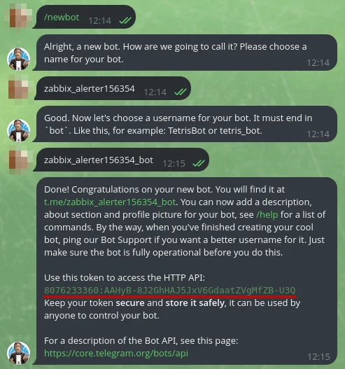
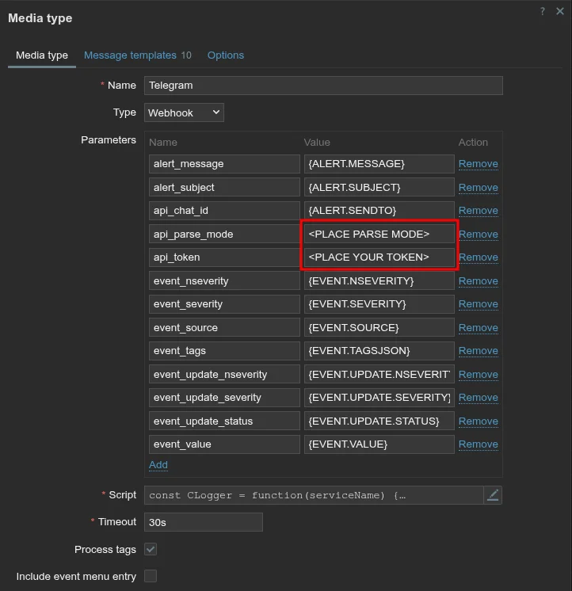
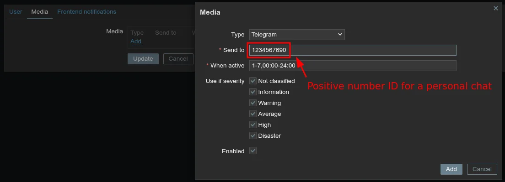

# Set Up Telegram Notifications in Zabbix

This guide covers how to configure Zabbix to send alert notifications through a Telegram bot, so you receive instant messages when a monitored host or service has a problem.

This guide implements the concept introduced in
[Chapter 2 -- Monitoring](../../2-Imaginary-Use-Case/2.5-Monitoring/index.md).

## What You'll Learn

- How to create a Telegram bot and obtain its API token
- How to find your Telegram chat ID (personal or group)
- How to configure the Telegram media type in Zabbix
- How to assign Telegram as a notification channel for a Zabbix user
- How to create trigger actions that send alerts on problems and recoveries
- How to customize message templates

## Prerequisites

- A running Zabbix server (7.0 LTS or later) with admin access to the web interface
- A Telegram account
- At least one monitored host already configured in Zabbix (see [Add Hosts to Zabbix](Add-Hosts.md))

## Used Versions

| Software      | Version   |
|---------------|-----------|
| Zabbix Server | 7.0 LTS   |
| Telegram Bot API | current |

## Step-by-Step Implementation

### 1. Create a Telegram bot with BotFather

1. Open Telegram and search for **@BotFather**.
2. Start a conversation and send the command:

    ```
    /newbot
    ```

3. Follow the prompts:
    - Enter a **display name** for your bot (e.g., `Zabbix Alerts`).
    - Enter a **username** for your bot (must end in `bot`, e.g., `mynetwork_zabbix_bot`).
4. BotFather replies with your bot's **API token**. Copy and save it -- you will need it in Step 3.

<!-- TODO: Replace placeholder image -- screenshot of BotFather conversation showing the token -->
{ width="600" }

!!! warning "Keep your token secret"
    Anyone with the bot token can send messages as your bot. Do not share it publicly or commit it to version control.

---

### 2. Get your Telegram chat ID

You need the chat ID of the user or group that should receive notifications.

**For a personal chat ID:**

1. Open Telegram and search for **@myidbot**.
2. Start a conversation and send:

    ```
    /getid
    ```

3. The bot replies with your numeric chat ID. Copy it.

**For a group chat ID:**

1. Create a Telegram group (or use an existing one).
2. Add both **@myidbot** and your newly created bot to the group.
3. In the group, send:

    ```
    /getgroupid@myidbot
    ```

4. The bot replies with the group's numeric chat ID (it will be a negative number). Copy it.
5. Also send the following in the group so your bot can post messages:

    ```
    /start@mynetwork_zabbix_bot
    ```

!!! info "Personal vs. group notifications"
    A personal chat ID sends alerts only to you. A group chat ID sends alerts to everyone in the group, which is useful when multiple people manage the network. You can configure different Zabbix users with different chat IDs.

---

### 3. Configure the Telegram media type in Zabbix

Zabbix ships with a pre-configured Telegram webhook media type. You just need to add your bot token.

1. Log in to the Zabbix web interface.
2. Navigate to **Alerts --> Media types**.
3. Find **Telegram** in the list and click on it to edit.
4. In the **Parameters** section, set the following:
    - **Token**: paste your bot API token from Step 1
    - **ParseMode**: select `Markdown`, `HTML`, or `MarkdownV2` (controls message formatting)
5. Click **Update** to save.
6. Ensure the media type is **Enabled** (the toggle in the **Status** column should be green).

<!-- TODO: Replace placeholder image -- screenshot of Alerts > Media types > Telegram configuration -->
{ width="600" }

!!! tip "Test the media type"
    Click the **Test** button at the bottom of the Telegram media type configuration. Enter your chat ID in the **Send to** field, a test subject, and a message body. Click **Test** to verify that your bot can send messages. If it fails, double-check the token and ensure the bot was added to the group (for group chat IDs).

---

### 4. Add Telegram as a notification channel for a user

1. Navigate to **Users --> Users**.
2. Click on the user that should receive Telegram notifications (e.g., **Admin**).
3. Go to the **Media** tab.
4. Click **Add** and fill in:
    - **Type**: `Telegram`
    - **Send to**: paste the chat ID from Step 2
    - **When active**: leave as `1-7,00:00-24:00` for 24/7 notifications (or adjust to your schedule)
    - **Use if severity**: check the severity levels you want to receive (at minimum: `Warning`, `Average`, `High`, `Disaster`)
5. Click **Add** to confirm the media entry.
6. Click **Update** to save the user.

<!-- TODO: Replace placeholder image -- screenshot of User > Media tab with Telegram entry -->
{ width="600" }

---

### 5. Create a trigger action for problem notifications

Trigger actions tell Zabbix what to do when a trigger fires (a problem is detected) and when the problem is resolved.

1. Navigate to **Alerts --> Actions --> Trigger actions**.
2. You can either edit the default **Report problems to Zabbix administrators** action, or click **Create action** for a new one.

#### 5a. Configure the action

1. Set the **Name** (e.g., `Send Telegram alerts`).
2. Under **Conditions**, add any filters you want (e.g., only specific host groups or severity levels). Leave empty to alert on all triggers.

#### 5b. Configure operations (problem notification)

1. Go to the **Operations** tab.
2. Click **Add** in the **Operations** section.
3. Configure:
    - **Send to users**: select the user(s) configured with Telegram media
    - **Send only to**: `Telegram`
4. Click **Add** to save the operation.

#### 5c. Configure recovery operations

1. In the same **Operations** tab, scroll to **Recovery operations**.
2. Click **Add**.
3. Configure:
    - **Send to users**: same user(s) as above
    - **Send only to**: `Telegram`
4. Click **Add** to save the recovery operation.
5. Click **Add** (or **Update**) to save the entire action.

<!-- TODO: Replace placeholder image -- screenshot of Trigger action Operations tab -->
{ width="600" }

!!! info "Why recovery operations matter"
    Without recovery operations, you only get notified when something breaks -- not when it comes back online. Configuring both ensures you know when a problem starts and when it is resolved.

---

### 6. Customize message templates

The default Telegram messages may be too verbose or lack information relevant to your network. You can customize them per media type.

1. Navigate to **Alerts --> Media types**.
2. Click on **Telegram**.
3. Scroll down to **Message templates**.
4. Click on a template to edit it (e.g., **Problem**, **Problem recovery**).
5. Modify the **Subject** and **Message** fields. Example for a concise problem notification:

    ```
    Subject: {TRIGGER.SEVERITY}: {TRIGGER.NAME}
    Message:
    Host: {HOST.NAME}
    Problem: {TRIGGER.NAME}
    Severity: {TRIGGER.SEVERITY}
    Time: {EVENT.DATE} {EVENT.TIME}
    IP: {HOST.CONN}
    ```

6. Click **Update** to save.

<!-- TODO: Replace placeholder image -- screenshot of Telegram message templates section -->
{ width="600" }

!!! tip "Available macros"
    Zabbix provides many macros you can use in templates. Common ones include `{HOST.NAME}`, `{TRIGGER.NAME}`, `{TRIGGER.SEVERITY}`, `{EVENT.DATE}`, `{EVENT.TIME}`, and `{HOST.CONN}`. See the Zabbix documentation on [macros supported by location](https://www.zabbix.com/documentation/7.0/en/manual/appendix/macros/supported_by_location) for a full list.

!!! warning "Parse mode and formatting"
    If you set the ParseMode to `Markdown` or `HTML` in Step 3, your message templates must follow that syntax. Characters like `_`, `*`, and `[` have special meaning in Markdown. If messages fail to send, try switching to `HTML` or escaping special characters.

## References

- Zabbix Telegram integration page -- <https://www.zabbix.com/integrations/telegram>
- Zabbix 7.0 Documentation -- Media types -- <https://www.zabbix.com/documentation/7.0/en/manual/config/notifications/media>
- Zabbix 7.0 Documentation -- Trigger actions -- <https://www.zabbix.com/documentation/7.0/en/manual/config/notifications/action>
- Zabbix 7.0 Documentation -- Notification macros -- <https://www.zabbix.com/documentation/7.0/en/manual/appendix/macros/supported_by_location>
- Telegram Bot API -- <https://core.telegram.org/bots/api>

## Revision History

| Date       | Version | Changes                | Author           | Contributors                |
|------------|---------|------------------------|------------------|-----------------------------|
| 2026-04-01 | 1.0     | Initial guide creation | Jaime Motje      |                             |
