# The Guide

You've read the story. Now it's time to **do it for real**.

This chapter contains step-by-step technical instructions for every technology introduced in [Chapter 2](../2-Imaginary-Use-Case/index.md). Each section is self-contained — you don't need to follow them in order.

## Where do I start? The Decision Tree

Use this flowchart to figure out which guide sections are relevant to your situation:

```mermaid
flowchart TD
    Start([I want to build a community network]) --> Internet{Do you have<br>internet access?}
    Internet -->|No| GetISP[Get an ISP connection first]
    Internet -->|Yes| OneRoom{Just one room<br>or a bigger space?}

    OneRoom -->|One room| AP["<a href='Flash-OpenWrt/'>Flash OpenWrt</a>"]
    OneRoom -->|Bigger space| MultiAP{Multiple<br>buildings?}

    MultiAP -->|No, one building| Coverage["<a href='IP-Addressing/'>IP Addressing</a><br><a href='Mesh-and-Switches/'>Mesh & Switches</a>"]
    MultiAP -->|Yes, multiple| Antennas["<a href='Antennas/'>Antennas</a>"]

    AP --> ManyRouters{More than<br>5 routers?}
    Coverage --> ManyRouters
    Antennas --> ManyRouters

    ManyRouters -->|Yes| Manage["<a href='OpenWISP/'>OpenWISP</a><br><a href='Zabbix/'>Zabbix</a>"]
    ManyRouters -->|No| DNSq{Having trouble<br>remembering IPs?}

    Manage --> DNSq
    DNSq -->|Yes| DNS["<a href='DNS/'>DNS</a>"]
    DNSq -->|No| Remote

    DNS --> Remote{Need remote<br>access?}
    Remote -->|Yes| VPN["<a href='VPN/'>VPN</a>"]
    Remote -->|No| Users

    VPN --> Users{Many users<br>connecting?}
    Users -->|Yes| Auth["<a href='Captive-Portal/'>Captive Portal</a><br><a href='RADIUS/'>RADIUS</a>"]
    Users -->|Not yet| Security

    Auth --> Security["<a href='Security/'>Security</a><br>Always do this!"]

    Security --> Services{Want to host<br>local services?}
    Services -->|Yes| LocalSvc["<a href='Nextcloud/'>Nextcloud</a><br><a href='Proxmox/'>Proxmox</a>"]
    Services -->|No| Done

    LocalSvc --> Scale{Running out<br>of resources?}
    Scale -->|Storage| Storage["<a href='Storage/'>Storage</a>"]
    Scale -->|Compute| Cluster["<a href='Clustering/'>Clustering</a>"]
    Scale -->|No| Protect

    Storage --> Protect
    Cluster --> Protect

    Protect{Need to protect<br>your setup?} -->|Yes| Protection["<a href='Power-and-UPS/'>Power & UPS</a><br><a href='Proxmox-Backup-Server/'>Backups</a><br><a href='High-Availability/'>High Availability</a>"]
    Protect -->|Later| Public

    Protection --> Public
    Public{Want a public<br>presence?} -->|Yes| Web["<a href='Domain/'>Domain</a><br><a href='Website/'>Website</a>"]
    Public -->|No| Done

    Web --> Done([You have a community network! 🎉])
```

---

## All Guide Sections

| Topic | What you'll learn |
|---|---|
| [Antennas](Antennas/index.md) | Point-to-point radio links |
| [Captive Portal](Captive-Portal/index.md) | Welcome page for WiFi users |
| [Clustering](Clustering/index.md) | Multi-server setup |
| [DNS](DNS/index.md) | Local domain name resolution |
| [Domain](Domain/index.md) | Register and configure a domain |
| [Flash OpenWrt](Flash-OpenWrt/index.md) | Install OpenWrt on specific router models |
| [High Availability](High-Availability/index.md) | Redundancy and failover |
| [IP Addressing](IP-Addressing/index.md) | Subnet planning and IP assignment |
| [Mesh & Switches](Mesh-and-Switches/index.md) | Wired and wireless backhaul |
| [Nextcloud](Nextcloud/index.md) | File sharing and collaboration |
| [OpenWISP](OpenWISP/index.md) | Centralized router management |
| [Power & UPS](Power-and-UPS/index.md) | Uninterruptible power and solar |
| [Proxmox](Proxmox/index.md) | Server virtualization |
| [Proxmox Backup Server](Proxmox-Backup-Server/index.md) | Proxmox Backup Server |
| [RADIUS](RADIUS/index.md) | User authentication and management |
| [Security](Security/index.md) | Firewall, encryption, hardening |
| [Storage](Storage/index.md) | External drives and NAS |
| [Updates and Maintenance](Updates-and-Maintenance/index.md) | Update routines and upkeep |
| [VPN](VPN/index.md) | Remote access to your network |
| [Website](Website/index.md) | Build a public-facing site |
| [Zabbix](Zabbix/index.md) | Network monitoring and alerts |
