# The Guide

You've read the story. Now it's time to **do it for real**.

This chapter contains step-by-step technical instructions for every technology introduced in [Chapter 2](../2-Imaginary-Use-Case/index.md). Each section is self-contained — you don't need to follow them in order.

## Where do I start? The Decision Tree

Use this flowchart to figure out which guide sections are relevant to your situation:

```mermaid
flowchart TD
    Start([I want to build a community network]) --> Internet{Do you have<br>internet access?}
    Internet -->|No| GetISP[Get an ISP connection first]
    Internet -->|Yes| OneRoom{Just one room<br>or a bigger space?}

    OneRoom -->|One room| AP["<a href='3.1-Flash-OpenWrt/'>3.1 Flash OpenWrt</a>"]
    OneRoom -->|Bigger space| MultiAP{Multiple<br>buildings?}

    MultiAP -->|No, one building| Coverage["<a href='3.2-IP-Addressing/'>3.2 IP Addressing</a><br><a href='3.3-Mesh-and-Switches/'>3.3 Mesh & Switches</a>"]
    MultiAP -->|Yes, multiple| Antennas["<a href='3.4-Antennas/'>3.4 Antennas</a>"]

    AP --> ManyRouters{More than<br>5 routers?}
    Coverage --> ManyRouters
    Antennas --> ManyRouters

    ManyRouters -->|Yes| Manage["<a href='3.5-OpenWISP/'>3.5 OpenWISP</a><br><a href='3.6-Zabbix/'>3.6 Zabbix</a>"]
    ManyRouters -->|No| DNSq{Having trouble<br>remembering IPs?}

    Manage --> DNSq
    DNSq -->|Yes| DNS["<a href='3.7-DNS/'>3.7 DNS</a>"]
    DNSq -->|No| Remote

    DNS --> Remote{Need remote<br>access?}
    Remote -->|Yes| VPN["<a href='3.8-VPN/'>3.8 VPN</a>"]
    Remote -->|No| Users

    VPN --> Users{Many users<br>connecting?}
    Users -->|Yes| Auth["<a href='3.9-Captive-Portal/'>3.9 Captive Portal</a><br><a href='3.10-RADIUS/'>3.10 RADIUS</a>"]
    Users -->|Not yet| Security

    Auth --> Security["<a href='3.11-Security/'>3.11 Security</a><br>Always do this!"]

    Security --> Services{Want to host<br>local services?}
    Services -->|Yes| LocalSvc["<a href='3.12-Nextcloud/'>3.12 Nextcloud</a><br><a href='3.13-Proxmox/'>3.13 Proxmox</a>"]
    Services -->|No| Done

    LocalSvc --> Scale{Running out<br>of resources?}
    Scale -->|Storage| Storage["<a href='3.14-Storage/'>3.14 Storage</a>"]
    Scale -->|Compute| Cluster["<a href='3.15-Clustering/'>3.15 Clustering</a>"]
    Scale -->|No| Protect

    Storage --> Protect
    Cluster --> Protect

    Protect{Need to protect<br>your setup?} -->|Yes| Protection["<a href='3.16-Power-and-UPS/'>3.16 Power & UPS</a><br><a href='3.17-Proxmox-Backup-Server/'>3.17 Backups</a><br><a href='3.18-High-Availability/'>3.18 High Availability</a>"]
    Protect -->|Later| Public

    Protection --> Public
    Public{Want a public<br>presence?} -->|Yes| Web["<a href='3.20-Domain/'>3.20 Domain</a><br><a href='3.21-Website/'>3.21 Website</a>"]
    Public -->|No| Done

    Web --> Done([You have a community network! 🎉])
```

---

## All Guide Sections

| # | Topic | What you'll learn |
|---|---|---|
| [3.1](3.1-Flash-OpenWrt/index.md) | Flash OpenWrt | Install OpenWrt on specific router models |
| [3.2](3.2-IP-Addressing.md) | IP Addressing | Subnet planning and IP assignment |
| [3.3](3.3-Mesh-and-Switches.md) | Mesh & Switches | Wired and wireless backhaul |
| [3.4](3.4-Antennas.md) | Antennas | Point-to-point radio links |
| [3.5](3.5-OpenWISP.md) | OpenWISP | Centralized router management |
| [3.6](3.6-Zabbix.md) | Zabbix | Network monitoring and alerts |
| [3.7](3.7-DNS.md) | DNS | Local domain name resolution |
| [3.8](3.8-VPN.md) | VPN | Remote access to your network |
| [3.9](3.9-Captive-Portal.md) | Captive Portal | Welcome page for WiFi users |
| [3.10](3.10-RADIUS.md) | RADIUS | User authentication and management |
| [3.11](3.11-Security.md) | Security | Firewall, encryption, hardening |
| [3.12](3.12-Nextcloud.md) | Nextcloud | File sharing and collaboration |
| [3.13](3.13-Proxmox.md) | Proxmox | Server virtualization |
| [3.14](3.14-Storage.md) | Storage | External drives and NAS |
| [3.15](3.15-Clustering.md) | Clustering | Multi-server setup |
| [3.16](3.16-Power-and-UPS.md) | Power & UPS | Uninterruptible power and solar |
| [3.17](3.17-Proxmox-Backup-Server.md) | Backups | Proxmox Backup Server |
| [3.18](3.18-High-Availability.md) | High Availability | Redundancy and failover |
| [3.19](3.19-Updates-and-Maintenance.md) | Maintenance | Update routines and upkeep |
| [3.20](3.20-Domain.md) | Domain | Register and configure a domain |
| [3.21](3.21-Website.md) | Website | Build a public-facing site |
