# Namibia — N Mutschuana Primary School

This case study documents a real community network deployment at N Mutschuana Primary School in Gochas, Namibia, carried out in March 2026 by a team from AUCOOP (UPC): Jaume, Maria and Sergio. It is written as a technical field diary: what we planned, what we found on the ground, what we changed, and what we would do differently next time.

!!! note "Offtopic"
    If you want to learn about our experience in Namibia from a more human and not so nerdy way, check our travel blog (English translation is automatic, expect typos — we still think you will enjoy it): <https://aucoop.upc.edu/gochas-namibia/>

## Context

### Location

Gochas is a small town in the Hardap Region of Namibia, in the Kalahari Desert. Fewer than 2,000 inhabitants live there, split between two areas: the central town with more established housing, and "the Location" — a poorer area with humbler dwellings, separated by more than 500 meters (a distance not coincidental: it exceeds the flight range of most local mosquitoes). The Location is where most of the black population still lives, a legacy of the apartheid system that ruled the region until 1990.

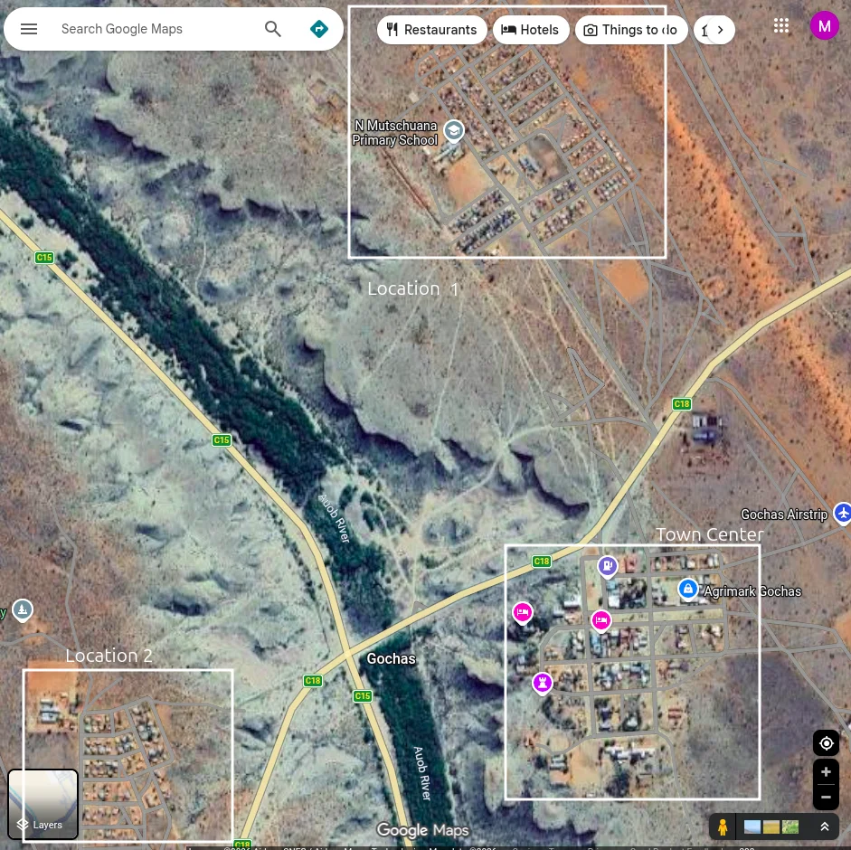

### The Community

N Mutschuana Primary School serves over 300 students from the local community. Many children come from families in the Location who struggle to provide for their education. The Namaqua Kalahari Children's Home, run by Theo Pauline, provides housing for 60 children whose parents cannot care for them.

### Project Scope

The project had three concrete objectives:

1. **Connectivity for the whole school** — bring Wi-Fi to all 20+ classrooms across the different building blocks.
2. **Reconditioning donated PCs for teachers** — many teachers had no computer; others were using personal laptops or very old machines that struggled to load Windows.
3. **Two-day seminar with the teaching board** — basics of the new computers and an overview of how the network works, so the staff could operate and explain it themselves.

We also ran feedback sessions with the users to customize the machines:

- **Nama keyboard layout** for teachers writing in the local language.
- **Schoolkink** for student report management.
- **Shared printing from any classroom** — previously the printer was attached by USB in the secretary's room, so anyone needing to print had to physically walk there with a USB stick.

## Pre-mobility Scoping

Before flying, we ran **three online touchpoints** with the school staff to scope the solution and the equipment list. This let us arrive with most of the hardware already bought and tested, instead of trying to source it locally (Gochas has no electronics shop; the nearest is hours away by car).

!!! warning "Cudy router hardware revision incident"
    The Cudy routers we bought in the first batch turned out to be a **silently revised hardware version (v2)** that dropped OpenWrt compatibility. The brand had not changed the model name on the box. We discovered this only when flashing failed at the bench in Barcelona, days before departure.

    In extremis we found a **different Cudy model still listed as compatible** on the OpenWrt Table of Hardware and re-ordered. Without that flexibility we would have had no way to do the OpenWrt-based mesh on site.

    **Lesson:** before buying, verify the **exact hardware revision** (not just the model name) against the [OpenWrt Table of Hardware](https://openwrt.org/toh/start), and check the [Flash OpenWrt guide](../../3-Guide/Flash-OpenWrt/index.md) and the [Cudy WR3000E notes](../../3-Guide/Flash-OpenWrt/Cudy-WR3000E.md). When buying in bulk, ask the vendor for the revision number on the box.

## Initial Situation

When we arrived, the school had a fragmented and undocumented network:

- **Two old ADSL routers** provided by the government.
- **ADSL Router 1**, in the Principal's Office area, radiating a Wi-Fi signal but **not connected to the ISP**. It provided no actual internet, although nobody in the school knew that.
- **ADSL Router 2**, near the main classroom blocks, connected to the internet but with **limited coverage**, leaving most classrooms without Wi-Fi.
- **No IP addressing plan** — devices used factory defaults.
- **No documentation** — staff couldn't tell which router did what.

The result: teachers in the staff room had unreliable connectivity, most classrooms had nothing, and troubleshooting was nearly impossible because nobody knew the network layout.

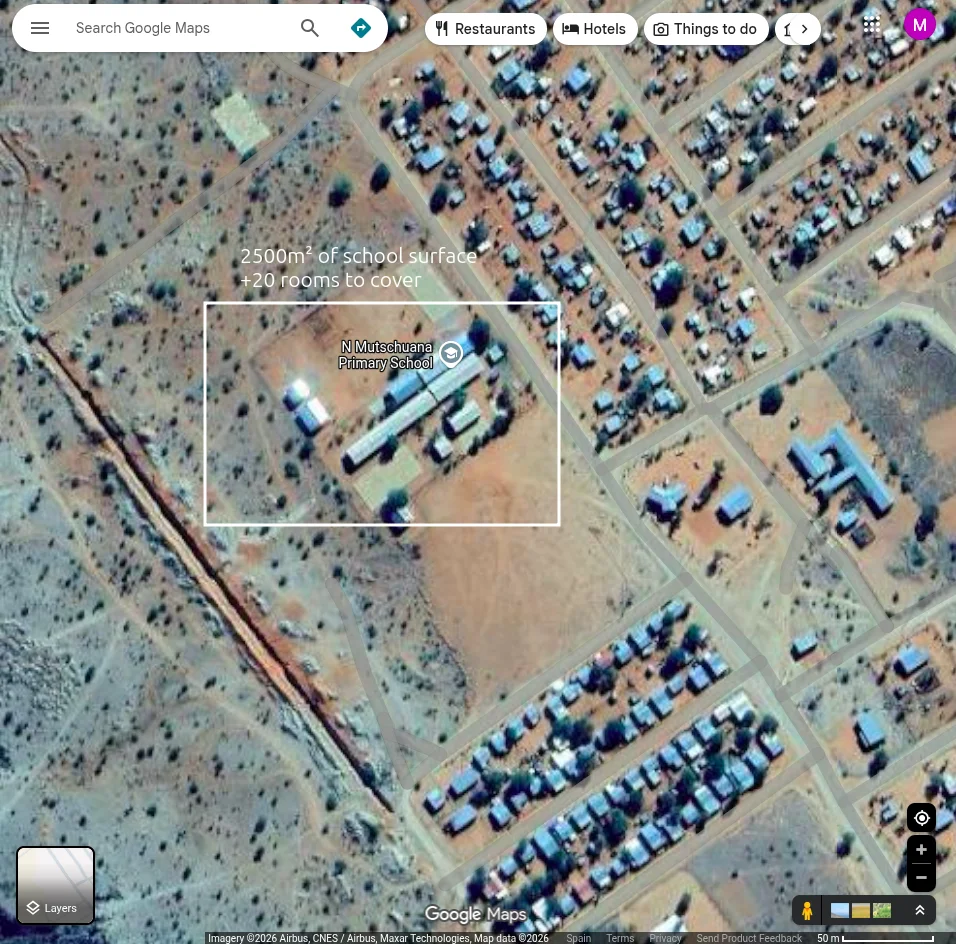

### What our pre-trip interviews missed

The online interviews told us there was **one ADSL router**. On site we found **two**. Router 2 was hanging in the air, with no clear story attached — staff did not know how it had been installed or when it had stopped working.

It took 1–2 days for the School Director to bring in the Telecom team. They explained that, in the past, Router 2 had been **cable-extended from Router 1**: the second ADSL signal was actually the same uplink relayed by wire. So in reality there had only ever been **one internet gateway**. The staff could not tell when Router 2 had failed, because they had no way to distinguish "the second router is down" from "the school's internet is down".

!!! tip "Field-survey lesson"
    Trust the site, not the description. Always plan for a **physical site survey** as part of the deployment ([Site Assessment guide](../../3-Guide/Network-Planning/2-Site-Assessment.md)) and budget at least one day of slack to chase down missing context with local operators.

## Design Decision — Wired vs Wireless Mesh

With the real situation understood, we sat with the school board to decide how to cover all the buildings. Two options were on the table:

| Aspect | Wired mesh (Ethernet backhaul) | Wireless mesh (802.11s/802.11ac backhaul) |
|---|---|---|
| Throughput per link (typical) | Up to ~1 Gbps (Cat5e/Cat6) | ~100–300 Mbps real, halved per hop |
| Latency per hop (typical) | < 1 ms | ~5–20 ms |
| Reliability | High — wires don't suffer interference | Sensitive to interference and physical obstacles |
| Civil works | Drilling through walls, cable trays | None — just hang the routers |
| Permissions | Education Ministry approval needed | Not needed |
| Cost (cable + labour) | High | Low |
| Reconfigurability | Low — moving an AP means re-cabling | High — move and re-mount |

The decisive factor was the school's **internet uplink: 4 Mbps**. A wired mesh giving us ~1 Gbps inside the school would be wildly over-provisioned for a 4 Mbps uplink — we would be paying for capacity that nothing on site could use. A wireless mesh, even at much lower nominal numbers, **still vastly outperforms 4 Mbps**, and remains good enough if the school later upgrades the uplink (see the 4G demo below).

We chose the **wireless mesh**. See the implementation in the [Wireless Mesh guide](../../3-Guide/Wireless-Mesh/index.md), specifically the [Static IP Mesh recipe](../../3-Guide/Wireless-Mesh/1-Static-IP-Mesh/index.md) we followed.

### Key design decisions

- **Single network range**: `192.168.70.0/24` — avoiding the common `192.168.1.x` default that collides with everything.
- **Static IPs for all routers** for easy identification and troubleshooting.
- **Wireless mesh backhaul** between routers — no Ethernet runs between buildings.
- **One gateway**: ADSL Router 2 (the one with actual internet) at `192.168.70.1`.

## IP Addressing Plan

The plan follows the [Chapter 3 — IP Addressing guide](../../3-Guide/IP-Addressing/index.md) and is mirrored in the [Chapter 2 IP Addressing story](../../2-Imaginary-Use-Case/2.2-Expanding-Coverage/2.2.2-IP-Addressing.md):

| Device | IP Address | Location |
|--------|------------|----------|
| ISP Router (Gateway) | `192.168.70.1` | Main classroom block |
| Mesh Router 1 | `192.168.70.2` | Main classroom block (north) |
| Mesh Router 2 | `192.168.70.3` | Main classroom block (center) |
| Mesh Router 3 | `192.168.70.4` | Preprimary classrooms |
| Mesh Router 4 | `192.168.70.5` | Principal's Office / Staff Room |
| Mesh Router 5 | `192.168.70.6` | Main classroom block (south) |
| Mesh Router 6 | `192.168.70.7` | Main classroom block (far south) |
| DHCP Range | `192.168.70.100 – 200` | User devices |

## Implementation

### Wireless mesh

Six Cudy routers flashed with OpenWrt, configured as a single 802.11s mesh with a common ESSID for clients. One SSID across the school, seamless roaming between APs. Procedure: [Wireless Mesh — Static IP Mesh](../../3-Guide/Wireless-Mesh/1-Static-IP-Mesh/index.md).

### Computers configuration

Donated and refurbished laptops were prepared with a common Linux Mint image, then customized in the field with the Nama keyboard, Schoolkink, and shared-printer setup. PXE network boot + Clonezilla brought the per-machine setup time down from a full day to roughly an hour for the whole batch.

| Model | CPU | RAM | Storage | Quantity |
|---|---|---|---|---|
| Lenovo T460 | Intel i5-6200U | 8 GB DDR4 | ~466 GB HDD | 7 |
| Lenovo X260 | Intel i5-6200U | 8 GB DDR4 | ~238 GB SSD / ~466 GB HDD | 2 |

Procedure: [Laptop Deployment guide](../../3-Guide/Laptop-Deployment/index.md) and the [AUCOOP image](../../3-Guide/Laptop-Deployment/AUCOOP-image.md).

### Monitoring — Zabbix

We installed Zabbix on one of the local mini-PC servers to monitor the mesh routers (uplink status, ping, CPU, memory). This gives the maintainer a single dashboard to see which AP is down before a teacher has to report it.

!!! info "Work in Progress"
    The Zabbix guide is being written on the `feature/zabbix-guide` branch. See the current state at [Zabbix guide](../../3-Guide/Zabbix/index.md).

<!-- TODO: Replace with screenshot of the actual Zabbix dashboard from the school deployment -->

### Telegram bot — alerting

On top of Zabbix we wired a **Telegram bot** as the alerting channel. When an AP goes down or the gateway loses internet, the bot pings a group chat that includes the AUCOOP team in Barcelona. This way we hear about outages even from 8,000 km away, and we can coordinate with the school to act on them.

Same status as the Zabbix guide — see [Zabbix guide](../../3-Guide/Zabbix/index.md).

### VPN for remote support

We deployed a Netmaker-based VPN so the AUCOOP team can SSH back into the routers and the Proxmox host from Barcelona. Without this, every minor change would require flying back. Procedure: [VPN guide](../../3-Guide/VPN/index.md), [Netmaker on a VPS](../../3-Guide/VPN/Netmaker-VPS.md), [Netclient on OpenWrt](../../3-Guide/VPN/Netclient-OpenWrt.md).

### Proxmox

Two mini-PCs donated by NexTReT run Proxmox and host the local services (Zabbix, the Telegram bot bridge, and a small Nextcloud for the school staff). Proxmox gives us LXC and VM isolation on modest hardware, and snapshot-based rollback when we push a change remotely. Procedure: [Proxmox guide](../../3-Guide/Proxmox/index.md), [Install Proxmox](../../3-Guide/Proxmox/Install-Proxmox.md), [OpenWrt in an LXC](../../3-Guide/Proxmox/OpenWrt-LXC.md).

## Seminars and Knowledge Transfer

The two-day seminar with the teaching board covered:

- Basics of the new Linux Mint laptops (browsers, files, LibreOffice, printer).
- The Nama keyboard layout and how to switch it.
- Schoolkink for student reports.
- A high-level walk-through of the network: where each AP is, what to do if Wi-Fi drops in a classroom, and who to contact if it stays down.

### The 4G demo

During the seminar we did a live demo: we **swapped the ADSL gateway for a 4G router** we had brought along, and showed the speed difference on the same mesh. Going from 4 Mbps ADSL to a 4G uplink was visible immediately on a YouTube load and on a Speedtest.

We left the school with a concrete recommendation: once the mesh is validated in real day-to-day use, **request the Education Ministry to upgrade the uplink to a 4G router**. Conversations with the Ministry have started, with the additional argument that the school could then offer an **ICT class for older students**, giving them an introduction to the PC world before high school where some classes already require it.

!!! info "Slide deck"
    The presentation we used at the school is archived as `AUCOOP & N MUTSCHUANA PRIMARY SCHOOL.pdf`. See **References** below.

<!-- Slide images extracted from the presentation PDF. 3x4 grid
     Use HTML  inside links so markdown-in-HTML rendering does not
     leave raw markdown in the compiled HTML. -->

  <table>
    <tr>
      <td><a class="slide-link" href="images/slides/slide-01.png">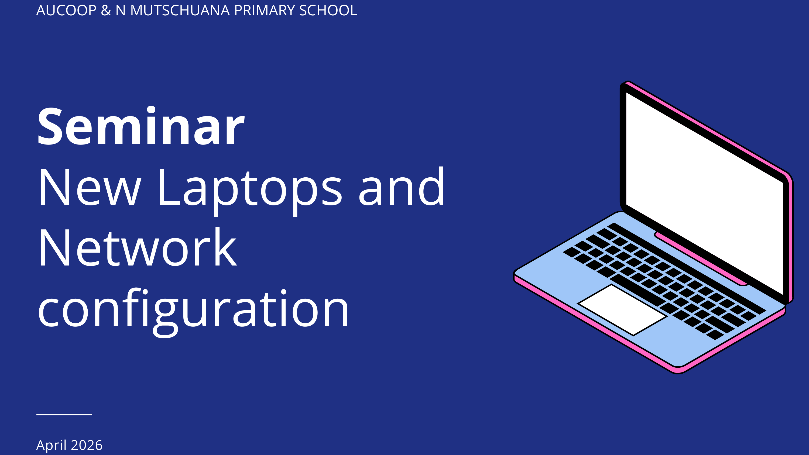</a></td>
      <td><a class="slide-link" href="images/slides/slide-02.png">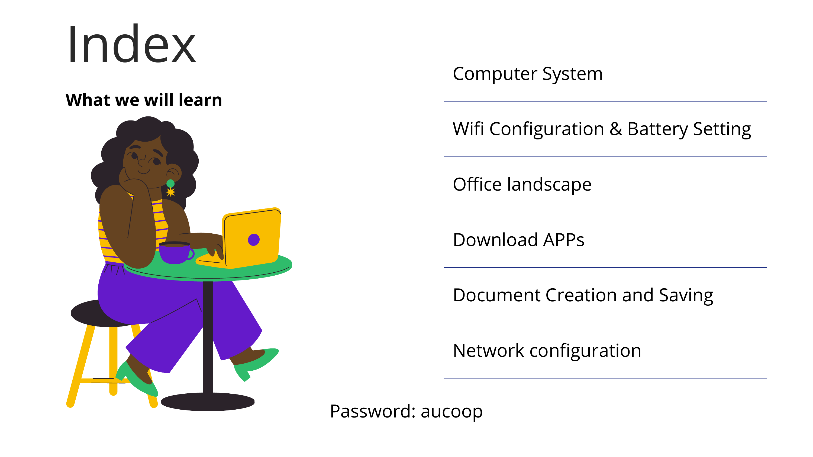</a></td>
      <td><a class="slide-link" href="images/slides/slide-03.png">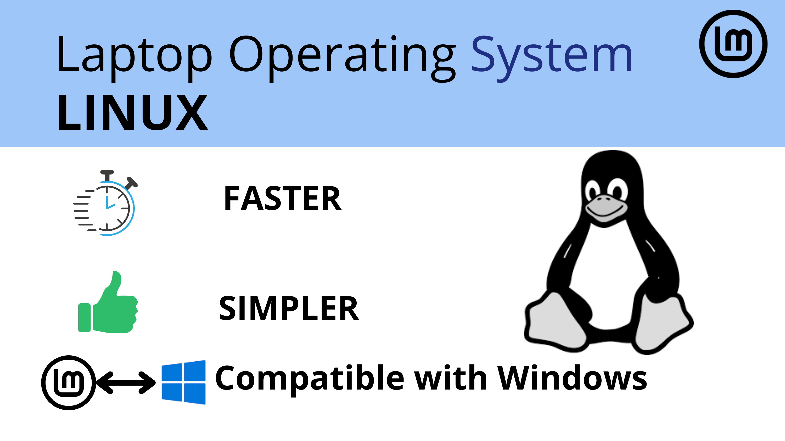</a></td>
    </tr>
    <tr>
      <td><a class="slide-link" href="images/slides/slide-04.png">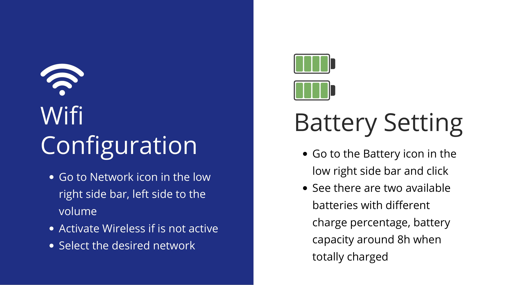</a></td>
      <td><a class="slide-link" href="images/slides/slide-05.png">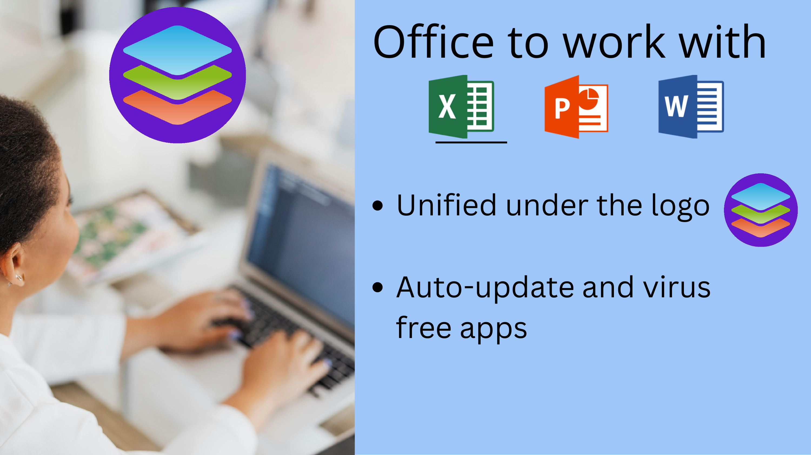</a></td>
      <td><a class="slide-link" href="images/slides/slide-06.png">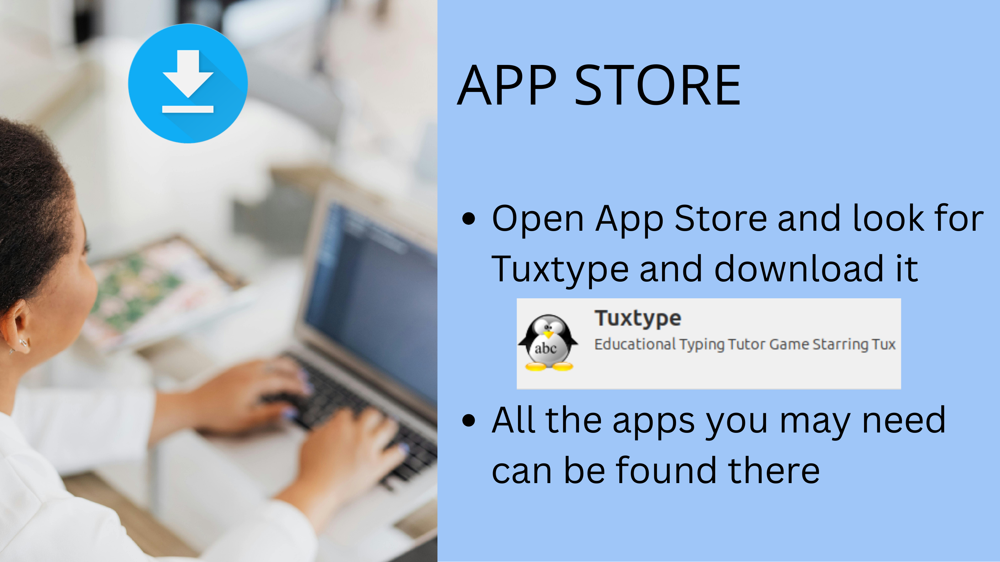</a></td>
    </tr>
    <tr>
      <td><a class="slide-link" href="images/slides/slide-07.png">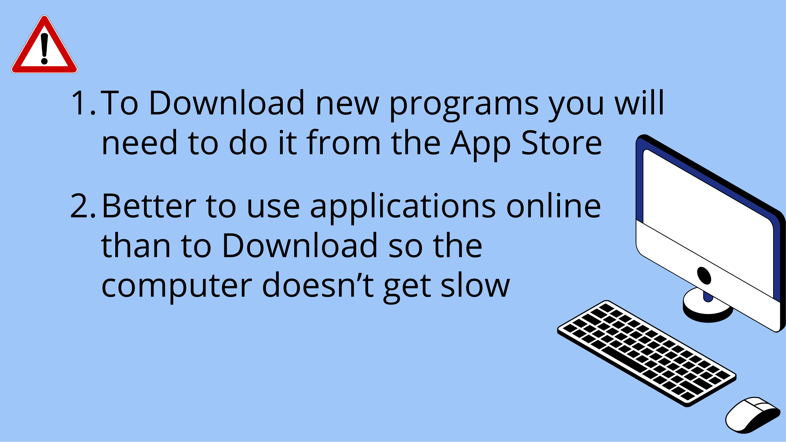</a></td>
      <td><a class="slide-link" href="images/slides/slide-08.png">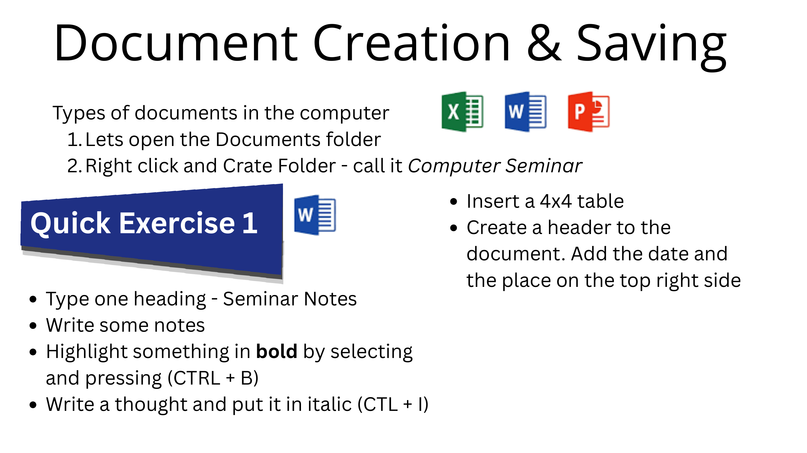</a></td>
      <td><a class="slide-link" href="images/slides/slide-09.png">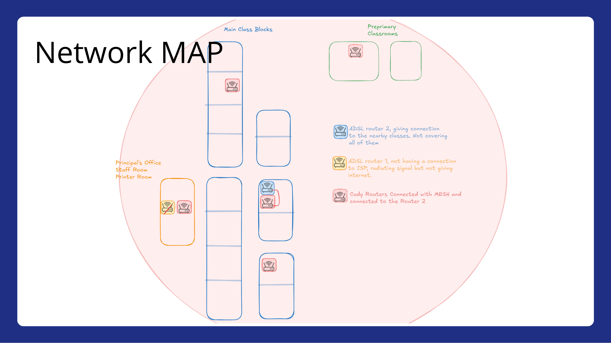</a></td>
    </tr>
    <tr>
      <td><a class="slide-link" href="images/slides/slide-10.png">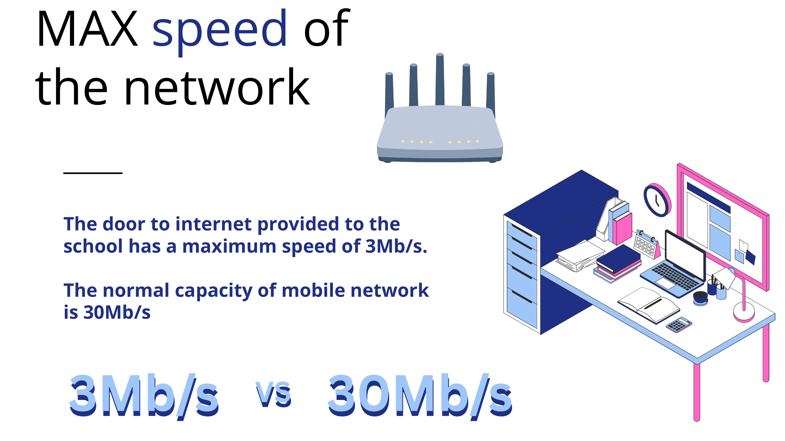</a></td>
      <td></td>
      <td></td>
    </tr>
  </table>

  <!-- Lightbox overlay -->
  

    

    

      <button id="slide-lightbox-close" aria-label="Close">✕</button>
      
    

  

  

  

## Challenges Encountered

### Challenge 1: The "broken" router

On Day 6, the school director called saying "the main router doesn't work anymore", implying we had broken it. Investigation revealed the router in question had **never been connected to anything**; its Ethernet cable was literally wrapped around an unplugged power outlet. We diplomatically "fixed" it by deploying the mesh.

### Challenge 2: IP conflicts

On Day 8, a newly added router refused to integrate with the mesh. After an hour of debugging we found a missing configuration causing routers to conflict and misroute traffic. The fix took five minutes once identified — a classic case of "detection takes longer than correction".

!!! info "Lesson learned"
    This experience directly informed the troubleshooting section in [Chapter 2 — IP Addressing](../../2-Imaginary-Use-Case/2.2-Expanding-Coverage/2.2.2-IP-Addressing.md). When routers don't communicate, check IP conflicts first.

### Challenge 3: WPA3 compatibility

One team member's laptop couldn't connect to the mesh. The routers were configured with WPA3-SAE; older devices don't support it. We reconfigured to **WPA2/WPA3 mixed mode** for compatibility.

### Challenge 4: Cudy hardware revision

See the **Pre-mobility Scoping** section above. Worth restating: **always verify the hardware revision before buying in bulk**. A model name on the box is not enough — silent revisions can drop OpenWrt support entirely.

### Challenge 5: Infrastructure limitations

Gochas suffers frequent power outages, especially during the rainy season. The town's communication tower runs on a generator that shuts off at 8 PM. During one outage we lost both power and internet for three days — a reminder that community networks in remote areas need resilience planning (UPS for the gateway and APs, scheduled state for after-hours).

## Timeline

| Day | Activities |
|-----|------------|
| Day 3 | Initial site survey, met with school director Gerda and staff, assessed existing infrastructure |
| Day 4 | Flashed all Cudy routers with OpenWrt, conducted connectivity tests in classrooms |
| Day 5 | Configured wireless mesh, validated documentation by having a team member follow the guides cold |
| Day 6 | First mesh deployment at the school — 30 minutes to cover all buildings, teachers got the Wi-Fi password immediately |
| Day 8 | Troubleshot IP conflict, configured VPN for future remote support |

## What's Running

- **7 access points** providing full coverage across all school buildings.
- **Single unified network** — one SSID, seamless roaming.
- **Documented IP plan** — staff know which router is where.
- **VPN configured** — we can provide remote support from Barcelona.
- **Zabbix + Telegram alerts** — we get pinged when something goes down.
- **2 Proxmox mini-PC servers** hosting local services.
- **13 refurbished laptops** delivered to the school with Linux Mint.

### Metrics

Within 30 minutes of the Day 6 deployment, all teachers in the staff room had the new Wi-Fi password. The network spread "like wildfire" — a sign of genuine demand for connectivity.

## Namaqua Kalahari Children's Home

The Children's Home was inaugurated at the beginning of 2026. The home director had requested an internet line from the public authorities and followed up several times while we were on site, but the installation was not done during our stay.

Given the constraint, we adjusted what we could deliver:

- **Computer seminar for the home staff and workers**, covering the basics of the Office Suite and how it can serve the day-to-day running of the home: Excel for accounting, Word for a recipe book, Chrome to look up solutions on the internet. The presentation was an adapted, more basic version of the school deck — the Children's Home staff was less computer-literate than the teachers.
- **Pre-configured 3-node mesh as a plug-and-play kit**. The moment the government installs the uplink, the House Director plugs the gateway into the first node and the network comes up. We walked her through the topology and committed to **remote support over VPN** when activation happens, so any first-day question can be solved from Barcelona.

!!! tip "Pre-staging works"
    Pre-configuring and labelling all the gear before leaving means a non-technical user can bring the network up the day connectivity arrives. It also avoids a second trip just for plug-in.

## Reflection

Almost everyone we met has a smartphone. Very few are computer-literate. Smartphones have done enormous good in putting the internet in everyone's hand, but they frame the internet primarily as **entertainment, social media and video** — not as a tool. A computer in front of a teacher reframes technology as something you **do work with**: write a report, keep accounts, look up a solution to a problem in the classroom.

That reframing is, in the long run, the point of the project. The mesh and the laptops are the visible deliverables; the change in mindset is the one that lasts.

## Lessons Learned

1. **Document everything** — the IP plan saved hours of debugging and will help future maintainers.
2. **Verify hardware revisions before buying** — model names lie; ask for the revision on the box.
3. **Plan a physical site survey** — the network you're told about is rarely the network that exists.
4. **Match the LAN to the WAN** — over-provisioning the LAN buys you nothing if the uplink is 4 Mbps.
5. **Test with multiple devices** — WPA3 compatibility issues only appeared with older hardware.
6. **Expect the unexpected** — "broken" equipment is often just misconfigured or never properly set up.
7. **Pre-stage when connectivity is uncertain** — see the Children's Home case.
8. **Build relationships** — technical success depends on community trust and clear communication.

## References

- AUCOOP project diary — <https://aucoop.upc.edu/gochas-namibia/>
- Community Network Handbook — <https://aucoop.github.io/Community-Network-Handbook/>
- Foundawtion (local partner) — <https://foundawtion.org/en/home-english>
- Slide deck used in the school seminar — `AUCOOP & N MUTSCHUANA PRIMARY SCHOOL.pdf` (archived locally; ask the AUCOOP team for a copy)
- [Chapter 2 — IP Addressing](../../2-Imaginary-Use-Case/2.2-Expanding-Coverage/2.2.2-IP-Addressing.md)
- [Chapter 3 — IP Addressing guide](../../3-Guide/IP-Addressing/index.md)
- [Chapter 3 — Network Planning / Site Assessment](../../3-Guide/Network-Planning/2-Site-Assessment.md)
- [Chapter 3 — Wireless Mesh](../../3-Guide/Wireless-Mesh/index.md)
- [Chapter 3 — Flash OpenWrt](../../3-Guide/Flash-OpenWrt/index.md)
- [Chapter 3 — Laptop Deployment](../../3-Guide/Laptop-Deployment/index.md)
- [Chapter 3 — Zabbix (WIP)](../../3-Guide/Zabbix/index.md)
- [Chapter 3 — VPN](../../3-Guide/VPN/index.md)
- [Chapter 3 — Proxmox](../../3-Guide/Proxmox/index.md)

## Project Team

- **Sergio Gimenez** — UPC PHD student
- **Jaume Motje** — UPC Masters student
- **Maria Jover** — UPC Masters student
- **Eva Vidal** — UPC professor

**Local partners:** Gerda (School Director), Theo Pauline (Children's Home Director), Mr. Isaak and staff at N Mutschuana Primary School.

**Supporting organizations:**

- UPC: CCD (Centre de Cooperació per al Desenvolupament) — grant of 5,600 €
- AUCOOP — project coordinator and executor
- Labdoo — provided 9 laptops
- NexTReT — provided 3 laptops and 2 mini-PC servers
