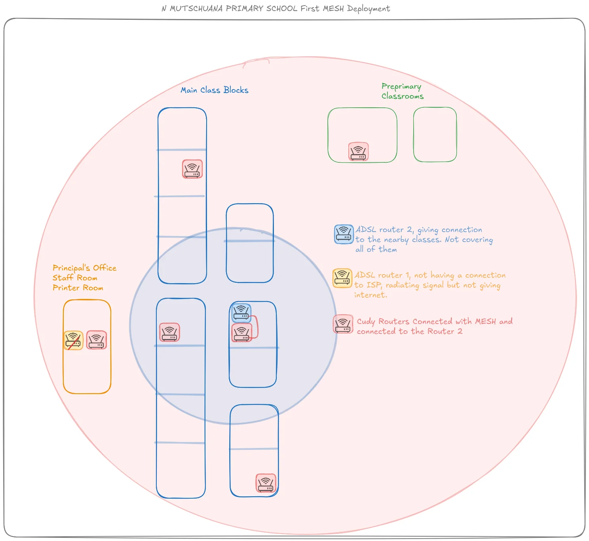
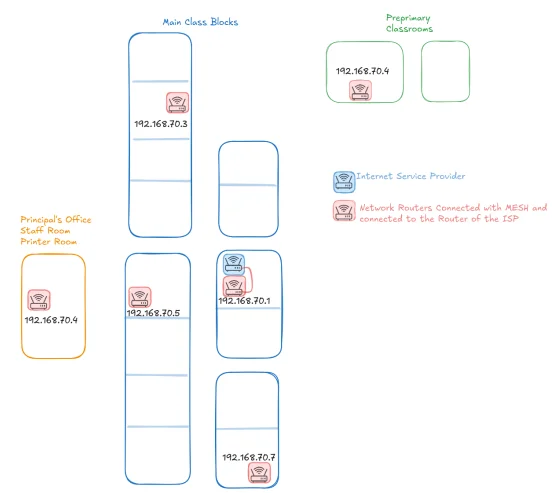

# Namibia — N Mutschuana Primary School

This case study documents a real community network deployment at N Mutschuana Primary School in Gochas, Namibia, carried out in March 2026 by a team from AUCOOP (UPC): Jaume, Maria and Sergio.

It covers two complementary efforts that happened in parallel during the same field trip:

1. The **wireless network deployment** that brought unified Wi-Fi coverage to the whole school.
2. The **laptop deployment** that provisioned 9 refurbished Lenovo ThinkPads with a standard Linux Mint image, using PXE network boot and Clonezilla.

!!! note "Offtopic"
    If you want to learn about our experience in Namibia from a more human and not so nerdy way, you can check our travel blog here :) (translations in english are automatic, expect typos. Still we think you will enjoy it :D https://aucoop.upc.edu/gochas-namibia/)

## Context

### Location

Gochas is a small town in the Hardap Region of Namibia, in the Kalahari Desert. The town has fewer than 2,000 inhabitants split between two areas: the central town with more established housing, and "the Location" — a poorer area with more humble dwellings, separated by more than 500 meters (a distance not coincidental: it exceeds the flight range of most local mosquitoes). There is were more black people live still legacy from the apartheid system that established in the region before 1990.

### The Community

N Mutschuana Primary School serves over 300 students from the local community. Many children come from families in the Location who struggle to provide for their education. The Namaqua Kalahari Children's Home, run by Theo Pauline, provides housing for 60 children whose parents cannot care for them — giving these kids a chance at education and a better future.

### Initial Situation

When the team arrived, the school had a fragmented network setup:

- **Two old ADSL routers** provided by the government
- **ADSL Router 1** in the Principal's Office area — radiating a Wi-Fi signal but **not connected to the ISP**, providing no actual internet
- **ADSL Router 2** near the main classroom blocks — connected to the internet but with **limited coverage**, leaving most classrooms without connectivity
- **No IP addressing plan** — devices used default configurations
- **No documentation** — staff didn't know which router did what

The result: teachers in the staff room had unreliable connectivity, most classrooms had no Wi-Fi at all, and troubleshooting was nearly impossible because nobody knew the network layout.

### The Problem

The existing setup suffered from three core issues:

1. **Coverage gaps** — The ADSL routers couldn't reach all classroom blocks
2. **No unified network** — Two separate routers meant two separate networks
3. **No IP plan** — Default IPs (`192.168.1.1`) on every device made expansion impossible

## Network: Wireless Mesh with Proper IP Addressing

Following the approach documented in [Chapter 2 — IP Addressing](../../2-Imaginary-Use-Case/2.2-Expanding-Coverage/2.2.2-IP-Addressing.md), the team designed a mesh network using Cudy routers flashed with OpenWrt.

**Key design decisions:**

- **Single network range**: `192.168.70.0/24` — avoiding the common `192.168.1.x` default
- **Static IPs for all routers**: Each access point received a unique address for easy identification and troubleshooting
- **Wireless mesh backhaul**: Routers connect to each other wirelessly, eliminating the need for Ethernet runs between buildings
- **One gateway**: ADSL Router 2 (the one with actual internet) serves as the gateway at `192.168.70.1`

### IP Addressing Plan

The team created a simple IP plan following the guide in [Chapter 3 — IP Addressing](../../3-Guide/IP-Addressing/index.md):

| Device | IP Address | Location |
|--------|------------|----------|
| ISP Router (Gateway) | `192.168.70.1` | Main classroom block |
| Mesh Router 1 | `192.168.70.2` | Main classroom block (north) |
| Mesh Router 2 | `192.168.70.3` | Main classroom block (center) |
| Mesh Router 3 | `192.168.70.4` | Preprimary classrooms |
| Mesh Router 4 | `192.168.70.5` | Principal's Office / Staff Room |
| Mesh Router 5 | `192.168.70.6` | Main classroom block (south) |
| Mesh Router 6 | `192.168.70.7` | Main classroom block (far south) |
| DHCP Range | `192.168.70.100 - 200` | User devices |

## Laptop Deployment

In parallel with the network roll-out, the team had to provision a fleet of refurbished laptops obtained through the [Labdoo](https://www.labdoo.org/) project. Setting up 9 machines manually would have taken most of a day. Using PXE network boot and Clonezilla, the same task was completed in about an hour.

### Hardware

| Model          | CPU            | RAM       | Storage                    | Quantity |
|----------------|----------------|-----------|----------------------------|----------|
| Lenovo T460    | Intel i5-6200U | 8 GB DDR4 | ~466 GB HDD                | 7        |
| Lenovo X260    | Intel i5-6200U | 8 GB DDR4 | ~238 GB SSD / ~466 GB HDD  | 2        |

### Deployment Method

The deployment followed the [Laptop Deployment Guide](../../3-Guide/Laptop-Deployment/index.md):

1. One laptop was configured as the **golden master** (Linux Mint 22.3, `aucoop` user, pre-installed software)
2. The disk image was captured with **Clonezilla** (~4 GB compressed from a 466 GB source disk)
3. The image was **resized** to fit the smallest target disk (238 GB SSD) — the source ext4 partition was shrunk from 466 GB to 20 GB using `resize2fs` and `parted`, then recaptured with `partclone` (~3.6 GB compressed)
4. A **PXE server** (one of the deployed ThinkPads) served the image to all 9 machines over an isolated Ethernet switch
5. All machines booted from the network and received the image simultaneously

### Laptop Lessons Learned

- **Secure Boot must be disabled** on all target machines before PXE boot. The unsigned GRUB binary is silently rejected otherwise — no error message, just falls through to IPv6 PXE. This was the root cause of hours of debugging.
- **TFTP `--secure` mode breaks symlinks.** Files served via TFTP must be physically inside the TFTP root directory, not symlinked from outside.
- **Partition size matters more than data size.** An image captured from a 466 GB disk cannot be restored to a 238 GB disk, even if the actual data is only 12 GB. The ext4 filesystem scatters blocks across the entire partition, and `partclone` fails when seeking beyond the target disk boundary. The fix is to shrink the filesystem and partition before capturing the image (see [Phase 3 of the guide](../../3-Guide/Laptop-Deployment/index.md#phase-3----resize-the-image-for-smaller-target-disks)).
- **Auto-detect the target disk.** Machines may have SATA (`/dev/sda`) or NVMe (`/dev/nvme0n1`) storage. Use a script that probes for the correct device instead of hardcoding the disk name.
- **DRBL is overkill for this use case.** A simple setup with `isc-dhcp-server` + `tftpd-hpa` + `nfs-kernel-server` + Clonezilla Live is much easier to debug and maintain than a full DRBL deployment.
- **Use `-k1` and `-icds` flags** with `ocs-sr` when deploying to disks of varying sizes. `-k1` proportionally resizes partitions to fill the target disk, and `-icds` skips the disk size check.

## Timeline

| Day | Activities |
|-----|------------|
| Day 3 | Initial site survey, met with school director Gerda and staff, assessed existing infrastructure |
| Day 4 | Flashed all Cudy routers with OpenWrt, conducted connectivity tests in classrooms |
| Day 5 | Configured wireless mesh, validated documentation by having team member follow guides |
| Day 6 | First mesh deployment at school — 30 minutes to cover all buildings, teachers got Wi-Fi password immediately |
| Day 8 | Troubleshot IP conflict issue, configured VPN for future remote support |

## Challenges Encountered

### Challenge 1: The "Broken" Router

On Day 6, the school director called saying "the main router doesn't work anymore" — implying the team had broken it. Investigation revealed the router in question had never been connected to anything; its Ethernet cable was literally wrapped around an unplugged power outlet. The team diplomatically "fixed" it by deploying the mesh network instead.

### Challenge 2: IP Conflicts

On Day 8, a newly added router wouldn't integrate with the mesh. After an hour of debugging, the team discovered a missing configuration that caused routers to conflict and misroute traffic. The fix took five minutes once identified — a classic case of "detection takes longer than correction."

!!! info "Lesson learned"
    This experience directly informed the troubleshooting section in [Chapter 2 — IP Addressing](../../2-Imaginary-Use-Case/2.2-Expanding-Coverage/2.2.2-IP-Addressing.md). When routers don't communicate, check IP conflicts first.

### Challenge 3: WPA3 Compatibility

One team member's laptop couldn't connect to the mesh. The routers were configured with WPA3-SAE security, which older devices don't support. The team reconfigured to WPA2/WPA3 mixed mode to ensure compatibility.

### Challenge 4: Infrastructure Limitations

Gochas experiences frequent power outages, especially during rainy season. The town's communication tower runs on a generator that shuts off at 8 PM. During one outage, the team lost both power and internet for three days — a reminder that community networks in remote areas need resilience planning.

## What's Running

- **7 access points** providing full coverage across all school buildings
- **Single unified network** — one SSID, seamless roaming between access points
- **Documented IP plan** — staff know which router is where
- **VPN configured** — the team can provide remote support from Barcelona
- **13 refurbished laptops** delivered to the school with Linux Mint installed

## Metrics

Within 30 minutes of deployment on Day 6, all teachers in the staff room had the new Wi-Fi password. The network spread "like wildfire" — a sign of genuine demand for connectivity.

## Project-Level Lessons Learned

1. **Document everything** — The IP addressing plan saved hours of debugging and will help future maintainers
2. **Test with multiple devices** — WPA3 compatibility issues only appeared when testing with older hardware
3. **Expect the unexpected** — "Broken" equipment is often just misconfigured or never properly set up
4. **Build relationships** — Technical success depends on community trust and communication

## References

- AUCOOP Project Diary — https://aucoop.upc.edu/gochas-namibia/
- Community Network Handbook — https://aucoop.github.io/Community-Network-Handbook/
- Foundawtion (local partner) — https://foundawtion.org/en/home-english
- Chapter 2 — IP Addressing — [Link](../../2-Imaginary-Use-Case/2.2-Expanding-Coverage/2.2.2-IP-Addressing.md)
- Chapter 3 — IP Addressing Guide — [Link](../../3-Guide/IP-Addressing/index.md)
- Chapter 3 — Laptop Deployment Guide — [Link](../../3-Guide/Laptop-Deployment/index.md)

## Project Team

- **Sergio Gimenez** — UPC student
- **Jaume Motje** — UPC student
- **Maria Jover** — UPC student
- **Eva Vidal** — UPC professor

**Local partners:** Gerda (School Director), TheoPauline (Children's Home Director), Mr. Isaak and staff at N Mutschuana Primary School.

**Supporting organizations:**

- UPC: CCD (Centre de Cooperacio per al Desenvolupament) with a grant of 5600€
- AUCOOP: Project coordinator and executor
- Labdoo: Provided 9 laptops.
- NexTReT: Provided 3 laptops and 2 miniPCs servers.
